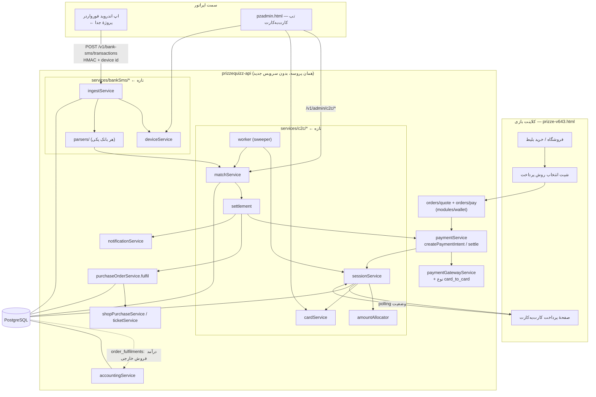
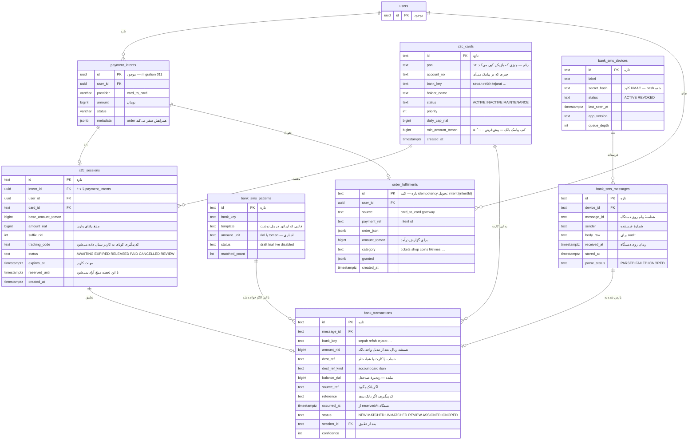
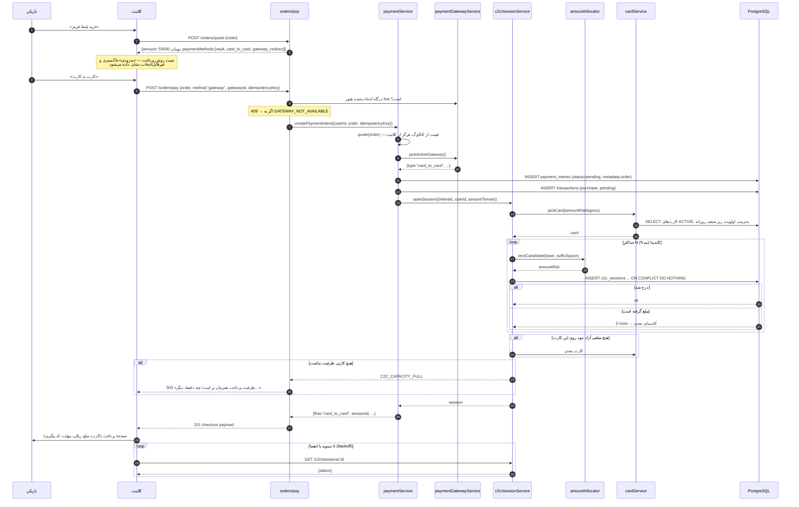
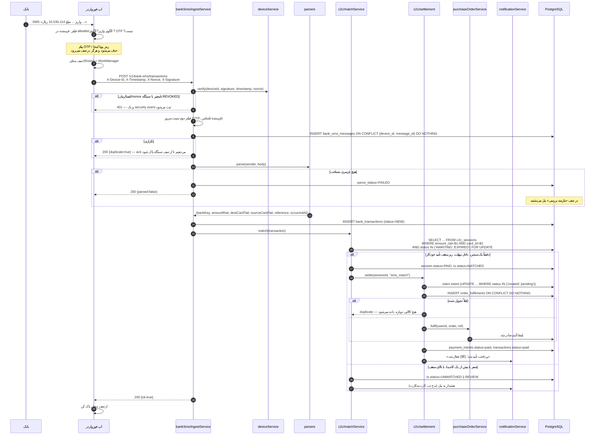
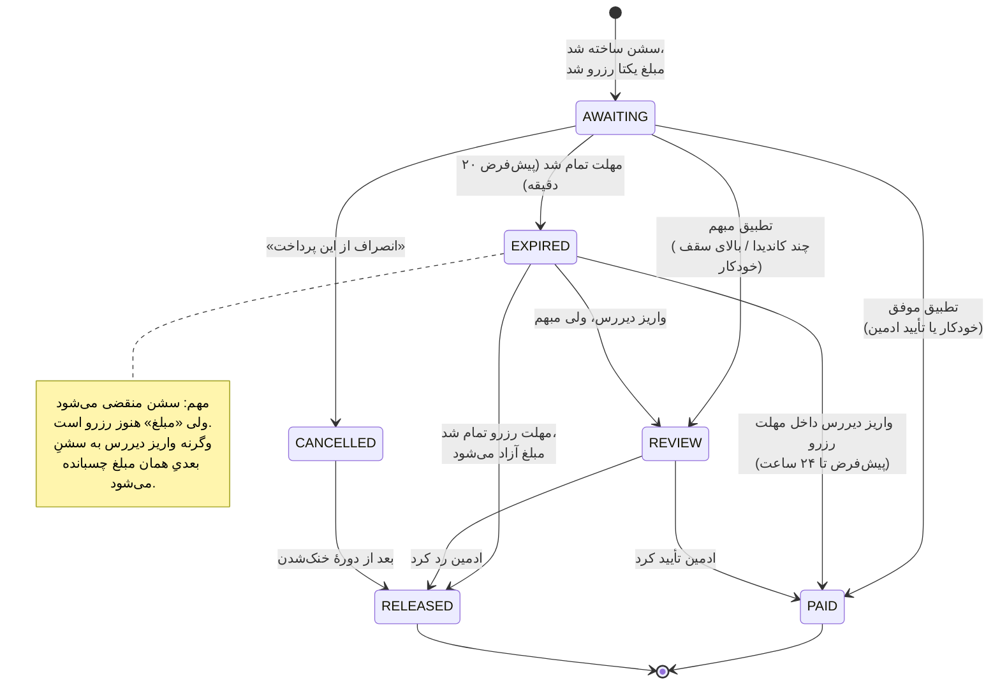
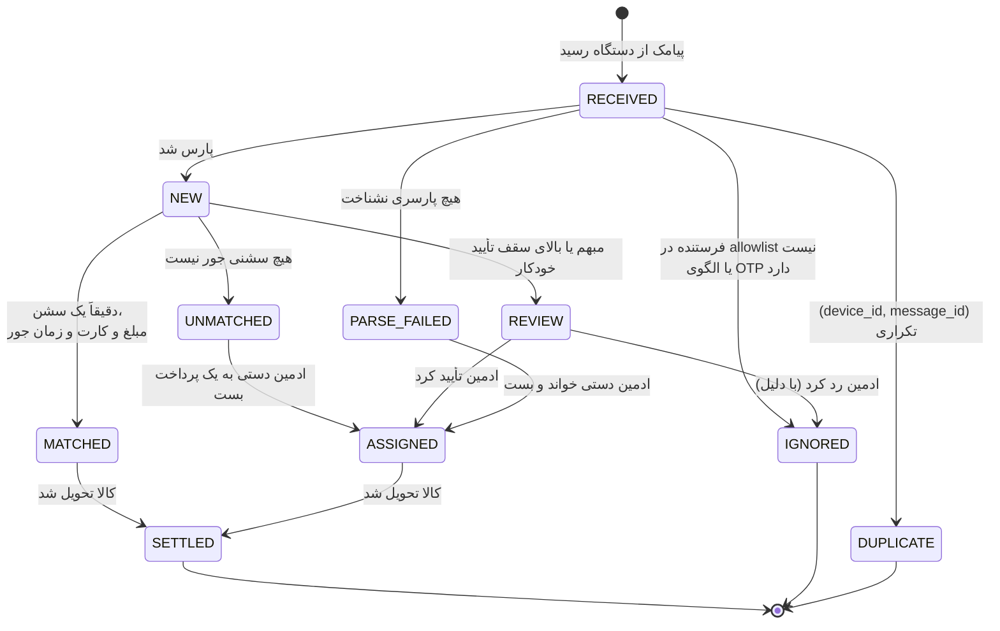
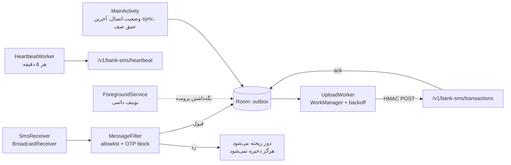
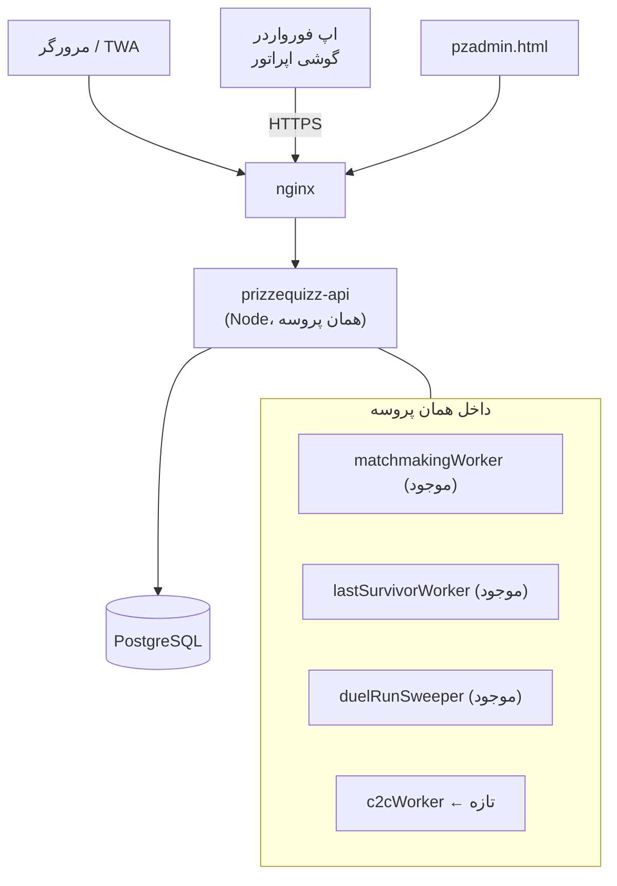

# درگاه کارت‌به‌کارت آنی — سند معماری (مرحلهٔ طراحی، قبل از کد)

وضعیت: **معماری تأیید شد؛ پیاده‌سازی مرحله‌به‌مرحله در جریان است.**
هر هشت یافتهٔ F1–F8 توسط اپراتور در کد بررسی و تأیید شد، و سه تصمیم محصولی
(بندهای ۱-۲، ۲-۲ و ۱۸) به سند اضافه شده‌اند. ترتیب اجرا در بند ۱۸ است.

مرجع بصری: دو تصویر از سرویس CartBeCart فرستاده شد. آن‌ها **فقط برای فهرست
اطلاعاتی** که یک صفحهٔ پرداخت کارت‌به‌کارت لازم دارد به کار رفته‌اند. هیچ بخشی از
برندینگ، رنگ، چیدمان یا متن آن سرویس بازتولید نمی‌شود؛ صفحهٔ پرداخت ما با زبان
بصری خودِ `prizze-v643.html` ساخته می‌شود (RTL، فونت Vazirmatn، همان مودال‌ها و
همان لحن فارسی).

---

## ۰) اول از همه: چیزهایی که در کد دیدم و با پرامپت جور در نمی‌آید

پرامپت گفته بود «اگر جایی جور در نمی‌آید، کد را باور کن و بگو». این‌ها را قبل از
هر تصمیم معماری بخوانید، چون سه موردشان روی طراحی اثر مستقیم دارند.

### F1 — کد روی شاخهٔ `main` نیست — ✅ تعیین تکلیف شد
`origin/main` فقط یک `README.md` دارد؛ کل پروژه روی
`origin/claude/gracious-johnson-sog828` است.

**شاخهٔ این کار:** `claude/cartbecart-checkout-info-kanmxo`

از `claude/gracious-johnson-sog828` منشعب شده و **جداست**، پس دو سشن هم‌زمان به
هم نمی‌خورند. هر چه اینجا نوشته شود فقط به همین شاخه push می‌شود.

یک قید عملیاتی که باید بدانید: چون شاخهٔ مبنا در حال حرکت است، هر چه دیرتر merge
شود واگرایی بیشتر می‌شود. رویهٔ من این است که **در شروع هر مرحله** (بند ۱۸)
شاخهٔ مبنا را داخل این شاخه merge کنم — نه rebase، چون تاریخچهٔ شاخهٔ کس دیگری را
بازنویسی نمی‌کنیم. اگر تداخلی روی فایلی افتاد که هر دو سشن دست زده‌اند (محتمل‌ترین:
`prizze-v643.html`)، قبل از حل کردنش می‌پرسم.

### F2 — «تحویل دقیقاً یک‌بار» امروز تضمین‌شده نیست 🔴
پرامپت (بند ۵-و) می‌گوید از idempotency موجود استفاده کن. اما دو نگهبانِ تحویل،
**در حافظهٔ پروسه** هستند، نه در دیتابیس:

| فایل | خط | نگهبان |
|---|---|---|
| `prizzequizz-api/src/services/purchaseOrderService.ts` | `const _fulfilled = new Set<string>()` | تحویل بلیط |
| `prizzequizz-api/src/services/shopPurchaseService.ts` | `const _seen = new Map<string, PurchaseResult>()` | خرید فروشگاه |

خودِ کد هم این را می‌داند و نوشته است:

> «A restart between two callbacks for the same intent is the one gap, and the
> gateway's own retry window is far shorter than that.»

برای درگاه فعلی این استدلال قابل قبول است (پنجرهٔ retry درگاه چند ثانیه است).
**برای کارت‌به‌کارت قابل قبول نیست**، چون:

- تأیید ممکن است دقایق یا ساعت‌ها بعد از ساخت سشن برسد؛
- تأیید از **سه مسیر مختلف** می‌تواند بیاید: موتور تطبیق، تأیید دستی ادمین، و
  sweeper ی که پرداخت‌های عقب‌مانده را دوباره تلاش می‌کند؛
- اگر روزی API روی بیش از یک instance اجرا شود، `Set` هر پروسه جداست.

و یک جزئیات که اپراتور اضافه کرد و مهم است: **این دو حتی بدون ری‌استارت هم
فراموش می‌کنند.** هر دو سقف دارند و قدیمی‌ترین‌ها را دور می‌ریزند:

```ts
// purchaseOrderService.ts:144
if (_fulfilled.size > 20_000) { const first = _fulfilled.values().next().value; if (first) _fulfilled.delete(first); }

// shopPurchaseService.ts:162 — تهاجمی‌تر: هزار کلید را یکجا حذف می‌کند
if (_seen.size > 5000) for (const k2 of [..._seen.keys()].slice(0, 1000)) _seen.delete(k2);
```

یعنی در یک شب پرترافیک، کلیدِ یک پرداختِ واقعی می‌تواند قبل از رسیدن پیامکِ
دیررسِ همان پرداخت از حافظه بیرون بیفتد. این دیگر یک شکاف «فقط موقع ری‌استارت»
نیست؛ تابعی از حجم است — و حجم قرار است زیاد شود.

**نتیجه:** جدول بادوام `order_fulfilments` (بند ۴) ساخته می‌شود و **هر دو**
نگهبانِ حافظه‌ای **حذف** می‌شوند، نه اینکه کنارش بمانند (قاعدهٔ «کد قدیمی نماند»).

### F3 — درآمد پرداخت‌های خارجی در حسابداری اصلاً دیده نمی‌شود 🔴
`accountingService.ts` تمام خط‌های درآمد را از `wallet_ledger` می‌خواند:

```sql
sum(amount) FILTER (WHERE entry_type='ticket_purchase')  AS tickets
sum(amount) FILTER (WHERE entry_type='shop_purchase')    AS shop
sum(amount) FILTER (WHERE entry_type='lifeline_purchase') AS lifelines
```

اما مسیر پرداخت خارجی عمداً هیچ ردیفی در ledger نمی‌نویسد
(`settlePaymentIntent` → «nothing is posted to the ledger: the goods are simply
handed over»). یعنی **امروز هر فروشی که از درگاه انجام شود، در گزارش مالی پنل
صفر است.** الان که درگاه واقعی فعال نیست این نامرئی مانده؛ با کارت‌به‌کارت که
قرار است **کانال اصلی درآمد** شود، یعنی کل درآمد شرکت از گزارش مالی غایب می‌شود.

**و این باگ سابقه دارد.** خودِ `accountingService` دربارهٔ نسخهٔ قبلیِ همین اشتباه
نوشته است:

> This read `shop_purchases` — a table built for a buy flow that did not exist
> yet and still does not write to it… every real shop sale has been missing
> from income since the day the shop opened, and the panel reported
> «فروش ثبت نشده» while money was coming in.

یعنی یک بار افتاده، و حالا دارد برای کانالی تکرار می‌شود که قرار است **کانال
اصلی درآمد** باشد. تفاوت این بار: آن‌جا یک قلم درآمد گم شده بود، این‌جا همهٔ آن.

**نتیجه، با دو قید که اپراتور گذاشت:**

1. **به `wallet_ledger` نوشته نمی‌شود.** ننوشتن عمدی و درست است — پول درگاه سهم
   خانه است، نه جایزهٔ قابل‌برداشت — پس منبع درآمد تازه باید **جدا** باشد. اگر
   روزی کسی وسوسه شد یک `postEntry` به مسیر تسویه اضافه کند، تست
   `c2cRevenue.test.ts` (بند ۱۷) قرمز می‌شود.
2. **الگوی موجود تکرار می‌شود، نه اختراع تازه.** `accountingService` هم‌اکنون
   **دو** منبع را با هم جمع می‌کند (`wallet_ledger` و جدول قدیمی
   `shop_purchases`). `order_fulfilments` **منبع سوم** است، با همان شکل و همان
   تفکیک بلیط / فروشگاه / کمک‌ها. جمعِ سه منبع، نه جایگزینی.
3. **فقط ردیف‌های پرداخت‌شده از بیرون درآمد تازه‌اند.** هر ردیف ستون `source`
   دارد. `source='vault'` یعنی پول از صندوق جایزه رفته و **قبلاً** در
   `wallet_ledger` شمرده شده؛ اگر آن هم جمع شود، هر خرید از صندوق دوبار در
   درآمد می‌آید. پس گزارش فقط `source IN ('gateway','card_to_card')` را
   می‌خواند. این دقیقاً همان دامی است که یک بار برای `shop_purchases` افتاد،
   فقط از سمت مقابل.

### F4 — `POST /v1/payments/intents` عملاً مرده است
در `src/modules/payments/routes.ts` این route فقط `amount` می‌فرستد، ولی
`createPaymentIntent` بدون `order` همیشه `DEPOSIT_REMOVED` پرتاب می‌کند. یعنی این
endpoint در هر حالت 400 برمی‌گرداند. مسیر واقعی خرید `POST /v1/orders/pay` است.
طبق قاعدهٔ «کد قدیمی نماند»، این route حذف می‌شود.

### F5 — Redis هست، ولی اختیاری
پرامپت گفت «پروژه الان Redis ندارد». دقیق‌تر: `redis` در `package.json` هست، در
`docker-compose.yml` سرویسش بالا می‌آید، و سه adapter از آن استفاده می‌کنند
(`matchmakingQueue`, `leaderboardService`, `realtime/presenceStore`) — اما **هر
سه پشت env-flag** هستند و پیش‌فرض `memory` است.

اپراتور این را تأیید کرد و جملهٔ پرامپت را پس گرفت. پس دلیل را دقیق می‌نویسم:

**Redis اضافه نمی‌کنیم، چون به آن نیازی نیست — نه چون وجود ندارد.** یکتایی مبلغ
را یک ایندکس یکتای جزئی تضمین می‌کند، همزمانی را `SELECT … FOR UPDATE`، و
idempotency را کلید یکتای خود دیتابیس (بند ۹). هر سه‌تا چیزی هستند که PostgreSQL
از قبل و بهتر انجام می‌دهد، چون در همان تراکنشی می‌افتند که پول در آن حرکت می‌کند؛
یک قفل در Redis بیرون از آن تراکنش است و می‌تواند با آن ناهماهنگ شود.

**هیچ وابستگی عملیاتی تازه‌ای اضافه نمی‌شود.**

### F6 — دو منبع حقیقت برای «نوع درگاه»
`src/types/domain.ts` دارد:
```ts
export type PaymentProvider = 'sandbox' | 'zarinpal' | 'stripe' | 'manual';
```
و `paymentGatewayService.ts` جدا دارد:
```ts
export const GATEWAY_TYPES = ['zibal','zarinpal','nextpay','idpay','bitpay','sandbox','custom'];
```
این دو هم‌اکنون هم با هم نمی‌خوانند (`zibal` در یکی هست در دیگری نیست). موقع
افزودن `card_to_card` **هر دو** به‌روز می‌شوند و در سند API یکی‌شان مرجع اعلام
می‌شود: `GATEWAY_TYPES` مرجع است، `PaymentProvider` فقط برچسبِ ذخیره‌شده در
`payment_intents.provider` (که `VARCHAR(40)` است و جا دارد).

### F7 — بقایای «شارژ کیف پول» در کلاینت
در `prizze-v643.html`: شیت `#topupSheet` (خطوط ۷۵۱۳–۷۵۳۰)، `selectTopupAmount()`،
بدنهٔ قدیمی `submitTopup()` (خط ۱۴۸۱۹) که **در سمت کلاینت** `wallet+=amount`
می‌کند و یک تراکنش جعلی «شارژ صندوق جایزه» به UI اضافه می‌کند، و کارت «شارژ سریع»
در شبکهٔ کیف پول (خط ۱۴۷۸۱) هنوز سر جایشان هستند. `openTopup()` خنثی شده و
`submitTopup` در خط ۲۲۱۶۷ override شده، ولی خودِ کد مانده است.

این دقیقاً همان صفحه‌ای است که ورودی پرداخت جدید در آن می‌نشیند، پس در همین کار
**حذف می‌شوند**. جای «شارژ سریع» چیزی نمی‌گذاریم: پرداخت همیشه از مسیر یک
**سفارش مشخص** شروع می‌شود، نه از کیف پول.

### F8 — محدودیت‌های طولی که طراحی باید رعایت کند
`wallet_ledger.ref_type VARCHAR(32)`، `ref_id VARCHAR(120)`،
`idempotency_key VARCHAR(200)`، `payment_intents.idempotency_key VARCHAR(180) UNIQUE`.
کلیدهای idempotency پیشنهادی در بند ۹ زیر این سقف‌ها طراحی شده‌اند.

---

## ۱) قید بنیادی — دوباره، چون کل طراحی رویش سوار است

**صندوق جایزه شارژ نمی‌شود.** هیچ‌جای این طراحی `entryType: 'deposit'` وجود ندارد
و هیچ مسیری موجودی نقدی به کاربر نمی‌دهد. کارت‌به‌کارت **فقط** یک راه تازه برای
«تأیید پرداختِ یک سفارش مشخص» است:

```
سفارش (بلیط / سکه / جان / پک چت / کاراکتر / آیتم فروشگاه)
  → PaymentIntent (سفارش همراهش سفر می‌کند)
  → سشن کارت‌به‌کارت (کارت مقصد + مبلغ یکتای ریالی + مهلت)
  → کاربر واریز می‌کند
  → پیامک بانکِ اپراتور می‌رسد → پارس → تطبیق
  → تسویهٔ داخلی → purchaseOrderService.fulfil()
  → کالا تحویل می‌شود، wallet_ledger اصلاً حرکت نمی‌کند
```

پولی که به کارت اپراتور می‌رسد **پول شرکت** است، نه موجودی بازیکن. تنها جایی که
ثبت می‌شود `order_fulfilments` (درآمد فروش) است، نه دفتر کل بازیکن.

---

## ۱-۲) شارژ مستقیم صندوق — الان نه، و هیچ قلابی هم گذاشته نمی‌شود

تصمیم اپراتور: ممکن است روزی بازیکن بتواند مستقیم صندوقش را شارژ کند، **ولی الان
نه، و برای آن آماده‌سازی هم نمی‌شود.** دلیلش هم فنی نیست: اگر پول بگذاری و همان را
برداشت کنی، بازی دارد پول مردم را جابه‌جا می‌کند، که مجوز جداگانه می‌خواهد. آن یک
تصمیم حقوقی است که هنوز گرفته نشده.

پس در این طراحی، به‌صراحت:

- هیچ ستون، فلگ، enum یا مسیرِ خوابیده «برای بعد» وجود ندارد. کدِ مرده‌ای که یک
  روز کسی روشنش می‌کند، بدترین حالت است — چون هیچ‌کس آن روز نمی‌داند با چه فرضی
  نوشته شده بود.
- `postEntry` و ممنوعیت `entryType: 'deposit'` **دست نمی‌خورند**.
- `c2c_sessions` هیچ ستون «نوع» یا «بدون سفارش» ندارد. سشن **همیشه** به یک
  `payment_intent` وصل است، و `createPaymentIntent` بدون `order` خطا می‌دهد.
  یعنی از نظر ساختاری نمی‌شود سشنی ساخت که کالایی پشتش نباشد.

### اگر روزی آن تصمیم گرفته شد، با چه چیزی روبه‌رو می‌شویم

اپراتور خواست بنویسم این طراحی آن روز را سخت‌تر می‌کند یا آسان‌تر. پاسخ کوتاه:
**لوله‌کشی‌اش تقریباً آماده است؛ چیزی که آماده نیست، لوله‌کشی نبوده.**

| جزء | آن روز |
|---|---|
| مبلغ یکتا، کارت مقصد، ظرفیت، دورهٔ رزرو | **بدون تغییر** — به سفارش کاری ندارند |
| اپ فورواردر، پارسرها، ingest | **بدون تغییر** — متن پیامک را می‌فرستند، نه معنی‌اش |
| موتور تطبیق | **بدون تغییر** — مبلغ را به «سشن» می‌بندد، نه به «کالا» |
| صفحهٔ پرداخت | تقریباً بدون تغییر — فقط بلوک «خلاصهٔ سفارش» چیز دیگری می‌گوید |
| `payment_intents` | **تغییر لازم دارد**: امروز intent بدون `order` غیرممکن است |
| `order_fulfilments` | **کار نمی‌کند**: شارژ چیزی برای «تحویل» ندارد |
| `accountingService` | **کار نمی‌کند** و نباید هم بکند: شارژ درآمد نیست، **بدهی** است |

سه نکته که آن روز کار اصلی‌اند و هیچ‌کدام کد نیستند:

1. **حسابداری‌اش وارونه است.** خط `deposits` در `accountingService` از قبل هست و
   عمداً از درآمد کنار گذاشته شده («Deposits are the player's own money arriving
   — not revenue»). آن استدلال آن روز هم درست می‌ماند، ولی آن‌وقت باید طرف
   بدهی‌ها هم گزارش شود، که امروز اصلاً وجود ندارد.
2. **مسیر برگشت وجه.** پول واریزشده به کارت اپراتور با کارت‌به‌کارت **قابل
   استرداد خودکار نیست**. برای خرید کالا این پذیرفتنی است؛ برای موجودی نقدی نه.
3. **احراز هویت.** جابه‌جا کردن پول، الزامات هویتی دارد که امروز نداریم.

تنها جای این طراحی که آن روز باید بازنویسی شود، اتصال «سشن ← چه چیزی تحویل شود»
است — یعنی `settlement`، و بس. بقیهٔ کارت‌به‌کارت دست‌نخورده می‌ماند. اگر تصمیم
گرفته شد، این بند نقطهٔ شروع بازبینی است.

---

## ۲) دیاگرام معماری



**تصمیم‌های ساختاری که در این دیاگرام تثبیت شده‌اند:**

1. **سرویس جدید بالا نمی‌آید.** همه چیز داخل همان پروسهٔ `prizzequizz-api` است.
   worker با `setInterval` اجرا می‌شود، دقیقاً مثل `startDuelRunSweeper()` و
   `startLastSurvivorWorker()` که از قبل هستند. صف (queue) نداریم — بند ۱۲
   می‌گوید دقیقاً کجا و با چه علامتی worker جدا می‌شود.
2. **رجیستری درگاه موازی ساخته نمی‌شود.** `card_to_card` به `GATEWAY_TYPES`
   اضافه می‌شود و خودبه‌خود اولویت، فعال/غیرفعال، تست اتصال و `gatewayReports()`
   می‌گیرد.
3. **پیامک ورودی و خروجی هرگز قاطی نمی‌شوند.** جدول زیر مرز را تعریف می‌کند.

### مرز پیامک ورودی و خروجی

| | پیامک **خروجی** (از قبل) | پیامک **ورودی** (تازه) |
|---|---|---|
| کاربرد | OTP، اطلاع‌رسانی، تبلیغات | پیامک واریز بانکِ اپراتور |
| سرویس | `services/smsService.ts` | `services/bankSms/*` |
| ماژول | `modules/sms/` | `modules/bankSms/` |
| مسیر API | `/v1/admin/sms/*` | `/v1/bank-sms/*` و `/v1/admin/c2c/*` |
| جدول‌ها | `sms_config`, `sms_templates`, `sms_log`, `sms_blacklist` | `bank_sms_devices`, `bank_sms_messages`, `bank_transactions` |
| تب پنل | `sms`, `smsgroups` | `c2c`, `c2ccards`, `c2cdevices` |

> **چرا `/v1/bank-sms` و نه `/v1/sms/transactions` که پرامپت گفته بود:** فضای نام
> `/v1/.../sms` در `tabForPath()` به تب `sms` نگاشت می‌شود
> (`if (p.includes('/admin/sms')) return 'sms'`). کنار هم گذاشتن دو دامنهٔ کاملاً
> متفاوت زیر یک پیشوند، مدل دسترسی را شکننده می‌کند: کسی که دسترسی «پنل پیامکی»
> دارد نباید به‌خاطر شباهت مسیر به تراکنش‌های بانکی برسد. اسم `bank-sms` این را
> در سطح مسیر حل می‌کند، نه با یک قرارداد شفاهی.

---

## ۲-۲) سه حالت نمایش درگاه — «فعال»، «به‌زودی»، «پنهان»

تصمیم اپراتور: **هر دو راه پرداخت باید باشند**؛ درگاه بانکی عادی فعلاً با برچسب
«به‌زودی». و نکتهٔ درستی که گذاشت: «به‌زودی» با «غیرفعال» یکی نیست.

امروز `PaymentGateway` فقط `enabled: boolean` دارد، یعنی این دو معنی در یک فیلد
له شده‌اند. یک فیلد سه‌حالته جایش را می‌گیرد:

| `availability` | `pickActiveGateway` انتخابش می‌کند؟ | به بازیکن نشان داده می‌شود؟ | قابل انتخاب؟ |
|---|---|---|---|
| `live` — فعال | بله | بله | بله |
| `coming_soon` — به‌زودی | **هرگز** | بله، خاکستری با برچسب «به‌زودی» | **نه** |
| `hidden` — پنهان | هرگز | نه | نه |

`enabled` **حذف می‌شود**، نه اینکه کنارش بماند: migration ستون `availability` را
اضافه می‌کند، از روی `enabled` پر می‌کند (`true → 'live'`، `false → 'hidden'`) و
بعد `enabled` را می‌اندازد. چون کد و migration با هم دیپلوی می‌شوند، ترتیبش مهم
است و در بند ۱۵ نوشته شده.

سه جایی که این فیلد را می‌خوانند:

- `pickActiveGateway()` — فقط `live`. یک درگاه `coming_soon` هرگز پرداختی
  نمی‌گیرد، حتی اگر اولویتش ۱ باشد.
- `orders/quote` — فهرست روش‌های پرداخت را با وضعیتشان برمی‌گرداند (بند ۸-۱).
- پنل — سه‌دکمه‌ای به‌جای چک‌باکس فعلی.

`gatewayReports()` دست نمی‌خورد: گزارش دربارهٔ تراکنش‌های انجام‌شده است، و یک درگاهِ
«به‌زودی» تراکنشی ندارد که گزارش شود.

> **چرا `coming_soon` سمت سرور است و نه یک متن ثابت در کلاینت:** اگر کلاینت
> خودش تصمیم بگیرد چه چیزی «به‌زودی» است، روزی که درگاه واقعاً راه بیفتد باید
> کلاینت دیپلوی شود و کاربرهای با نسخهٔ کش‌شده همچنان «به‌زودی» می‌بینند. با
> فیلد سروری، روشن کردنش یک کلیک در پنل است.

---

## ۳) واحد پول — دقیق، چون یک «× ۱۰» جاافتاده یعنی ده برابر پول

قاعده‌ها:

| چیز | واحد | کجا |
|---|---|---|
| قیمت کاتالوگ و quote | **تومان** | `economyConfig.getTicketPrices()`, `shopService.price` |
| `payment_intents.amount` | **تومان** | همان ستون موجود، بدون تغییر معنا |
| `wallet_ledger.amount` | **تومان** | دست‌نخورده |
| مبلغ نمایش‌داده‌شده به کاربر («مبلغ نهایی») | **تومان** | صفحهٔ پرداخت |
| **مبلغ واریز** (`c2c_sessions.amount_rial`) | **ریال** | صفحهٔ پرداخت، بزرگ، با دکمهٔ کپی |
| خروجی پارسر پیامک | **ریال** | `bankSms/parsers/*` |
| **تطبیق** | **ریال** | `matchService` |
| `order_fulfilments.amount_toman` | **تومان** | برای حسابداری |

**تنها جایی که ضرب و تقسیم در ۱۰ وجود دارد:** `src/services/money.ts`

```ts
export const RIAL_PER_TOMAN = 10;
export function tomanToRial(t: number): number;   // ورودی صحیح مثبت، وگرنه throw
export function rialToToman(r: number): number;   // فقط اگر بر ۱۰ بخش‌پذیر باشد، وگرنه throw
export function formatRialFa(r: number): string;  // «۱۰٬۵۳۰٬۱۱۴ ریال»
export function formatTomanFa(t: number): string; // «۱٬۰۵۳٬۰۰۰ تومان»
```

هیچ فایل دیگری اجازهٔ نوشتن `* 10` یا `/ 10` روی مبلغ ندارد. تست
`money.test.ts` این را با یک grep روی سورس هم چک می‌کند (بند ۱۳).

> `money.ts` در **مرحلهٔ ۴** نوشته می‌شود، نه مرحلهٔ ۱ — یعنی همان‌جا که اولین
> ریال واقعاً وارد سیستم می‌شود. نوشتنش زودتر، یک ماژول بدون فراخوان می‌شد؛
> و کدی که هنوز هیچ‌کس صدایش نمی‌زند، همان «کد خوابیده»ای است که قرار شد
> نگذاریم.

**چرا یکتاسازی در ریال:** دقیقاً به دلیلی که در تصویر مرجع هم پیداست — رقم تومانی
گرد و قابل‌فهم می‌ماند (۱٬۰۵۳٬۰۰۰ تومان) و پسوند یکتا در ریال پنهان می‌شود
(۱۰٬۵۳۰٬۱۱۴). اختلاف حداکثر ۹۹ ریال ≈ ۹٫۹ تومان است که برای کاربر بی‌معنی است.

✅ **A1 تأیید شد:** اپراتور با اپ بانکی خودش آزمایش کرد و مبلغ ریالیِ غیرمضرب
۱۰ پذیرفته شد. پس حالت `rial` پیش‌فرض می‌ماند. متن زیر دلیلِ اهمیتش را نگه
می‌دارد، چون بانکِ تازه‌ای که فردا اضافه شود ممکن است سخت‌گیرتر باشد و آن‌وقت
`suffixMode` در پنل یک کلید است، نه یک بازنویسی.

~~یک فرض که باید تأیید شود (A1 در بند ۱۴):~~ این فقط وقتی کار می‌کند که اپِ
بانکیِ *پرداخت‌کننده* اجازهٔ وارد کردن مبلغ ریالیِ غیرمضرب ۱۰ را بدهد. بعضی
اپ‌ها ورودی را به تومان می‌گیرند و آخرین رقم ریال را صفر می‌کنند. برای همین
حالت، `suffixMode` قابل تنظیم است:

- `rial` (پیش‌فرض): پسوند ۱..۹۹ ریال — ظرفیت ۹۹، اختلاف ≤ ۹٫۹ تومان
- `toman`: پسوند مضرب ۱۰ ریال (۱۰..۹۹۰) — ظرفیت ۹۹، اختلاف ≤ ۹۹ تومان

هر دو حالت ظرفیت یکسان دارند؛ فقط بزرگی اختلاف فرق می‌کند. اگر گزارش شد که
کاربران نمی‌توانند مبلغ را دقیق وارد کنند، یک سوییچ در پنل کافی است و هیچ کدی
عوض نمی‌شود.

---

## ۳-۲) کف مبلغ — بانک برای واریز زیر ۵۰٬۰۰۰ تومان پیامک نمی‌فرستد

اپراتور خبر داد: **واریزِ زیر ۵۰٬۰۰۰ تومان اصلاً پیامک ندارد.** در این طراحی،
پیامک تنها شاهد پرداخت است. پس این یک تنظیم نیست، یک **قید سخت** است: زیر آن
آستانه، کارت‌به‌کارت اصلاً نباید پیشنهاد شود، چون سیستم راهی برای فهمیدن اینکه
پول رسیده ندارد.

### کجا اعمال می‌شود

آستانه، خاصیتِ **حساب گیرنده** است نه خاصیت پلتفرم (هر بانک و هر حساب می‌تواند
فرق کند)، پس روی خودِ کارت می‌نشیند:

```
c2c_cards.min_amount_toman   -- پیش‌فرض ۵۰٬۰۰۰، قابل ویرایش در پنل
```

- `pickCard()` فقط کارتی را برمی‌دارد که `finalToman > min_amount_toman` باشد.
- `orders/quote` روش «کارت به کارت» را با `selectable:false` و این متن
  برمی‌گرداند: **«برای پرداخت کارت‌به‌کارت، مبلغ خرید باید بیشتر از ۵۰٬۰۰۰
  تومان باشد.»** — نه پنهانش می‌کند، نه بی‌توضیح خاکستری‌اش می‌کند.
- هیچ سشنی زیر آستانه ساخته نمی‌شود، حتی اگر کلاینت اصرار کند.

### یک دام که باید صریح رد شود

پسوند یکتاسازی (۱ تا ۹۹ ریال) مبلغ را کمی **بالا** می‌برد. یعنی بلیط قرمز
(۵۰٬۰۰۰ تومان = ۵۰۰٬۰۰۰ ریال) با پسوند می‌شود ۵۰۰٬۰۴۷ ریال، که از ۵۰۰٬۰۰۰ ریال
بیشتر است و «فنی» از آستانه رد می‌شود.

**به این تکیه نمی‌کنیم.** آستانه روی `finalToman` سنجیده می‌شود، نه روی
`payableRial`. دلیلش ساده است: اگر روزی `suffixMode` عوض شود، یا بانک قاعده‌اش
را «۵۰۰٬۰۰۰ و بالاتر» کند، یا پسوند تصادفاً کوچک بیفتد، پرداخت بی‌صدا
غیرقابل‌شناسایی می‌شود و هیچ‌کس نمی‌فهمد چرا. یکتاسازی کارش تشخیص است، نه عبور
از آستانهٔ بانک.

### شکافی که این قید می‌سازد — و باید دربارهٔ آن تصمیم بگیرید 🔴

قیمت بلیط‌ها امروز اینهاست:

| بلیط | قیمت | با آستانهٔ ۵۰٬۰۰۰ تومان |
|---|---|---|
| سبز | ۱۲٬۵۰۰ تومان | ❌ کارت‌به‌کارت ندارد |
| آبی | ۲۵٬۰۰۰ تومان | ❌ |
| قرمز | ۵۰٬۰۰۰ تومان | ❌ (باید **بیشتر** باشد، نه مساوی) |

یعنی **هیچ بلیطی به‌تنهایی با کارت‌به‌کارت قابل خرید نیست.** و چون شارژ صندوق هم
وجود ندارد و درگاه بانکی هنوز «به‌زودی» است، بازیکنی که صندوقش خالی است برای
خرید یک بلیط **هیچ راهی ندارد**. این مستقیماً روی درآمد می‌نشیند و طراحی
نمی‌تواند خودش حلش کند. سه راه، به‌ترتیب سرعت:

1. **بسته‌های چندتایی** — سازوکارش از قبل هست (`qty` در سفارش). ۵ بلیط سبز
   می‌شود ۶۲٬۵۰۰ تومان و از آستانه رد می‌شود. سریع‌ترین راه، بدون کد تازه.
2. **آیتم‌های فروشگاه بالای آستانه** — پک‌های موجود فروشگاه (مثل پک جان
   ۸۰٬۰۰۰ تومانی) از همین حالا واجد شرایط‌اند.
3. **صبر تا درگاه بانکی** — که «به‌زودی» است و آستانه ندارد.

پیشنهاد من: گزینهٔ ۱ و ۲ از روز اول، و در شیت پرداخت وقتی مبلغ کم است به‌جای یک
«نمی‌شود» خشک، پیشنهاد بستهٔ چندتایی نشان داده شود.

---

## ۴) ERD — چه چیزی تازه است و چه چیزی از قبل هست



### جدول‌های **موجود** که استفاده می‌شوند (هیچ‌کدام بازسازی نمی‌شوند)

| جدول | نقش در این کار |
|---|---|
| `payment_intents` (mig 011) | همان aggregate پرداخت. سفارش در `metadata.order` سفر می‌کند. |
| `payment_gateways` / `payment_settings` | رجیستری درگاه، اولویت، فعال/غیرفعال — `card_to_card` یکی از آن‌ها |
| `transactions` | ردیف سازگاری `purchase/pending` که `createPaymentIntent` می‌سازد و تسویه به `paid` برمی‌گرداند |
| `users` | مالک سفارش |
| `wallet_ledger` / `wallet_accounts` | **دست نمی‌خورد.** کارت‌به‌کارت هیچ ردیفی اینجا نمی‌نویسد. |
| `notifications` | «پرداخت تأیید شد» |
| `admin_audit` (`adminAuditService.recordAdmin`) | هر تأیید/رد دستی ادمین |
| `company_expenses` | کارمزد بانکی، اگر بعداً ثبت شد (دستهٔ `gateway` از قبل هست) |

### جدول‌های **تازه** (۷ عدد)

| جدول | مرحله (بند ۱۸) |
|---|---|
| `order_fulfilments` | **۱ — ساخته شد** (`026_order_fulfilments.sql`) |
| `c2c_cards` | ۴ |
| `c2c_sessions` | ۵ |
| `bank_sms_devices` | **۸ — ساخته شد** (`032_bank_sms_devices.sql`) |
| `bank_sms_messages` | **۷ — ساخته شد** (`031_bank_sms.sql`) |
| `bank_transactions` | **۶ — ساخته شد** (`030_bank_transactions.sql`) |
| `bank_sms_patterns` | **۷ — ساخته شد** (`031_bank_sms.sql`) |

طبق الگوی موجود پروژه (`walletLedgerService.ensureSchema`)، هر سرویس علاوه بر
فایل migration یک `ensureSchema()` هم دارد تا «build + restart» بدون اجرای دستی
migration هم کار کند.

### ایندکس‌ها و قیدهایی که *معنا* دارند

```sql
-- قلب یکتایی مبلغ: دو سشنِ زنده روی یک کارت هرگز یک مبلغ ندارند.
CREATE UNIQUE INDEX c2c_amount_unique
  ON c2c_sessions(card_id, amount_rial)
  WHERE status IN ('AWAITING','EXPIRED');

-- پیامک تکراری از یک دستگاه هرگز دوبار ذخیره نمی‌شود.
CREATE UNIQUE INDEX bank_sms_dedupe
  ON bank_sms_messages(device_id, message_id);

-- شمارهٔ پیگیری بانک، وقتی بانک آن را می‌دهد، دومین سد ضد تکرار است.
CREATE UNIQUE INDEX bank_tx_reference_unique
  ON bank_transactions(bank_key, reference)
  WHERE reference IS NOT NULL AND reference <> '';

-- تحویل دقیقاً یک‌بار (جایگزین Set و Map حافظه‌ای).
-- id خودش کلید idempotency است: PRIMARY KEY + INSERT ... ON CONFLICT DO NOTHING

CREATE INDEX c2c_sessions_status_time ON c2c_sessions(status, expires_at);
CREATE INDEX bank_tx_status_time      ON bank_transactions(status, occurred_at DESC);
CREATE INDEX bank_tx_amount_lookup    ON bank_transactions(amount_rial, occurred_at DESC);
CREATE INDEX order_fulfilments_time   ON order_fulfilments(created_at DESC);
CREATE INDEX order_fulfilments_cat    ON order_fulfilments(category, created_at DESC);
```

`c2c_amount_unique` تنها چیزی است که یکتایی مبلغ را **تضمین** می‌کند. الگوریتم
بند ۹ فقط کاندیدا پیشنهاد می‌دهد؛ داور نهایی این ایندکس است. این تفاوت مهم است:
با هر تعداد instance و هر تعداد درخواست همزمان، دیتابیس اجازه نمی‌دهد دو سشن
زنده مبلغ یکسان بگیرند.

---

## ۵) Sequence Diagram — مسیر پرداخت (از کلیک تا صفحهٔ واریز)



نکات تصمیمی:

- **کلاینت هرگز مبلغ نمی‌فرستد.** `orders/quote` و `orders/pay` هر دو قیمت را از
  کاتالوگ می‌خوانند؛ این رفتار از قبل درست است و حفظ می‌شود.
- **یک درِ ورودی، نه دو تا.** روش پرداخت همان `method: "gateway"` می‌ماند و
  پاسخ یک discriminated union است (`flow: "redirect" | "card_to_card"`). حالا که
  قرار است هر دو درگاه هم‌زمان وجود داشته باشند، کلاینت `gatewayId` را هم
  می‌فرستد — ولی **فقط به‌عنوان انتخابِ کاربر، نه به‌عنوان اجازه**: سرور دوباره
  چک می‌کند که آن درگاه `live` است. اگر `gatewayId` نیاید، `pickActiveGateway()`
  تصمیم می‌گیرد. نتیجه: روزی که درگاه بانکی از «به‌زودی» به «فعال» برود، یک کلیک
  در پنل کافی است و هیچ دیپلویی لازم نیست.
- **سشن قبل از نمایش صفحه ساخته می‌شود، نه بعد.** اگر مبلغ یکتا گرفته نشود،
  کاربر هرگز صفحه‌ای نمی‌بیند که مبلغش قابل شناسایی نیست.
- **پولینگ با backoff**: ۲ ثانیه برای ۳۰ ثانیهٔ اول، بعد ۵ ثانیه، بعد ۱۵ ثانیه.
  اگر صفحه بسته شد، اطلاع‌رسانی از مسیر `notificationService` (وب‌پوش) می‌آید —
  همان مسیری که «پرداخت موفق بود» فعلی از آن استفاده می‌کند. WebSocket فعلاً
  کانال کاربرمحور ندارد (`ServerRealtimeType` فقط رویدادهای مسابقه دارد)؛ اضافه
  کردنش یک کار جدا است و اینجا لازم نیست.

---

## ۶) Sequence Diagram — مسیر پیامک (از گوشی اپراتور تا تحویل کالا)



**چرا `FOR UPDATE`:** دو پیامک هم‌زمان (مثلاً retry دستگاه + پیامک دوم بانک) و دو
instance API می‌توانند هم‌زمان یک سشن را ببینند. قفل ردیف سشن، تطبیق را سریالی
می‌کند. این همان الگویی است که `walletLedgerService.postEntryPg` از قبل دارد؛
چیز تازه‌ای اختراع نمی‌کنیم.

**چرا `INSERT order_fulfilments` قبل از `fulfil`:** درج، هم کلید idempotency است
هم رکورد درآمد. اگر پروسه بین درج و تحویل کرش کند، sweeper ردیفی را می‌بیند که
`granted` ندارد و تحویل را کامل می‌کند (بند ۱۰، ردیف «کرش وسط تحویل»). برعکسش —
اول تحویل بعد درج — یعنی کرش وسط کار، کالای تحویل‌شدهٔ بدون رکورد، و تحویل دوباره
در تلاش بعدی.

---

## ۷) State Machine — سشن پرداخت



**تفکیک «انقضای سشن» از «آزادسازی مبلغ» مهم‌ترین جزئیات این ماشین است.** اگر
مبلغ همان لحظهٔ انقضا آزاد شود و به کاربر بعدی داده شود، واریز دیررسِ کاربر اول
به سفارش کاربر دوم تطبیق می‌خورد. با فاصلهٔ رزرو (`reserved_until`)، این حالت
از نظر ساختاری غیرممکن است، نه اینکه «بعید» باشد.

نگاشت به `payment_intents.status` (که از قبل وجود دارد):

| c2c_sessions.status | payment_intents.status |
|---|---|
| AWAITING | `pending` |
| PAID | `paid` |
| EXPIRED / RELEASED | `expired` |
| CANCELLED | `failed` |
| REVIEW | `pending` (تا تعیین تکلیف) |

## ۷-۲) State Machine — تراکنش بانکی



`PARSE_FAILED` عمداً حالت پایانی نیست: پیامکی که پارسر نشناخته، پول واقعی است که
رسیده. باید در صف پنل بنشیند تا آدم ببیندش، و همان‌جا نمونه‌اش برای نوشتن پارسر
تازه به کار برود.

---

## ۸) API Contract

قرارداد پاسخ‌ها همان `http/response.ts` موجود است (`{data}` / `{error:{code,message}}`).
همهٔ پیام‌های خطا فارسی‌اند.

### ۸-۱ بازیکن (نیازمند `Authorization: Bearer`)

#### `POST /v1/orders/quote` — *موجود، فهرست روش‌های پرداخت اضافه می‌شود*
```jsonc
{
  "order": {"kind":"ticket","tier":"red","qty":1},
  "amount": 50000, "currency": "cash", "label": "بلیط قرمز",
  "vaultBalance": 12000,

  // این دو می‌مانند: کلاینتِ کش‌شده هنوز می‌خواندشان و معنایشان هم هنوز درست است
  "canPayFromVault": false,
  "canPayByGateway": true,

  // تازه — شیت انتخاب روش پرداخت دقیقاً از روی این ساخته می‌شود
  "paymentMethods": [
    {"id":"vault","kind":"vault","label":"صندوق جایزه",
     "state":"live","selectable":false,
     "note":"موجودی صندوق کافی نیست (۱۲٬۰۰۰ تومان)"},

    {"id":"gw_7f21…","kind":"card_to_card","label":"کارت به کارت",
     "state":"live","selectable":true,
     "note":"تأیید خودکار پس از واریز"},

    {"id":"gw_9a03…","kind":"gateway_redirect","label":"درگاه بانکی",
     "state":"coming_soon","selectable":false,
     "note":"به‌زودی"}
  ]
}
```

سه قاعده که این شکل را تعیین کرده‌اند:

- **ترتیب آرایه، ترتیب نمایش است** و از اولویت درگاه در پنل می‌آید. کلاینت
  مرتب‌سازی نمی‌کند.
- **`selectable` را سرور می‌گوید، نه کلاینت.** یک روش می‌تواند `state:"live"`
  باشد ولی `selectable:false` (صندوقی که موجودی‌اش کم است). کلاینت فقط رنگ
  می‌زند.
- **`note` متن آمادهٔ فارسی است.** کلاینت هیچ‌وقت از روی `state` جمله نمی‌سازد،
  وگرنه فردا که حالت چهارمی اضافه شود، نسخه‌های کش‌شده متن غلط نشان می‌دهند.

#### `POST /v1/orders/pay` — *موجود، `gatewayId` اختیاری اضافه می‌شود*
```jsonc
// درخواست
{"order": {...}, "method": "gateway",
 "gatewayId": "gw_7f21…",          // ← تازه و اختیاری: همان id که در شیت نشان داده شد
 "idempotencyKey": "ord_...", "callbackUrl": null}
```

`gatewayId` **دوباره سمت سرور اعتبارسنجی می‌شود**: باید وجود داشته باشد و
`availability === 'live'` باشد، وگرنه `409 GATEWAY_NOT_AVAILABLE`. اگر فرستاده
نشود، `pickActiveGateway()` تصمیم می‌گیرد (رفتار امروز). این یعنی کلاینتی که
نسخه‌اش قدیمی است هم کار می‌کند، و کلاینتی که «به‌زودی» را دور بزند به جایی
نمی‌رسد.

```jsonc
// پاسخ وقتی درگاه انتخاب‌شده از نوع card_to_card است
{
  "method": "gateway",
  "flow": "card_to_card",
  "intentId": "…", "sessionId": "…",
  "status": "AWAITING",
  "trackingCode": "PQ-7K3M",
  "order":   {"label":"بلیط قرمز", "qty":1},
  "amounts": {
    "baseToman": 50000,
    "discountToman": 0,
    "finalToman": 50000,
    "payableRial": 500047        // ← این عدد را کاربر واریز می‌کند
  },
  "card": {
    "pan": "6274121777044256",
    "panFormatted": "۶۲۷۴ ۱۲۱۷ ۷۷۰۴ ۴۲۵۶",
    "holderName": "…", "bankName": "بانک …"
  },
  "expiresAt": "2026-09-10T21:24:00Z",
  "serverTime": "2026-09-10T21:04:00Z",   // برای شمارش معکوس بدون اتکا به ساعت گوشی
  "notice": "مبلغ را دقیقاً و بدون تغییر واریز کنید؛ حتی یک ریال اختلاف باعث می‌شود پرداخت شناسایی نشود."
}

// پاسخ وقتی درگاه انتخاب‌شده از نوع redirect است (رفتار امروز، بدون تغییر)
{"method":"gateway","flow":"redirect","intentId":"…","amount":50000,"status":"pending","paymentUrl":"…"}
```

> `serverTime` عمدی است: شمارش معکوس مهلت نباید به ساعت گوشی کاربر تکیه کند.
> کلاینت اختلاف را یک‌بار حساب می‌کند و بقیهٔ شمارش را از روی `performance.now()`
> جلو می‌برد.

#### `GET /v1/c2c/sessions/:id` — *تازه*
مالکیت چک می‌شود؛ سشن کاربر دیگر ۴۰۴ می‌دهد (نه ۴۰۳، تا وجود سشن لو نرود).
```jsonc
{"status":"AWAITING","expiresAt":"…","serverTime":"…","secondsLeft":842,
 "settled":false,"granted":null}
// بعد از تسویه:
{"status":"PAID","settled":true,
 "granted":[{"key":"ticket-red","value":1,"label":"بلیط قرمز"}]}
```
Rate limit: ۱ درخواست در ثانیه به‌ازای هر کاربر (سازگار با backoff کلاینت).

#### `POST /v1/c2c/sessions/:id/cancel` — *تازه*
«انصراف از این پرداخت». سشن `CANCELLED` می‌شود، intent `failed`. مبلغ فوراً آزاد
**نمی‌شود** (دورهٔ خنک‌شدن؛ بند ۹).

### ۸-۲ دستگاه فورواردر (بدون توکن کاربر — احراز هویت دستگاه)

#### `POST /v1/bank-sms/pair` — *تازه*
```jsonc
// درخواست: {"pairingCode":"482913","label":"گوشی اپراتور — سیم‌کارت ملت","appVersion":"1.0.0"}
// پاسخ  : {"deviceId":"…","secret":"…"}   ← secret فقط همین یک‌بار برگردانده می‌شود
```
کد جفت‌سازی در پنل تولید می‌شود، ۶ رقمی، یک‌بارمصرف، عمر ۱۰ دقیقه، حداکثر ۵ تلاش.

#### `POST /v1/bank-sms/transactions` — *تازه*
هدرها: `X-Device-Id`, `X-Timestamp` (unix ms), `X-Nonce`, `X-Signature`
که `X-Signature = HMAC-SHA256(secret, deviceId + "\n" + timestamp + "\n" + nonce + "\n" + sha256(body))`
```jsonc
// درخواست — دسته‌ای، چون دستگاه صف آفلاین دارد
{"messages":[
  {"messageId":"…","sender":"+9810001100","body":"…","receivedAt":"2026-09-10T21:12:03Z","simSlot":0}
]}
// پاسخ
{"results":[{"messageId":"…","stored":true,"duplicate":false,"parsed":true,"matched":true}]}
```
حداکثر ۵۰ پیام در هر درخواست. پاسخ همیشه per-message است تا دستگاه بداند کدام را
از صف پاک کند.

#### `POST /v1/bank-sms/heartbeat` — *تازه*
```jsonc
// {"queueDepth":0,"appVersion":"1.0.0","batteryOptimized":false,"lastSmsAt":"…"}
```
پنل از این برای «آخرین sync موفق» و هشدار آفلاین‌بودن استفاده می‌کند.

### ۸-۳ ادمین (تب‌های `c2c`, `c2ccards`, `c2cdevices`)

| متد و مسیر | کار |
|---|---|
| `GET /v1/admin/c2c/transactions` | صف تراکنش‌ها با فیلتر status/بازهٔ زمانی/مبلغ |
| `GET /v1/admin/c2c/sessions` | پرداخت‌های در انتظار و تاریخچه |
| `POST /v1/admin/c2c/transactions/:id/assign` | تخصیص دستی تراکنش به یک سشن → تسویه |
| `POST /v1/admin/c2c/transactions/:id/ignore` | رد با دلیل اجباری |
| `POST /v1/admin/c2c/transactions/manual` | ثبت دستی پیامک (وقتی فورواردر آفلاین است) |
| `GET/POST/DELETE /v1/admin/c2c/cards` | کارت‌های مقصد، وضعیت، اولویت، سقف روزانه |
| `GET /v1/admin/c2c/devices` | دستگاه‌ها، آخرین sync، عمق صف، نسخه |
| `POST /v1/admin/c2c/devices/pairing-code` | تولید کد جفت‌سازی |
| `POST /v1/admin/c2c/devices/:id/revoke` | ابطال فوری دستگاه |
| `GET /v1/admin/c2c/reports/daily` | گزارش روزانه: تعداد/مبلغ، نرخ تطبیق خودکار، میانگین تأخیر |
| `GET /v1/admin/c2c/settings` / `PUT` | مهلت، مهلت رزرو، سقف تأیید خودکار، `suffixMode` |

`assign` و `ignore` هر دو از طریق `adminAuditService.recordAdmin` ثبت می‌شوند
(چه کسی، چه زمانی، چه مبلغی، چه دلیلی) — جدول audit تازه‌ای ساخته نمی‌شود.

### ۸-۴ حذف‌شده‌ها (قاعدهٔ «کد قدیمی نماند»)

| چه چیزی | چرا |
|---|---|
| `POST /v1/payments/intents` | همیشه ۴۰۰ می‌دهد (F4) |
| `POST /v1/payments/intents/:id/verify` | فقط تکرارِ `GET` همان مسیر است |
| شیت `#topupSheet` و `selectTopupAmount` و بدنهٔ `submitTopup` در کلاینت | بقایای شارژ کیف پول (F7) |
| کارت «شارژ سریع» در صفحهٔ کیف پول | همان |
| `_fulfilled: Set` و `_seen: Map` | جایشان را `order_fulfilments` می‌گیرد (F2) |
| `PaymentGateway.enabled` | جایش را `availability` سه‌حالته می‌گیرد (بند ۲-۲) |

`POST /v1/payments/callback` و `GET /v1/payments/sandbox/:id/pay` **می‌مانند** —
مسیر درگاه‌های redirect است و کارت‌به‌کارت جایگزینش نیست، مکملش است.

---

## ۹) الگوریتم مبلغ یکتا (با تحلیل برخورد و ظرفیت)

### تعریف

```
payableRial = tomanToRial(finalToman) + suffix
suffix ∈ S,  S = {1..99}            وقتی suffixMode = 'rial'   (پیش‌فرض)
             {10,20,…,990}          وقتی suffixMode = 'toman'
```

`suffix = 0` هرگز استفاده نمی‌شود. دلیل: مبلغ «گرد» همان چیزی است که یک واریز
نامرتبط یا دستی به احتمال زیاد دارد. با کنار گذاشتنش، هیچ واریز گردی هرگز
خودبه‌خود به یک سفارش تطبیق نمی‌خورد.

### تخصیص

```
allocate(intent, baseRial):
  cards ← کارت‌های ACTIVE، مرتب بر اولویت، که سقف روزانه‌شان پر نشده
  for card in cards:
      candidates ← جایگشت تصادفی S            ← تصادفی، نه ترتیبی
      for s in first K candidates (K = 25):
          try INSERT c2c_sessions(card_id=card, amount_rial=baseRial+s, status='AWAITING')
              ON CONFLICT DO NOTHING
          if inserted: return session
  raise C2C_CAPACITY_FULL
```

سه تصمیم و دلیلشان:

1. **ترتیب تصادفی، نه `s=1,2,3…`** — ترتیبی بودن دو ضرر دارد: کاربر بعدی همیشه
   با کاربر قبلی سر یک مبلغ رقابت می‌کند (کشمکش درج)، و از روی پسوند می‌شود
   حدس زد چند پرداخت فعال است. تصادفی هر دو را حل می‌کند.
2. **`ON CONFLICT DO NOTHING` به‌جای «اول بخوان بعد بنویس»** — خواندن و بعد نوشتن
   یک race شرطی کلاسیک است. اینجا دیتابیس داور است، پس دو درخواست همزمان با
   مبلغ یکسان، یکی موفق و یکی صفر ردیف می‌گیرد و کاندیدای بعدی را می‌رود.
> **نکته‌ای که موقع تست بیرون آمد:** چون کاوش تصادفی است و بعد از ۲۵ تلاش به
> کارت بعدی می‌رویم، تخصیص نزدیک سقف **احتمالاتی** است: ممکن است رد شود در
> حالی که چند جای خالی مانده. ظرفیت مؤثر هر (کارت، قیمت) عملاً حدود ۸۰ تا ۹۰
> از ۹۹ است، نه دقیقاً ۹۹. این عمدی است — گرفتن آخرین چند جا ارزش ۷۴ کاوش
> اضافه را ندارد — ولی در محاسبهٔ ظرفیت باید دیده شود.

3. **`K = 25` نه همهٔ ۹۹ تا** — اگر ۲۵ کاندیدای تصادفی همه گرفته باشند، یعنی
   اشغال آن کارت به‌احتمال زیاد بالای ۸۰٪ است و بهتر است به کارت بعدی برویم تا
   اینکه ۹۹ بار به دیتابیس بزنیم. (احتمال شکستِ ۲۵ کاندیدا وقتی اشغال ۵۰٪ است:
   ۰٫۵²⁵ ≈ ۳×۱۰⁻⁸؛ وقتی ۷۰٪ است: ≈ ۱٫۳×۱۰⁻⁴.)

   در پیاده‌سازی، `ON CONFLICT` با inference clause صریح نوشته می‌شود
   (`ON CONFLICT (card_id, amount_rial) WHERE status IN ('AWAITING','EXPIRED')`)
   نه به شکل خالی، تا برخورد روی «مبلغ» از هر برخورد دیگری قابل تفکیک بماند.

### تحلیل ظرفیت

فضای مبلغ به‌ازای **هر (کارت، قیمت پایه)** است، نه کل سیستم:

| متغیر | مقدار |
|---|---|
| اندازهٔ فضای پسوند | ۹۹ |
| مهلت پرداخت (`ttl`) | ۲۰ دقیقه |
| مهلت رزرو (`reserved_until`) | مهلت + ۲۴ ساعت |

⚠️ اینجا یک نکتهٔ ظریف هست که راحت از قلم می‌افتد: **آنچه ظرفیت را مصرف می‌کند
مهلت رزرو است، نه مهلت پرداخت.** یک سشن منقضی تا ۲۴ ساعت مبلغش را نگه می‌دارد.
پس ظرفیت واقعی:

```
حداکثر سشن ساخته‌شده در ۲۴ ساعت، به ازای هر (کارت، قیمت) = ۹۹
با ۳ کارت فعال و قیمت‌های ۱۲٬۵۰۰ / ۲۵٬۰۰۰ / ۵۰٬۰۰۰ تومان:
  ۹۹ × ۳ کارت × ۳ قیمت = ۸۹۱ پرداخت در ۲۴ ساعت
```

برای شروع کافی است، ولی **سقف است و باید دیده شود**. سه اهرم برای بزرگ کردنش،
به‌ترتیب ارجحیت:

| اهرم | اثر | هزینه |
|---|---|---|
| کاهش مهلت رزرو از ۲۴ به ۶ ساعت | ۴ برابر ظرفیت | واریز دیررسِ بعد از ۶ ساعت دستی می‌شود |
| افزودن کارت مقصد | خطی | یک حساب بانکی بیشتر |
| `suffixMode='rial'` با فضای ۱..۹۹۹ (سه رقم) | ۱۰ برابر | اختلاف تا ۹۹٫۹ تومان |

**هشدار عملیاتی:** وقتی اشغالِ یک (کارت، قیمت) از ۶۰٪ رد شد، پنل هشدار می‌دهد.
این عدد در گزارش روزانه هست تا سقف قبل از رسیدن دیده شود، نه بعدش.

### وقتی همهٔ پسوندها اشغال باشند

پرامپت درست می‌گوید که این حالت باید رفتار مشخص داشته باشد. رفتار:

1. کارت بعدی با ظرفیت آزاد امتحان می‌شود؛
2. اگر هیچ کارتی ظرفیت نداشت → **هیچ سشنی ساخته نمی‌شود** و کاربر ۵۰۳ می‌گیرد با
   پیام: «الان ظرفیت پرداخت همزمان تکمیل است. چند دقیقهٔ دیگر دوباره تلاش کن.»
   — نه مبلغ تکراری، نه خطای گنگ.
3. هم‌زمان یک هشدار برای ادمین ثبت می‌شود (بدج تب + ردیف در گزارش)، چون این
   وضعیت یعنی یا کارت کم است یا یک حملهٔ اشغال فضا در جریان است.

### چرا کد پیگیریِ بانک جای مبلغ یکتا را نمی‌گیرد

سؤال درستی است: اگر پیامک کد پیگیری داشت، چرا مبلغ را یکتا کنیم؟

چون **کد پیگیری را بانک در لحظهٔ انتقال می‌سازد**، و نه ما و نه پرداخت‌کننده پیش
از پرداخت آن را نمی‌دانیم. یک شناسه وقتی به درد تطبیق می‌خورد که **قبل** از
پرداخت به دست کاربر برسد — و کارت‌به‌کارت هیچ فیلد «شرح» ندارد که کاربر چیزی در
آن بنویسد. تنها چیزی که می‌شود از قبل به کاربر داد و مطمئن بود در پیامک بانک
ظاهر می‌شود، **خودِ مبلغ** است.

پس کد پیگیری، هرجا باشد، دو کاربرد دارد و هیچ‌کدام «کلید تطبیق» نیست: سدِ دوم
ضد تکرار، و لنگرِ audit موقع مغایرت‌گیری با صورت‌حساب بانک. (و در عمل هیچ‌کدام
از سه بانک نمونه‌مان آن را نمی‌دهند — بند ۱۲-۲.)

یک استثنا برای آینده: انتقال **پایا/ساتنا** فیلد شرح دارد که به گیرنده می‌رسد.
اگر روزی آن راه باز شود، می‌شود کد پیگیریِ خودمان را در شرح گذاشت و تطبیق را روی
آن انجام داد — ولی آن شرح در پیامک نمی‌آید، پس به import صورت‌حساب نیاز دارد نه
به فورواردر. کار جداست.

### دفاع در برابر «حملهٔ اشغال فضای مبلغ»

یک کاربر می‌تواند صد بار «خرید» بزند و صد مبلغ را قفل کند بدون اینکه یک ریال
بدهد. این یک DoS واقعی روی درآمد است. سه سد:

- حداکثر **۲ سشن `AWAITING`** به‌ازای هر کاربر؛ سشن سوم، قدیمی‌ترین را
  `CANCELLED` می‌کند (تجربهٔ کاربر هم بهتر است: کسی که دوباره از فروشگاه شروع
  کرده، سشن قبلی‌اش را نمی‌خواهد).
- حداکثر **۱۰ سشن ساخته‌شده در ساعت** به‌ازای هر کاربر
  (`userRateLimit` موجود در `modules/wallet/routes.ts` همین کار را می‌کند).
- سشن `CANCELLED` مبلغش را بعد از **دورهٔ خنک‌شدن ۱۵ دقیقه** آزاد می‌کند، نه
  فوراً — هم برای واریزِ «انصراف دادم ولی زده بودم»، هم برای اینکه لغو پشت‌سرهم
  به ابزار چرخاندن فضای مبلغ تبدیل نشود.

---

## ۱۰) Security Model

### تهدید اصلی، بی‌تعارف

**در کارت‌به‌کارت، تنها شاهدِ پرداخت یک پیامک است.** هرکسی که بتواند یک پیامک
واریزِ باورپذیر را به سرور برساند، می‌تواند کالای مجانی بگیرد. یعنی سقف امنیتی
این سیستم برابر است با امنیت **گوشی اپراتور و کلید آن دستگاه**. این یک ضعف ذاتی
روش است، نه ضعف پیاده‌سازی؛ نمی‌شود حذفش کرد، فقط می‌شود محدودش کرد. طراحی زیر
دقیقاً برای محدود کردن آن است.

### لایه‌ها

| لایه | کنترل |
|---|---|
| احراز هویت دستگاه | HMAC-SHA256 با کلید مخصوص هر دستگاه؛ `secret` فقط hash‌شده در دیتابیس؛ فقط یک‌بار در پاسخ pair نشان داده می‌شود |
| ضد بازپخش (replay) | `X-Timestamp` با پنجرهٔ ±۵ دقیقه + `X-Nonce` یکتا (جدول nonce با TTL) |
| ابطال | `status='REVOKED'` — از لحظهٔ ثبت، همهٔ درخواست‌های آن دستگاه ۴۰۱ می‌گیرند |
| مبدأ پیام | allowlist **نام** فرستنده (`sepah bank`، `refah bank`، `tejarat bank`) — بانک‌ها با نام لاتین می‌فرستند، نه سرشماره. تطبیق بعد از نرمال‌سازی و بدون حساسیت به بزرگی حروف. پیام از فرستندهٔ ناشناس ذخیره می‌شود ولی هرگز خودکار تطبیق نمی‌خورد |
| سقف تأیید خودکار | مبلغ بالاتر از سقف (پیش‌فرض قابل تنظیم) همیشه به `REVIEW` می‌رود، حتی با تطبیق کامل |
| سقف روزانهٔ کارت | جمع واریزهای تأییدشدهٔ هر کارت در روز؛ رسیدن به سقف کارت را از انتخاب خارج می‌کند |
| ناهنجاری | جهش ناگهانی تعداد/مبلغ تراکنش‌های یک دستگاه → هشدار پنل |
| مغایرت‌گیری | گزارش روزانه برای تطبیق دستی با صورت‌حساب واقعی بانک — تنها راهِ کشفِ پیامک جعلی |
| مجوز | endpointهای ادمین از `requireAdmin(ctx,{tab:'c2c'})` رد می‌شوند؛ endpoint بازیکن مالکیت سشن را چک می‌کند |
| ورودی | همهٔ مبالغ عدد صحیح مثبت؛ پارسر خروجی رشته‌ای به SQL نمی‌دهد؛ همه‌جا query پارامتری (الگوی موجود پروژه) |

> ⚠️ **نام فرستنده احراز هویت نیست.** یک sender ID متنی مثل `sepah bank` را
> فرستنده تعیین می‌کند و در بعضی مسیرها جعل‌پذیر است. این allowlist **نویز را
> فیلتر می‌کند، اصالت را ثابت نمی‌کند**. آنچه اصالت را نگه می‌دارد ترکیب امضای
> دستگاه، زنجیرهٔ مانده، سقف تأیید خودکار و مغایرت‌گیری روزانه است.

### چیزهایی که هرگز از دستگاه خوانده یا فرستاده نمی‌شوند

OTP، رمز پویا، رمز دوم، PIN، CVV2، و هر پیام حاوی «کد»/«رمز». این **در کد اپ
فیلتر می‌شود، نه فقط در مستندات** — و سرور هم دوباره فیلتر می‌کند (دفاع در عمق).
منطق فیلتر:

```
forward(msg):
  if sender ∉ allowlist:            drop
  if OTP_PATTERNS matches body:     drop  ← رد، حتی اگر الگوی واریز هم داشته باشد
  if not DEPOSIT_PATTERNS matches:  drop
  else enqueue(msg)
```

«رد» بر «قبول» اولویت دارد: پیامی که هم شبیه واریز است هم شبیه OTP، دور ریخته
می‌شود. این تصمیم عمدی است — هزینه‌اش یک پرداخت است که دستی می‌شود، در مقابلِ
احتمال بیرون رفتن رمز پویا از گوشی اپراتور.

### داده‌های حساس

- شمارهٔ کارت **مقصد** مال خود اپراتور است و باید کامل نمایش داده شود (کاربر باید
  بتواند کپی کند). در فهرست‌های پنل ماسک می‌شود؛ کامل فقط در صفحهٔ پرداخت و در
  فرم ویرایش کارت.
- **هیچ اطلاعاتی از کارت پرداخت‌کننده ذخیره نمی‌شود** جز ۴ رقم آخر که خود بانک در
  پیامک می‌فرستد، و آن هم فقط برای پشتیبانی و مغایرت‌گیری.
- `bank_sms_messages.body_raw` برای audit نگه داشته می‌شود؛ سیاست نگهداری:
  پیش‌فرض ۹۰ روز، بعد پاک‌سازی خودکار (چون بعد از مغایرت‌گیری ماهانه ارزشی ندارد و
  متن خام پیامک بانکی دادهٔ حساس است).

### CORS و توکن
`app.ts` امروز `access-control-allow-origin: *` می‌گذارد. چون احراز هویت با
`Authorization` است و نه کوکی، CSRF موضوعیت ندارد. ولی endpoint دستگاه با
هدرهای سفارشی کار می‌کند و لازم نیست از مرورگر قابل فراخوانی باشد؛ در فهرست
`access-control-allow-headers` اضافه **نمی‌شود** تا از مرورگر عملاً غیرقابل
فراخوانی بماند.

---

## ۱۱) Failure / Recovery Matrix

| # | اتفاق | چه می‌شود | راه بازگشت | حالت پایانی |
|---|---|---|---|---|
| ۱ | **پیامک دیر می‌رسد** (بعد از مهلت، قبل از پایان رزرو) | سشن `EXPIRED` است ولی مبلغ هنوز رزرو | تطبیق انجام می‌شود، کالا تحویل و به کاربر اطلاع داده می‌شود | `PAID` |
| ۲ | **پیامک خیلی دیر** (بعد از `reserved_until`) | سشن `RELEASED`؛ تطبیق خودکار انجام **نمی‌شود** | تراکنش `UNMATCHED` می‌شود و در صف پنل می‌نشیند؛ ادمین دستی تخصیص می‌دهد | `ASSIGNED → SETTLED` |
| ۳ | **پیامک تکراری** | `(device_id, message_id)` یکتاست → درج نمی‌شود | ۲۰۰ با `duplicate:true` تا دستگاه از صف پاکش کند | `DUPLICATE` |
| ۴ | **فورواردر آفلاین** | پیام‌ها در صف Room می‌مانند؛ heartbeat قطع می‌شود | پنل بعد از ۱۵ دقیقه بی‌خبری هشدار می‌دهد؛ اپراتور می‌تواند از «ثبت دستی پیامک» استفاده کند | تطبیق با تأخیر |
| ۵ | **سرور ری‌استارت وسط تحویل** | ردیف `order_fulfilments` هست ولی `granted` خالی | sweeper ردیف‌های ناتمام را برمی‌دارد و `fulfil` را دوباره صدا می‌زند (idempotent) | `SETTLED` |
| ۶ | **سرور ری‌استارت قبل از درج** | چیزی تحویل نشده، سشن هنوز `AWAITING`/`PAID` | تراکنش `MATCHED` است ولی سشن تسویه نشده → sweeper دوباره تسویه می‌کند | `SETTLED` |
| ۷ | **مبلغ اشتباه** (کم یا زیاد) | هیچ سشنی جور نیست | `UNMATCHED`؛ ادمین یا تخصیص می‌دهد یا با کاربر تماس می‌گیرد. پیشنهاد پنل: نزدیک‌ترین سشن بر اساس مبلغ و زمان نشان داده شود، ولی **هرگز خودکار تأیید نشود** | دستی |
| ۸ | **دو سشن با مبلغ یکسان** | از نظر ساختاری غیرممکن است (ایندکس یکتای جزئی). اگر رخ داد یعنی باگ | تطبیق چند کاندیدا پیدا می‌کند → `REVIEW` + لاگ `error` | دستی + باگ‌ریپورت |
| ۹ | **reference تکراری از بانک** | ایندکس یکتای `(bank_key, reference)` جلویش را می‌گیرد | مثل ردیف ۳ | `DUPLICATE` |
| ۱۰ | **پارسر ناتوان** | `parse_status=FAILED`، متن خام ذخیره | صف «نیازمند بررسی» در پنل؛ اپراتور دستی می‌خواند و تخصیص می‌دهد؛ همان نمونه ورودی نوشتن پارسر تازه می‌شود | `ASSIGNED` |
| ۱۱ | **کارت به سقف روزانه رسیده** | از انتخاب خارج می‌شود؛ سشن‌های قبلی‌اش دست‌نخورده معتبر می‌مانند | کارت بعدی انتخاب می‌شود؛ اگر کارتی نماند → ۵۰۳ با پیام روشن | — |
| ۱۲ | **تأیید اشتباه ادمین** | کالا تحویل شده | برگشت خودکار وجود ندارد (کالا مصرف‌شدنی است). عمل در audit ثبت است؛ اصلاح از مسیر `adminAdjust` موجود و با ثبت دلیل | دستی |
| ۱۳ | **پرداختی که قبلاً تحویل شده** | `order_fulfilments` کلید تکراری می‌بیند | `ON CONFLICT DO NOTHING` → هیچ کالای دومی صادر نمی‌شود؛ پاسخ `duplicate:true` | امن |
| ۱۴ | **کاربر انصراف داد ولی بعدش واریز کرد** | سشن `CANCELLED`، مبلغ در دورهٔ خنک‌شدن | تطبیق روی `CANCELLED` خودکار نیست → `REVIEW` تا ادمین تصمیم بگیرد | دستی |
| ۱۵ | **دستگاه فورواردر دزدیده/کپی شد** | امکان تزریق پیامک جعلی | ابطال فوری از پنل؛ سقف تأیید خودکار و سقف روزانه ضرر را محدود می‌کنند؛ مغایرت‌گیری روزانه کشفش می‌کند | ابطال + بررسی |
| ۱۶ | **دیتابیس در دسترس نیست موقع ساخت سشن** | intent ساخته نشده یا سشن ناقص | تراکنش دیتابیس اتمیک است: یا هر دو یا هیچ‌کدام. کاربر خطای «الان نمی‌شود» می‌گیرد | امن |
| ۱۷ | **پیامک واریزی که به هیچ سفارشی مربوط نیست** (مثلاً حقوق اپراتور) | `UNMATCHED` | ادمین با یک کلیک `ignore` می‌کند (با دلیل) تا صف تمیز بماند | `IGNORED` |

---

## ۱۲) معماری اپ اندروید فورواردر

### جایگاهش نسبت به `android/` موجود

`android/` امروز یک **TWA** است: پوستهٔ خود بازی روی `https://prizequiz.ir`، برای
انتشار در بازار. README آن یک قید سنگین دارد:

> «Bazaar accepts only a release-signed build, and every future update must be
> signed with the same key. Lose it and the listing can never be updated again.»

فورواردر **یک پروژهٔ کاملاً جدا** است: `prizzequizz-sms-forwarder/`.

| | `android/` (بازی) | `prizzequizz-sms-forwarder/` (تازه) |
|---|---|---|
| کاربر | همهٔ بازیکن‌ها | فقط اپراتور |
| توزیع | کافه‌بازار | APK مستقیم روی گوشی اپراتور |
| کلید امضا | کلید بازار، حیاتی | کلید مستقل، ساخته‌شده روی دستگاه خود اپراتور |
| مجوزها | هیچ مجوز حساسی | `RECEIVE_SMS` |

**چرا در بازار منتشر نمی‌شود:** یک اپ با مجوز `RECEIVE_SMS` که برای یک نفر
نوشته شده، هیچ دلیلی برای نشستن در فروشگاه ندارد؛ فقط سطح حمله و دردسر بازبینی
اضافه می‌کند. اگر روزی لازم شد، کلید امضایش هم جداست و **هرگز** نباید همان کلید
بازی باشد.

### ساختار داخلی



| جزء | مسئولیت | چرا اینطور |
|---|---|---|
| `SmsReceiver` | فقط دریافت و تحویل به فیلتر | هیچ منطقی اینجا نیست تا تست‌پذیر بماند |
| `MessageFilter` | allowlist فرستنده، بلاک OTP، تشخیص الگوی واریز | **کلاس خالص، بدون وابستگی به اندروید** → با unit test پوشش داده می‌شود |
| Room `outbox` | صف بادوام | پیام باید از kill شدن اپ و ری‌استارت گوشی جان سالم ببرد |
| `UploadWorker` | ارسال دسته‌ای با retry نمایی | WorkManager تنها راهی است که اندروید مدرن اجازهٔ کار پس‌زمینهٔ قابل‌اتکا می‌دهد |
| `ForegroundService` | نگه‌داشتن پروسه + نوتیف دائمی | بدون این، مدیریت باتری سازندگان اپ را می‌کشد |
| `HeartbeatWorker` | خبر زنده‌بودن | تنها راهی که سرور بفهمد دستگاه خاموش شده |
| `MainActivity` | وضعیت + جفت‌سازی + دکمهٔ «تست ارسال» | اپراتور باید بدون لاگ بفهمد چیزی خراب است |

### مجوزها (و آنچه عمداً نیست)

```xml
<uses-permission android:name="android.permission.RECEIVE_SMS"/>
<uses-permission android:name="android.permission.INTERNET"/>
<uses-permission android:name="android.permission.FOREGROUND_SERVICE"/>
<uses-permission android:name="android.permission.FOREGROUND_SERVICE_DATA_SYNC"/>
<uses-permission android:name="android.permission.RECEIVE_BOOT_COMPLETED"/>
<uses-permission android:name="android.permission.POST_NOTIFICATIONS"/>
```

**`READ_SMS` عمداً نیست.** `RECEIVE_SMS` فقط پیام‌های تازه را می‌دهد؛ `READ_SMS`
اجازهٔ خواندن کل صندوق پیام را می‌دهد، از جمله تمام OTPهای گذشتهٔ اپراتور. اپ به
آن نیازی ندارد، پس نمی‌گیردش. (اثر جانبی: پیامک‌هایی که موقع خاموش‌بودن گوشی
آمده‌اند خوانده نمی‌شوند — این معامله آگاهانه است و راه جبرانش «ثبت دستی پیامک»
در پنل است.)

### امنیت سمت اپ

- `secret` در **EncryptedSharedPreferences** ذخیره می‌شود.
- بدنهٔ پیام بعد از ack سرور از Room پاک می‌شود (نگهداری بلندمدت روی گوشی، ریسک
  بی‌دلیل است).
- هیچ لاگی متن پیامک را چاپ نمی‌کند (حتی در debug).
- فیلتر OTP در همان لحظهٔ دریافت اجرا می‌شود، **قبل** از هر ذخیره‌سازی.

### محدودیت‌های واقعی اندروید که باید بپذیریم

| محدودیت | اثر | کاهش اثر |
|---|---|---|
| مدیریت باتری سازندگان (شیائومی، سامسونگ، هواوی) | اپ کشته می‌شود و پیامک از دست می‌رود | ForegroundService + راهنمای درون‌اپ برای «Autostart» و معافیت از بهینه‌سازی باتری + هشدار سرور وقتی heartbeat قطع شد |
| Doze | تأخیر در ارسال، نه در دریافت | WorkManager با `expedited` برای اولین تلاش |
| دو سیم‌کارت | ممکن است پیامک روی سیم دیگر بیاید | `simSlot` ثبت و در پنل نمایش داده می‌شود |
| تغییر قالب پیامک بانک | پارسر می‌شکند | پارس **سمت سرور** است، نه روی گوشی؛ اصلاح پارسر یک دیپلوی سرور است، نه آپدیت اپ روی گوشی اپراتور |
| گوشی خاموش / بدون شبکه | تأخیر | صف بادوام + ثبت دستی در پنل |

> تصمیم مهم: **پارس کردن سمت سرور انجام می‌شود، نه در اپ.** اپ فقط متن خام را
> می‌فرستد. اگر پارس در اپ بود، هر تغییر قالب پیامک بانک نیازمند نصب نسخهٔ جدید
> روی گوشی اپراتور بود — و متن خام هم برای audit هرگز به سرور نمی‌رسید.

### معماری پارسرها (سمت سرور)

```ts
export interface BankSmsParser {
  readonly bankKey: string;              // 'mellat' | 'melli' | …
  readonly senderNumbers: string[];      // سرشماره‌های شناخته‌شده
  canParse(sender: string, body: string): boolean;
  parse(sender: string, body: string): ParsedDeposit | null;
}
export interface ParsedDeposit {
  amountRial: number;
  destCardTail?: string;
  sourceCardTail?: string;
  reference?: string;
  occurredAt?: string;
  raw: { matchedPattern: string };       // برای اینکه بشود فهمید کدام regex گرفت
}
```

رجیستری `parsers/index.ts` به‌ترتیب امتحان می‌کند و **اولین** پارسری که
`canParse` بدهد برنده است. هیچ regex ای بیرون از `parsers/` نوشته نمی‌شود.
هر پارسر فایل تست خودش را دارد که با نمونه‌های واقعی تغذیه می‌شود.

---

## ۱۲-۲) قالب پیامک بانک — آنچه نمونهٔ واقعی سپه نشان داد

اپراتور سه نمونهٔ واقعی فرستاد. هر سه‌تا با هم ارزشی دارند که یکی‌شان به‌تنهایی
نداشت: نشان می‌دهند **هیچ ساختار مشترکی بین بانک‌ها وجود ندارد.**

```
بانک سپه                          بانک رفاه
واريز:250,000ريال                 حساب292555271
حساب:49302749612                  کارت625,893+
مانده:59,719,997                  مانده14,591,760
2/23-20:43                        06/19-22:07
```

```
بانک تجارت حساب: 0151039084019 واریز: 12,000,000 ریال از طريق: شتاب
مانده:
89,579,894 ریال 1405/06/19 13:30
```

| | سپه | رفاه | تجارت |
|---|---|---|---|
| نشانهٔ واریز | «واريز:» | **علامت `+`** | «واریز:» |
| جداکنندهٔ برچسب | `:` | **ندارد** | `:` |
| واحد مبلغ | «ريال» چسبیده | **اصلاً نوشته نشده** | «ریال» با فاصله |
| شماره حساب | ساده | ساده | **با صفر ابتدایی** |
| کد پیگیری | ندارد | ندارد | ندارد (فقط «از طريق: شتاب») |
| مانده | دارد | دارد | دارد، **وسطش شکسته** |
| تاریخ | `2/23-20:43` | `06/19-22:07` | `1405/06/19 13:30` (با سال) |
| ساختار خط | ۵ خط تمیز | ۵ خط تمیز | **دلبخواه شکسته** |

این سه نمونه چند فرض طراحی را **باطل** کردند. هرکدام را جدا می‌نویسم چون هرکدام
یک تغییر مشخص در طراحی است.

### ۱) کارت نیست، حساب است

پیامک هیچ شمارهٔ کارتی ندارد؛ مقصد را با **شمارهٔ حساب** می‌گوید. ولی چیزی که به
بازیکن نشان می‌دهیم و او به آن واریز می‌کند، **شمارهٔ کارت** است. پس کارت مقصد
باید هر دو را داشته باشد:

```
c2c_cards.pan          -- ۱۶ رقم، چیزی که بازیکن کپی می‌کند
c2c_cards.account_no   -- چیزی که در پیامک می‌آید و تطبیق با آن انجام می‌شود
```

و در تراکنش، به‌جای «۴ رقم آخر کارت مقصد» یک جفت عمومی‌تر می‌نشیند، چون بانک‌های
مختلف چیزهای مختلفی چاپ می‌کنند:

```
bank_transactions.dest_ref        -- رشتهٔ خام: حساب، یا ۴ رقم آخر کارت، یا شبا
bank_transactions.dest_ref_kind   -- 'account' | 'card' | 'iban'
```

تطبیق، `dest_ref` را با کارتی که سشن رویش باز شده می‌سنجد — یعنی هم `account_no`
هم چهار رقم آخر `pan` را امتحان می‌کند.

### ۲) شمارهٔ پیگیری ندارد

هیچ کد رهگیری‌ای در پیامک نیست. یعنی ایندکس یکتای `(bank_key, reference)` — سدِ
دومِ ضد تکرار — **برای سپه اصلاً فعال نمی‌شود**. ضد تکرار کاملاً روی
`(device_id, message_id)` می‌ماند. ایندکس سر جایش می‌ماند برای بانک‌هایی که کد
می‌دهند، ولی دیگر نمی‌شود رویش حساب کرد.

### ۳) فرستنده هم ناشناس است

شمارهٔ کارت پرداخت‌کننده در پیامک نیست، پس در بررسی دستی، ادمین «چه کسی واریز
کرده» را نمی‌بیند. سیگنال `source_ref` **اختیاری** می‌شود، نه شرط تطبیق.

### ۴) «مانده» یک هدیهٔ امنیتی است

پیامک موجودی بعد از تراکنش را می‌دهد. این یعنی یک زنجیرهٔ قابل‌بررسی:

```
مانده(n) − مانده(n−1) == مبلغ(n)
```

هر پیامک جعلی که این زنجیره را نشکند باید موجودی واقعی حساب را هم بداند. پس
`bank_transactions.balance_rial` ذخیره می‌شود و ناسازگاری زنجیره، تراکنش را به
`REVIEW` می‌فرستد و به ادمین هشدار می‌دهد. این قوی‌ترین سیگنال ضدجعلی است که در
کارت‌به‌کارت در دسترس داریم — و بدون نمونهٔ واقعی هرگز پیدایش نمی‌کردیم.

### ۵) به تاریخِ داخل پیامک نمی‌شود اعتماد کرد

`2/23-20:43` نه سال دارد، نه ثانیه، و معلوم نیست شمسی است یا میلادی. زمان معتبر،
`receivedAt` دستگاه است؛ تاریخ داخل پیامک فقط برای **بررسی متقابل** استفاده
می‌شود (اگر ساعت و دقیقه‌اش با زمان دریافت بیش از چند دقیقه فرق داشت، پرچم
می‌خورد).

### ۶) نرمال‌سازی حروف اجباری است

در همین نمونه «واريز» با **یِ عربی** (ي، U+064A) نوشته شده، نه یِ فارسی
(ی، U+06CC). همین‌طور ک/ك، و ارقام که می‌توانند لاتین یا فارسی یا عربی باشند.
قبل از هر تطبیقی، متن از یک `normalizeFa()` رد می‌شود: یکسان‌سازی ی و ک، تبدیل
همهٔ ارقام به لاتین، حذف نیم‌فاصله و جداکننده‌های هزار، و فشرده‌سازی فاصله‌ها.
**بدون این، هیچ الگویی روی متن واقعی نمی‌گیرد.**

### ۷) «واریز» همیشه یک کلمه نیست — گاهی یک علامت است

سپه و تجارت کلمهٔ «واریز» دارند. **رفاه ندارد.** آنجا برچسبِ خطِ مبلغ «کارت»
است (یعنی کانال تراکنش) و آنچه واریز را از برداشت جدا می‌کند، **علامت `+` بعد
از مبلغ** است:

```
کارت625,893+      ← واریز
کارت625,893-      ← برداشت (احتمالاً؛ نمونه‌اش را نداریم)
```

اگر طراحی «کلیدواژهٔ واریز» را اجباری کرده بود، رفاه اصلاً پارس نمی‌شد — یا
بدتر، اگر کلیدواژه را نادیده می‌گرفتیم، یک **برداشت** به‌عنوان پرداخت خوانده
می‌شد و کالا مجانی تحویل می‌رفت.

این دقیقاً همان جایی است که رویکرد قالب (بند ۱۲-۳) خودش را ثابت می‌کند: `+` در
قالب فقط یک **متن ثابت** است و کامپایلر escape ‌اش می‌کند. یعنی
`کارت{amount}+` روی واریز می‌گیرد و روی برداشت **نمی‌گیرد**، بدون هیچ فیلد یا
منطق تازه‌ای. اگر به‌جای قالب، یک فیلد «کلیدواژهٔ واریز» ساخته بودیم، برای رفاه
باید استثنا می‌نوشتیم.

**ولی این یعنی تفکیک واریز از برداشت به درستیِ قالب وابسته است**، و درستیِ قالب
را نمی‌شود با نمونهٔ واریز تنها ثابت کرد. برای همین بند ۱۲-۳ یک **نمونهٔ منفی**
هم اجباری می‌کند.

### ۸) واحد مبلغ ممکن است اصلاً نوشته نشده باشد 🔴

سپه و تجارت «ریال» می‌نویسند. **رفاه هیچ واحدی نمی‌نویسد** — نه در مبلغ، نه در
مانده.

این خطرناک‌ترین فیلد کل سیستم است. اگر مبلغ رفاه در واقع تومان باشد و ما ریال
فرض کنیم، **هر تطبیقی ده برابر غلط می‌شود** — و چون تطبیق روی مبلغ دقیق است،
نتیجه‌اش تطبیق‌نشدن است، نه تحویل اشتباه؛ ولی برعکسش (تومان فرض کردن یک عدد
ریالی) می‌تواند به تطبیق اشتباه منجر شود.

پس واحد، **فیلد جدا و اجباریِ هر بانک** است:

```
bank_sms_patterns.amount_unit    -- 'rial' | 'toman'، بدون پیش‌فرضِ حدسی
```

و پنل هنگام تأیید نمونه، مبلغ استخراج‌شده را **در هر دو واحد** نشان می‌دهد
(«۶۲۵٬۸۹۳ ریال = ۶۲٬۵۸۹ تومان») تا اپراتور روی عددی که می‌شناسد تأیید کند، نه
روی یک برچسب.

⚠️ **این را باید تأیید کنید (A14):** مبلغ پیامک رفاه ریال است یا تومان؟

### ۹) پیام ممکن است وسط یک فیلد بشکند

در نمونهٔ تجارت، بین «مانده:» و عددش یک **خط جدید** افتاده، و کل پیام هم در
خطوط دلبخواه شکسته شده. هر الگویی که به ساختار خط تکیه کند، روی این پیام
می‌شکند.

پس کامپایلر قالب (بند ۱۲-۳) هر مرزی را با `\s*` می‌بندد — یعنی فاصله، خط جدید،
یا هیچ‌کدام، همه یکسان‌اند. رفاه که اصلاً جداکننده ندارد (`حساب292555271`) و
تجارت که وسط فیلد خط عوض می‌کند، با یک قاعدهٔ واحد هر دو پوشش داده می‌شوند.

### ۱۰) شماره حساب یک رشته است، نه یک عدد

حساب تجارت `0151039084019` است. اگر جایی به عدد تبدیل شود، صفرِ ابتدایی می‌افتد
و دیگر با کارت مقصد جور در نمی‌آید. شماره حساب همه‌جا **رشته** می‌ماند؛ تطبیق
روی رشتهٔ نرمال‌شده (بدون جداکننده) و **دقیق** است. اگر فقط پسوندش جور بود،
تطبیق خودکار انجام نمی‌شود و به `REVIEW` می‌رود.

### ۱۱) نویسهٔ نامرئی جهت‌دهی، داخل متن پیامک است 🔴

خط حساب در نمونهٔ برداشت سپه، به‌صورت خام این است:

```
'حساب :\u202a49302749612\u202c'
```

`U+202A` (LEFT-TO-RIGHT EMBEDDING) و `U+202C` (POP DIRECTIONAL FORMATTING) —
بانک آن‌ها را می‌گذارد تا شماره در متن راست‌به‌چپ، چپ‌به‌راست نمایش داده شود.
**هیچ‌کدام دیده نمی‌شوند.** اگر این شماره را با شماره‌ای که اپراتور در پنل تایپ
کرده مقایسه کنید، نتیجه «نابرابر» است و هیچ‌کس نمی‌فهمد چرا: دو رشته روی صفحه
عین هم‌اند.

پس `normalizeFa()` کل این خانواده را حذف می‌کند، نه فقط این دو تا:
`U+200B`–`U+200F` (نیم‌فاصله و علامت‌های جهت)، `U+202A`–`U+202E` (embedding و
override)، و `U+2066`–`U+2069` (isolate). این کار قبل از هر تطبیقی انجام
می‌شود، روی متن خام هم برای مقایسه و هم برای نمایش در پنل.

بدون نمونهٔ واقعی، این باگ فقط در تولید پیدا می‌شد — و به شکل «تطبیق نمی‌خورد و
دلیلش معلوم نیست».

### ۱۲) نمونهٔ برداشت سپه — نمونهٔ منفی رسید

```
بانک سپه
برداشت:6,009,000
حساب :‪49302749612‬
مانده:61,528,853
```

سه چیز از آن درآمد:

1. **`برداشت` در برابر `واريز`** — قالب سپه (`واريز:{amount}ريال`) روی این
   نمونه **نمی‌گیرد**، که همان چیزی است که قاعدهٔ نمونهٔ منفی می‌خواهد. ✅
2. **برداشت واحد «ريال» ندارد، ولی واریز دارد.** یعنی واحد حتی داخل یک بانک هم
   همیشه چاپ نمی‌شود. اگر روزی سپه واریزی بدون «ريال» بفرستد، قالب سخت‌گیرِ
   فعلی از دستش می‌دهد. برای همین کامپایلر یک نشانهٔ تازه می‌گیرد: **متن اختیاری**
   با `[...]`، که به `(?:…)?` کامپایل می‌شود. قالب امن سپه می‌شود
   `واريز:{amount}[ريال]`.
3. **`حساب :` با فاصله قبل از دونقطه**، در حالی که واریز `حساب:` است. همان بانک،
   همان روز، دو جور نقطه‌گذاری. این تصمیمِ «هر مرز `\s*` است» را تأیید می‌کند —
   بدون آن، نمونهٔ منفی هم پارس نمی‌شد و تفکیک واریز/برداشت اصلاً به آزمون
   نمی‌رسید.

---

## ۱۲-۳) الگوهای بانک از پنل تعریف می‌شوند، نه با کد

اپراتور گفت بقیهٔ بانک‌ها را **از پنل مدیریت** ست می‌کند. این طراحی پارسر را
عوض می‌کند: به‌جای «هر بانک یک کلاس در کد»، یک **کامپایلر قالب** داریم که
اپراتور با آن کار می‌کند.

### چرا قالب، و نه regex

اگر پنل regex خام بگیرد، سه مشکل دارد: یک regex بد می‌تواند مبلغ را غلط بخواند
(یعنی پول)، می‌تواند با backtracking نمایی کل API را بخواباند (ReDoS)، و کسی که
اپراتور است لازم نیست regex بلد باشد. پس ورودی پنل یک **قالب** است، نه الگو:

```
بانک سپه
واريز:{amount}ريال
حساب:{account}
مانده:{balance}
{datetime}
```

و همان قالب برای رفاه و تجارت هم کار می‌کند، بدون هیچ فیلد یا منطق تازه‌ای:

```
بانک رفاه                    بانک تجارت حساب: {account} واریز: {amount} ریال
حساب{account}                از طريق: {*}
کارت{amount}+                مانده: {balance} ریال {datetime}
مانده{balance}
{datetime}
```

سرور خودش این را به یک الگوی **کراندار** تبدیل می‌کند: هر متن ثابت escape
می‌شود (پس `+` رفاه یک علامت واقعی است، نه کوانتیفایر)، هر مرز به `\s*` تبدیل
می‌شود — فاصله، خط جدید، یا هیچ‌کدام، هر سه یکسان، که همان چیزی است که پیام
شکستهٔ تجارت لازم دارد — و هر جای‌نگهدار به یک کلاس نویسهٔ مشخص با سقف طول:

| جای‌نگهدار | چه چیزی را می‌گیرد | سقف |
|---|---|---|
| `{amount}` | رقم، جداکنندهٔ هزار، ارقام فارسی/عربی | ۲۴ نویسه |
| `{balance}` | همان | ۲۴ نویسه |
| `{account}` | رقم و حرف و خط تیره | ۳۴ نویسه |
| `{reference}` | رقم و حرف | ۳۴ نویسه |
| `{source}` | رقم و `*` و خط تیره | ۳۴ نویسه |
| `{datetime}` | رقم و `/` و `:` و `-` | ۲۴ نویسه |
| `{*}` | هرچه، برای خطی که اهمیت ندارد | ۶۴ نویسه |
| `[متن]` | متن ثابتی که **ممکن است نباشد** (مثل واحد «ريال») | — |

همهٔ کوانتیفایرها کراندارند، پس زمان اجرا خطی است و ReDoS از نظر ساختاری ممکن
نیست — نه اینکه «بعید» باشد. طول متن ورودی هم قبل از تطبیق به ۴۰۰ نویسه محدود
می‌شود.

### جدول تازه

```
bank_sms_patterns
  id, bank_key, label,
  sender_numbers[]        -- allowlist سرشمارهٔ فرستنده
  template                -- همان چیزی که اپراتور تایپ کرده
  amount_unit             -- 'rial' | 'toman'  ← اجباری، بدون پیش‌فرض حدسی
  reject_keywords[]       -- برداشت، خرید، رمز، پویا، کد، OTP، CVV2
  sample_deposit          -- نمونهٔ واقعی واریز که الگو روی آن گرفت
  sample_withdrawal       -- نمونهٔ واقعی برداشت که الگو روی آن نگرفت
  status                  -- draft | trial | live | disabled
  matched_count, created_by, verified_at
```

فیلدِ «کلیدواژهٔ واریز» عمداً وجود ندارد: رفاه نشان داد که نشانهٔ واریز می‌تواند
یک علامت باشد، و خودِ قالب این را بدون فیلد جداگانه می‌گیرد.

### قاعدهٔ ذخیره: یک نمونهٔ مثبت و یک نمونهٔ منفی

پنل دو چیز می‌خواهد و بدون هر دو ذخیره نمی‌کند:

1. **نمونهٔ واریز**، که الگو باید رویش بگیرد. سرور همان‌جا اجرا می‌کند و مبلغ و
   حساب استخراج‌شده را **در هر دو واحد** نشان می‌دهد؛ تا اپراتور تأیید نکند که
   «۲۵۰٬۰۰۰ ریال ≡ ۲۵٬۰۰۰ تومان» همان چیزی است که واریز شده، دکمهٔ ذخیره فعال
   نمی‌شود.
2. **نمونهٔ برداشت**، که الگو **نباید** رویش بگیرد. اگر گرفت، ذخیره رد می‌شود.

نمونهٔ منفی اختیاری نیست، چون تفکیک واریز از برداشت در بعضی بانک‌ها فقط به یک
علامت بند است (بند ۱۲-۲، مورد ۷). یک الگوی نیمه‌درست که مبلغ را ۲۵۰ بخواند بد
است؛ الگویی که برداشت را واریز بخواند، کالای مجانی تحویل می‌دهد.

### قاعدهٔ اعتماد: هر بانک تازه اول «آزمایشی» است

الگوی تازه با وضعیت `trial` شروع می‌کند: تطبیق‌هایش **همه** به `MANUAL_REVIEW`
می‌روند، حتی اگر کامل جور باشند. بعد از N تأیید دستی پیاپی (پیش‌فرض ۵)، پنل
پیشنهاد می‌دهد به `live` برود. اینطوری یک قالب اشتباه، حداکثر به چند بررسی دستی
منجر می‌شود، نه به تحویل رایگان کالا.

### الگوهای درون‌کد به‌عنوان کف

سپه، رفاه و تجارت — که نمونهٔ واقعی‌شان را داریم — به‌صورت درون‌کد عرضه
می‌شوند (رفاه تا روشن شدن واحد مبلغ، `trial`). این
دقیقاً همان الگویی است که `smsService` برای قالب‌های پیامک خروجی دارد:

> the built-in set is a FLOOR, so anything missing from it is put back

یعنی الگوهای درون‌کد همیشه وجود دارند و پنل می‌تواند رویشان را بنویسد یا
موارد تازه اضافه کند، ولی حذفشان نمی‌کند.

---

## ۱۳) ساختار تب پنل مدیریت

در `pzadmin.html`، گروه «اقتصاد» یک ورودی تازه می‌گیرد. چون این کار پنج صفحه
دارد، از الگوی `TAB_GROUPS` موجود استفاده می‌شود (همان کاری که برای «دریافت
جایزه» شده است):

```js
g_c2c: {icon:'🏦', label:'کارت به کارت', tabs:[
  ['c2c',        'تراکنش‌های ورودی'],
  ['c2csessions','پرداخت‌های در انتظار'],
  ['c2ccards',   'کارت‌های مقصد'],
  ['c2cdevices', 'دستگاه‌های فورواردر'],
  ['c2creports', 'گزارش روزانه']
]}
```

و در سرور:
- `ADMIN_TABS` در `adminAccountService.ts` این پنج کلید را می‌گیرد؛
- `tabForPath()` یک خط می‌گیرد: `if (p.includes('/admin/c2c')) return 'c2c';`

> نکته: `tabForPath` امروز فقط یک تب به‌ازای پیشوند مسیر برمی‌گرداند. برای اینکه
> «کارت‌های مقصد» و «دستگاه‌ها» مجوز جدا داشته باشند، هر کدام مسیر خودش را دارد
> (`/admin/c2c/cards`, `/admin/c2c/devices`) و در `tabForPath` **قبل** از قاعدهٔ
> کلی `/admin/c2c` می‌آیند — دقیقاً همان الگویی که برای `/admin/character-boxes`
> در برابر `/admin/characters` استفاده شده و دلیلش هم آنجا نوشته شده است.

### محتوای هر صفحه

| صفحه | چه چیزی نشان می‌دهد | چه کاری می‌شود کرد |
|---|---|---|
| تراکنش‌های ورودی | جدول تراکنش‌ها: زمان، مبلغ ریال، حساب/کارت مقصد، مانده، وضعیت، دستگاه | فیلتر بر وضعیت/بازه/مبلغ؛ تخصیص دستی؛ رد با دلیل؛ دیدن متن خام پیامک |
| الگوهای بانک | هر بانک: قالب، واحد مبلغ، سرشماره‌ها، وضعیت (`draft`/`trial`/`live`)، تعداد تطبیق | افزودن بانک تازه با قالب + نمونهٔ واریز + نمونهٔ برداشت؛ تست زنده قبل از ذخیره |
| پرداخت‌های در انتظار | سشن‌های `AWAITING`/`EXPIRED`/`REVIEW`: کاربر، سفارش، مبلغ ریال، مهلت | تسویهٔ دستی؛ لغو؛ دیدن تاریخچه |
| کارت‌های مقصد | کارت‌ها با وضعیت، اولویت، سقف روزانه، **درصد اشغال فضای مبلغ** | افزودن/ویرایش؛ `ACTIVE`/`INACTIVE`/`MAINTENANCE`؛ تغییر سقف |
| دستگاه‌های فورواردر | آخرین sync، عمق صف، نسخهٔ اپ، وضعیت بهینه‌سازی باتری | تولید کد جفت‌سازی؛ ابطال؛ تغییر نام |
| گزارش روزانه | تعداد و مبلغ به تفکیک روز/کارت؛ نرخ تطبیق خودکار؛ میانگین تأخیر از واریز تا تحویل؛ صف بررسی دستی | خروجی برای مغایرت‌گیری با صورت‌حساب بانک |

**بدج تب**: تعداد تراکنش‌های `UNMATCHED` + `REVIEW` روی نام تب، از همان مسیر
`badgeStart()` موجود. اگر عددی آنجا باشد یعنی پولی رسیده که هنوز به کسی نرسیده —
این دقیقاً چیزی است که باید فوراً دیده شود.

**اتصال به گزارش مالی (F3)**: تب «حسابداری» موجود، خط‌های درآمدش را از
`order_fulfilments` هم می‌خواند، با همان تفکیک بلیط / فروشگاه / کمک‌ها. یک ردیف
تازه هم اضافه می‌شود: «فروش کارت‌به‌کارت» تا کانال درآمد در گزارش پیدا باشد.

---

## ۱۴) صفحهٔ پرداخت بازیکن

اطلاعاتی که لازم است (برداشت‌شده از تصویر مرجع CartBeCart، بدون هیچ برداشتی از
ظاهرش):

| بخش | منبع داده |
|---|---|
| خلاصهٔ سفارش: عنوان، تعداد، قیمت، تخفیف، **مبلغ نهایی (تومان)** | `amounts` در پاسخ `orders/pay` |
| کد پیگیری | `trackingCode` |
| «انصراف از این پرداخت» | `POST /c2c/sessions/:id/cancel` |
| شمارهٔ کارت مقصد + نام صاحب کارت + بانک + دکمهٔ کپی | `card` |
| **مبلغ واریز به ریال، بزرگ، با دکمهٔ کپی** | `amounts.payableRial` |
| هشدار «مبلغ را دقیقاً و بدون تغییر واریز کنید…» | `notice` |
| شمارش معکوس مهلت | `expiresAt` − `serverTime` |
| «فعال‌سازی خودکار پس از واریز — می‌توانی صفحه را ببندی» | متن ثابت |

الزامات پیاده‌سازی:

- زبان بصری از خود `prizze-v643.html` می‌آید: RTL، فونت Vazirmatn، دکمهٔ بستن
  قرمز، همان کلاس‌های `sheet`/`aaa-modal` که بقیهٔ مودال‌ها استفاده می‌کنند.
  **هیچ رنگ، آیکون یا چیدمانی از CartBeCart کپی نمی‌شود.**
- ارقام فارسی با تابع `fa()` موجود.
- دکمهٔ کپی: `navigator.clipboard` با fallback به `document.execCommand('copy')`
  (اپ‌های وب‌ویو داخل بازار همیشه clipboard API ندارند) و بازخورد بصری «کپی شد».
- مبلغ ریالی برای کپی **بدون جداکننده** در clipboard می‌رود (چون در اپ بانکی
  paste می‌شود) ولی **با** جداکننده نمایش داده می‌شود.
- شمارش معکوس با `serverTime` کالیبره می‌شود، نه ساعت گوشی.
- وقتی مهلت تمام شد: صفحه به حالت «مهلت تمام شد» می‌رود با دکمهٔ «تلاش دوباره» که
  سفارش را از نو قیمت‌گذاری و سشن تازه می‌سازد — و متن روشن که «اگر واریز کرده‌ای،
  نگران نباش؛ تا ۲۴ ساعت شناسایی می‌شود».
- بعد از تسویه: همان `pzReceipt()` موجود که «چه چیزی تحویل داده شد» را از پاسخ
  سرور می‌خواند، نه از چیزی که کارت محصول تبلیغ کرده بود.
- **دسترس‌پذیری**: مبلغ ریالی و شمارهٔ کارت با `aria-label` خوانا؛ کنتراست متن
  هشدار حداقل ۴٫۵:۱؛ دکمه‌ها حداقل ۴۴×۴۴ پیکسل؛ شمارش معکوس با `aria-live="polite"`
  ولی نه هر ثانیه (هر ۳۰ ثانیه اعلام شود، وگرنه screen reader غیرقابل استفاده می‌شود).

---

## ۱۵) معماری استقرار

### امروز چه چیزی اضافه می‌شود: **هیچ سرویس تازه‌ای**



`c2cWorker` با `setInterval` هر ۳۰ ثانیه، دقیقاً مثل `startDuelRunSweeper`:

1. سشن‌های `AWAITING` که مهلتشان گذشته → `EXPIRED`
2. سشن‌های `EXPIRED` که مهلت رزروشان گذشته → `RELEASED`
3. سشن‌های `CANCELLED` بعد از خنک‌شدن → `RELEASED`
4. تسویه‌های ناتمام (ردیف `order_fulfilments` بدون `granted`) → تحویل دوباره
5. دستگاه‌های بدون heartbeat > ۱۵ دقیقه → هشدار

با env-flag: `C2C_WORKER=false` خاموشش می‌کند (همان الگوی
`MATCHMAKING_WORKER`/`LEAGUE_WORKER`).

### دیپلوی

```bash
cd prizzequizz-api
npm ci && npm run build
npm run migrate          # ۰۲۶، ۰۲۷، ۰۲۸
npm run db:verify
# restart سرویس
```

**روی یک دیتابیس خالی از صفر آزمایش شد**، نه فقط روی دیتابیسی که مهاجرت‌ها
تکه‌تکه رویش رفته بودند — همان چیزی که مشکل ترتیب مهاجرت را پنهان می‌کند و
روی سرور اپراتور لو می‌دهد نه اینجا. نتیجه: هر ۲۸ مهاجرت اعمال می‌شود،
`db:verify` سبز است، هر سه جدول تازه ساخته می‌شوند، ایندکس یکتای مبلغ با هر
سه وضعیت رزروکننده ساخته می‌شود، و ستون `enabled` واقعاً حذف و با
`availability` جایگزین می‌شود (مسیری که فقط روی دیتابیس تازه طی می‌شود، چون
آنجا خودِ مهاجرت ۰۲۷ جدول را با `enabled` می‌سازد و بعد می‌اندازدش).

تست‌ها هم روی همان دیتابیسِ فقط-مهاجرت‌شده اجرا و سبز شدند — یعنی سرویس‌ها به
`ensureSchema` وابسته نیستند و `npm run migrate` به‌تنهایی کافی است.

`ensureSchema()` هم داخل سرویس‌ها هست، پس «build + restart» بدون migration هم
کار می‌کند — همان تضمینی که `walletLedgerService` امروز می‌دهد.

### کجا worker جدا می‌شود (علامت مشخص، نه حدس)

فعلاً همه چیز هم‌زمان و در همان پروسه است. **شرط خروج** این است:

- اگر p95 زمان پاسخ `POST /v1/bank-sms/transactions` از **۵۰۰ms** رد شد، یا
- اگر بیش از **۵ تراکنش در ثانیه** پایدار شد، یا
- اگر API روی بیش از یک instance رفت،

آن‌وقت `matchService` از مسیر درخواست جدا می‌شود: ingest فقط ذخیره می‌کند و
`200` می‌دهد، و یک worker جدول `bank_transactions` با `status='NEW'` را با
`SELECT … FOR UPDATE SKIP LOCKED` می‌خورد. **این تغییر هیچ جدول یا API ای را عوض
نمی‌کند** — به همین دلیل است که الان صف نمی‌سازیم.

نکتهٔ چند-instance: طراحی از همین حالا امن است (قفل ردیف + ایندکس یکتا)، فقط
`c2cWorker` باید در آن حالت یک leader داشته باشد؛ ساده‌ترین راه با ابزار موجود،
یک `pg_advisory_lock` است — بدون Redis.

### مانیتورینگ

- متریک‌های موجود `recordHttpRequest` مسیرهای تازه را خودکار می‌گیرند.
- لاگ‌های ساخت‌یافته با `logger`: `c2c_session_opened`, `c2c_amount_exhausted`,
  `bank_sms_received`, `bank_sms_parse_failed`, `c2c_matched`,
  `c2c_manual_review`, `c2c_settled`, `c2c_device_offline`.
- سه عددی که باید در داشبورد باشند: **نرخ تطبیق خودکار**، **میانگین تأخیر واریز
  تا تحویل**، **عمق صف بررسی دستی**. اگر اولی افت کند یا سومی رشد کند، یعنی
  پارسر یا فورواردر مشکل دارد — قبل از اینکه کاربر شکایت کند.

---

## ۱۶) فرض‌ها — و آنچه از اپراتور لازم دارم

این‌ها را نمی‌شود از روی کد فهمید. تا وقتی روشن نشوند، پارسر و تطبیق روی حدس
ساخته می‌شوند و حدس در کدِ مالی قابل قبول نیست.

**وضعیت فعلی:** A1، A2، A4، A13، A14 (سپه) و A16 پاسخ گرفتند و A3 باطل شد.
باز مانده: A5–A12، A14 برای رفاه و تجارت، و A15 (آستانه در هر بانک). هیچ‌کدام
مرحله‌های ۱ تا ۷ را نگه نمی‌دارند.

از این‌ها **A14** بیشترین اثر را دارد: بدون یک نمونهٔ برداشت از هر بانک، قاعدهٔ
«نمونهٔ منفی» (بند ۱۲-۳) اجرا نمی‌شود و الگوها در `trial` می‌مانند.

| # | فرض | چرا مهم است | چه چیزی لازم دارم |
|---|---|---|---|
| **A1** | اپ بانکیِ پرداخت‌کننده اجازهٔ وارد کردن مبلغ ریالیِ غیرمضرب ۱۰ را می‌دهد | اگر ندهد، کل ایدهٔ پسوند ریالی می‌شکند و باید `suffixMode='toman'` شود | ✅ **قبول می‌کند** (اپراتور تأیید کرد). `suffixMode='rial'` پیش‌فرض می‌ماند: ۹۹ اسلات، اختلاف حداکثر ۹٫۹ تومان، و رقم تومانیِ بازیکن گرد. حالت `toman` در پنل می‌ماند چون یک بانکِ تازه ممکن است سخت‌گیرتر باشد — یک کلید در تنظیمات، نه کد خوابیده |
| **A2** | قالب پیامک واریز هر بانک | پارسر بدون نمونهٔ واقعی نوشتنی نیست | ✅ **رسید**: سپه، رفاه، تجارت (بند ۱۲-۲). اگر کارت مقصد در بانک دیگری هم دارید، نمونه‌اش لازم است |
| **A3** | پیامک بانک شمارهٔ پیگیری یکتا دارد | دومین سد ضد تکرار به آن وابسته بود | ❌ **باطل شد**: هیچ‌کدام از سه بانک کد پیگیری ندارند. ضد تکرار کاملاً روی `(device_id, message_id)` می‌ماند |
| **A4** | فرستندهٔ پیامک | allowlist مبدأ به آن وابسته است | ✅ **شماره نیست، نام است**: `sepah bank`، `refah bank`، `tejarat bank`. allowlist رشته‌ای می‌شود، نه عددی |
| **A5** | کارت‌های مقصد به نام شخص/شرکت اپراتور و برای این کار اختصاصی‌اند | اگر حقوق و خرید شخصی هم به همان کارت بیاید، صف `UNMATCHED` پر از نویز می‌شود | تأیید، و اینکه چند کارت و از چه بانک‌هایی |
| **A6** | سقف روزانهٔ کارت‌به‌کارت هر کارت (سقف بانکی و سقف دلخواه شما) | انتخاب کارت و سقف روزانه به آن وابسته است | عدد به ریال |
| **A7** | حجم مورد انتظار پرداخت روزانه | تحلیل ظرفیت بند ۹ روی آن سوار است | تخمین: روزی چند پرداخت، اوجش چند |
| **A8** | مهلت پرداخت ۲۰ دقیقه قابل قبول است | ظرفیت و تجربهٔ کاربر هر دو به آن وابسته‌اند | تأیید یا عدد دلخواه شما |
| **A9** | گوشی فورواردر یک دستگاه اختصاصی است که همیشه روشن و شارژ است | اگر گوشی شخصی روزمره باشد، مدیریت باتری آن را می‌کشد | ❌ **گوشی روزمره است.** طراحی عوض شد — بند ۱۸-۷ |
| **A10** | نسخهٔ اندروید گوشی فورواردر | `minSdk` و رفتار WorkManager به آن وابسته است | ⏳ هنوز نه. فعلاً `minSdk 24` گذاشته شد؛ اگر گوشی قدیمی‌تر است بگویید |
| **A11** | تخفیف (مثل «۱۰٪» در تصویر مرجع) در PrizzeQuizz وجود دارد یا نه | در کد فعلی هیچ مفهوم تخفیفی در `quote()` نیست. صفحهٔ پرداخت جای ردیف تخفیف را دارد ولی فعلاً همیشه صفر است | آیا تخفیف/کد تخفیف جزو این کار است یا کار جدا؟ |
| **A12** | دستور دیپلوی | برای مرحلهٔ پیاده‌سازی (شاخه در F1 تعیین شد) | همان‌طور که پرامپت گفته بود از شما بپرسم |
| **A13** | مبلغ پیامک **رفاه** ریال است یا تومان | حدس زدن یعنی خطای ده‌برابری در تطبیق | ✅ **ریال**. الگوی رفاه با `amount_unit='rial'` می‌رود و در `trial` نمی‌ماند |
| **A14** | یک نمونهٔ **برداشت** از هر بانک | قاعدهٔ ذخیرهٔ الگو نمونهٔ منفی اجباری می‌کند | ✅ سپه رسید (بند ۱۲-۲). رفاه و تجارت را اپراتور از پنل وارد می‌کند — و رفاه از همه مهم‌تر است، چون واریز و برداشتش فقط با یک علامت فرق دارند |
| **A15** | آستانهٔ ۵۰٬۰۰۰ تومانیِ پیامک | کف مبلغ کارت‌به‌کارت (بند ۳-۲) روی آن سوار است | آیا برای هر سه بانک یکسان است؟ «بیشتر از ۵۰٬۰۰۰» یا «۵۰٬۰۰۰ و بالاتر»؟ |
| **A16** | بلیط‌ها زیر آستانه‌اند | مستقیماً روی درآمد می‌نشیند (بند ۳-۲) | ✅ **بستهٔ چندتایی بلیط**. نکته: «بستهٔ شروع» موجود ۴۰٬۰۰۰ تومان است و آن هم زیر آستانه — حداقل یک بسته بالای ۵۰٬۰۰۰ تومان لازم است |

---

## ۱۷) برنامهٔ تست (رویهٔ جاری پروژه + mutation)

تست‌های API با `npx tsx src/tests/*.test.ts`، تست‌های مرورگر
`browser-*.mjs` با playwright. برای **هر تست تازه** یک خرابی عمدی مشخص می‌شود که
باید آن تست را قرمز کند — تستی که با خراب‌کردن کد هم سبز بماند، تست نیست.

| فایل تست | چه چیزی را ثابت می‌کند | جهش (mutation) که باید بگیرد |
|---|---|---|
| `money.test.ts` | تبدیل تومان↔ریال؛ رد مبلغ غیرصحیح؛ نبودن `*10` بیرون از `money.ts` | برگرداندن `RIAL_PER_TOMAN` به ۱؛ حذف `throw` روی باقیماندهٔ تقسیم |
| `orderFulfilment.test.ts` <br>*(مرحلهٔ ۱)* | یک ref = یک تحویل، حتی با ۱۰ فراخوانی موازی؛ بعد از پاک شدن کل حافظهٔ پروسه هم تحویل دوباره نمی‌دهد؛ ردیفِ نیمه‌کاره (بدون `granted`) در تلاش بعدی کامل می‌شود | برگرداندن `Set`/`Map` حافظه‌ای؛ برداشتن `ON CONFLICT DO NOTHING`؛ درج بعد از تحویل به‌جای قبلش |
| `fulfilmentEviction.test.ts` <br>*(مرحلهٔ ۱)* | ۲۵٬۰۰۰ تحویل پشت‌سرهم و بعد تکرارِ اولی: نباید دوباره تحویل شود | برگرداندن سقفِ ۲۰٬۰۰۰ و حذف قدیمی‌ترین |
| `accountingExternal.test.ts` <br>*(مرحلهٔ ۲)* | فروش پرداخت‌شده از بیرون در «درآمد» دیده می‌شود، با تفکیک درست بلیط/فروشگاه/کمک؛ جمعِ **سه** منبع، نه جایگزینی؛ `wallet_ledger` تکان نمی‌خورد | حذف منبع سوم؛ جایگزین کردن به‌جای جمع کردن؛ افزودن یک `postEntry` به مسیر تسویه |
| `deadRoutes.test.ts` <br>*(مرحلهٔ ۳)* | `POST /v1/payments/intents` و `/verify` دیگر وجود ندارند (۴۰۴)؛ `#topupSheet` و `openTopup` و `submitTopup` در `prizze-v643.html` نیستند | برگرداندن هر کدام از مسیرها |
| `gatewayAvailability.test.ts` <br>*(مرحلهٔ ۴)* | `pickActiveGateway` هرگز `coming_soon` را برنمی‌گرداند، حتی با اولویت ۱؛ `orders/pay` با `gatewayId` غیرفعال ۴۰۹ می‌دهد؛ migration مقدار `enabled` را درست تبدیل می‌کند | یکی کردن `coming_soon` با `live`؛ اعتماد به `gatewayId` کلاینت بدون بازبینی |
| `c2cAmount.test.ts` | دو سشن هم‌زمان روی یک کارت هرگز یک مبلغ نمی‌گیرند (۲۰۰ تخصیص موازی)؛ `suffix=0` هرگز؛ خطای روشن موقع پر شدن ظرفیت | حذف ایندکس یکتا؛ برداشتن `ON CONFLICT`؛ اجازه دادن به `suffix=0` |
| `c2cSession.test.ts` | ماشین حالت: انقضا، رزرو بعد از انقضا، آزادسازی، لغو، خنک‌شدن | یکی کردن `expires_at` و `reserved_until` |
| `smsNormalize.test.ts` <br>*(مرحلهٔ ۷)* | «واريز» با یِ عربی و «واریز» با یِ فارسی یکی خوانده شوند؛ ارقام فارسی/عربی/لاتین یکی شوند؛ جداکنندهٔ هزار حذف شود | حذف نرمال‌سازی ی/ک؛ حذف تبدیل ارقام |
| `smsTemplate.test.ts` <br>*(مرحلهٔ ۷)* | قالب هر سه بانک روی نمونهٔ واقعی خودش بگیرد؛ پیامِ شکستهٔ تجارت هم بگیرد؛ `+` رفاه متن ثابت باشد نه کوانتیفایر؛ قالب روی نمونهٔ برداشت **نگیرد**؛ حساب با صفر ابتدایی سالم بماند | تبدیل مرزها به `\s+` به‌جای `\s*`؛ escape نکردن متن ثابت؛ تبدیل حساب به عدد |
| `smsAmountUnit.test.ts` <br>*(مرحلهٔ ۷)* | بانکی که واحدش `toman` است، مبلغش ×۱۰ ذخیره شود؛ بانک بدون `amount_unit` اصلاً `live` نشود | حذف تبدیل واحد؛ پیش‌فرض حدسیِ `rial` |
| `smsBalanceChain.test.ts` <br>*(مرحلهٔ ۷)* | دو پیامک پیاپی از یک حساب که مانده‌شان با مبلغ نمی‌خواند → `REVIEW` | حذف بررسی زنجیرهٔ مانده |
| `c2cMinAmount.test.ts` <br>*(مرحلهٔ ۵)* | سفارش زیر کف، «کارت به کارت» را `selectable:false` با متن فارسی برگرداند و هیچ سشنی نسازد؛ کف روی `finalToman` سنجیده شود نه `payableRial` | سنجیدن کف روی مبلغ ریالیِ پسونددار؛ حذف گیت در `orders/pay` |
| `bankSmsParsers.test.ts` | هر الگو روی نمونه‌های واقعی (A2)؛ پیامک برداشت به‌عنوان واریز خوانده نشود؛ پیامک ناشناخته `FAILED` شود نه صفر | برداشتن تفکیک واریز/برداشت؛ برگرداندن ۰ به‌جای `null` |
| `bankSmsIngest.test.ts` | امضای نامعتبر رد شود؛ timestamp کهنه رد شود؛ nonce تکراری رد شود؛ دستگاه REVOKED رد شود؛ پیام تکراری دوبار ذخیره نشود | حذف چک امضا؛ حذف پنجرهٔ زمانی؛ حذف ایندکس dedupe |
| `bankSmsFilter.test.ts` | پیامک OTP/رمز پویا **هرگز** پذیرفته نشود، حتی اگر کلمهٔ «واریز» هم داشته باشد | معکوس کردن اولویت رد بر قبول |
| `c2cMatch.test.ts` | تطبیق فقط با مبلغ+کارت+زمان؛ چند کاندیدا → REVIEW؛ بالای سقف → REVIEW؛ واریز دیررس داخل رزرو → تطبیق؛ بعد از رزرو → UNMATCHED | حذف شرط کارت (تطبیق کور با مبلغ)؛ حذف سقف تأیید خودکار |
| `c2cSettleOnce.test.ts` | ۱۰ تسویهٔ موازی روی یک سشن = یک تحویل؛ تسویه بعد از ری‌استارت (شبیه‌سازی با پاک کردن حافظه) = یک تحویل | برگرداندن `_fulfilled` حافظه‌ای؛ برداشتن `ON CONFLICT` از `order_fulfilments` |
| `c2cRevenue.test.ts` | فروش کارت‌به‌کارت در گزارش حسابداری دیده شود و `wallet_ledger` تکان نخورد | حذف خواندن `order_fulfilments` در `accountingService`؛ اضافه کردن یک `postEntry` به مسیر تسویه |
| `c2cCards.test.ts` | کارت به سقف رسیده انتخاب نشود؛ `MAINTENANCE` انتخاب نشود؛ اولویت رعایت شود | برداشتن فیلتر سقف |
| `browser-c2c.mjs` | صفحهٔ پرداخت: مبلغ ریالی، کپی، شمارش معکوس، انصراف، فعال‌سازی خودکار بعد از تسویه | حذف `serverTime` (شمارش معکوس با ساعت گوشی) |
| `browser-panelcheck.mjs` (موجود، توسعه) | تب‌های تازه، مجوزها، بدج | حذف چک `canTab` |

نکتهٔ روش: تست‌های همزمانی (`c2cAmount`, `c2cSettleOnce`) با درایور Postgres
واقعی هم باید اجرا شوند، نه فقط با درایور حافظه‌ای — چون چیزی که ثابت می‌کنند
(ایندکس یکتا و `FOR UPDATE`) در درایور حافظه‌ای اصلاً وجود ندارد.

---

## ۱۸) مراحل پیاده‌سازی

اپراتور تصریح کرده است که F2، F3، F4 و F7 **جزو همین کارند**، نه یک کار جدا — و
ترتیبشان را هم داده. هر مرحله مستقلاً قابل دیپلوی است و هیچ مرحله‌ای مرحلهٔ بعد را
نیمه‌کاره نمی‌گذارد.

### پاک‌سازی پایه — قبل از اینکه کارت‌به‌کارت روی آن سوار شود

| مرحله | محتوا | چرا اول |
|---|---|---|
| **۱ — F2** ✅ | جدول بادوام `order_fulfilments`؛ `_fulfilled: Set` و `_seen: Map` حذف شدند | **انجام شد** — ۱۵ تست، ۷ جهش گرفته‌شده، روی Postgres واقعی هم اجرا شد |
| **۲ — F3** ✅ | منبع سوم درآمد، فقط `source IN ('gateway','card_to_card')` | **انجام شد** — ۱۴ تست روی Postgres، ۱۱ جهش، `wallet_ledger` دست‌نخورده |
| **۳الف — F4** ✅ | حذف `POST /v1/payments/intents` و `POST /payments/intents/:id/verify` | **انجام شد** — ۵ تست، ۴ جهش. `GET /payments/intents/:id` و `POST /payments/callback` عمداً ماندند و تست نگهبانشان است |
| **۳ب — F7** ✅ | حذف شیت شارژ، چیپ‌های مبلغ، `openTopup`/`closeTopup`/`selectTopupAmount`/`submitTopup`، کارت «شارژ سریع»، ردیف جعلی «شارژ صندوق جایزه» و خط «مجموع شارژها» | **انجام شد** — ۱۰ تست مرورگری، ۵ جهش |

### خودِ کارت‌به‌کارت

| مرحله | محتوا | خروجی قابل مشاهده |
|---|---|---|
| **۴الف** ✅ | `availability` سه‌حالته (جای `enabled`) + `card_to_card` در `GATEWAY_TYPES` + `money.ts` + پنل | **انجام شد** — ۱۷ تست، ۱۰ جهش؛ درگاه بانکی می‌تواند «به‌زودی» باشد |
| **۴ب** ✅ | `c2c_cards` + `cardService` + `c2c_sessions` + `amountAllocator` | **انجام شد** — ۱۲ تست (۲۰۰ تخصیص هم‌زمان روی ایندکس واقعی)، ۹ جهش |
| **۴ج** ✅ | `/v1/admin/c2c/cards` + تب «کارت‌های مقصد» در پنل + تست اتصال معنادار برای `card_to_card` | **انجام شد** — ۹ تست API + ۵ بررسی پنل، ۵ جهش |
| **۵** ✅ | `sessionService` + `paymentMethodService` + `orders/quote`/`orders/pay` تازه + `GET/POST /v1/c2c/sessions/:id` + صفحهٔ پرداخت کلاینت | **انجام شد** — ۱۶ تست API (روی Postgres واقعی هم) + ۲۲ تست مرورگری، ۱۹ جهش گرفته‌شده. کاربر صفحهٔ واریز را می‌بیند؛ تسویه هنوز فقط دستی |
| **۶** ✅ | `bank_transactions` + `settlementService` + صف تراکنش در پنل، ثبت دستی، تخصیص دستی، تسویه | **انجام شد** — ۱۹ تست API (روی حافظه و Postgres) + ۷ بررسی پنل، ۲۳ جهش. زنجیره **کامل کار می‌کند** با ورود دستی — قبل از یک خط کد اندروید |
| **۷** ✅ | کامپایلر قالب + `bank_sms_patterns` + `bank_sms_messages` + `matchService` + `c2cWorker` + تب الگوهای بانک | **انجام شد** — ۱۶ تست کامپایلر/فیلتر + ۲۱ تست سرتاسری (حافظه و Postgres) + ۸ بررسی پنل، ۲۵ جهش. تطبیق خودکار روی پیامکی که در پنل چسبانده می‌شود؛ اپراتور بانک تازه را خودش اضافه می‌کند |
| **۸** ✅ | `bank_sms_devices` + جفت‌سازی + امضای HMAC + heartbeat + تب دستگاه‌ها + اپ اندروید `prizzequizz-sms-forwarder/` | **انجام شد** — ۱۶ تست دستگاه (حافظه و Postgres) + ۸ تست هم‌خوانی اپ/سرور + ۶ بررسی پنل، ۱۴ جهش. اپ در این محیط **کامپایل نشده** (Android SDK نیست) |
| **۹** ✅ | `reportService` (گزارش روزانه + هشدارهای زنده) + پاک‌سازی متن خام در جاروکش + بنر هشدار روی صف | **انجام شد** — ۱۵ تست (حافظه و Postgres) + ۴ بررسی پنل، ۱۶ جهش. **آمادهٔ بهره‌برداری** |

**چرا مرحلهٔ ۶ قبل از ۷ و ۸:** با ورود دستی، کل زنجیرهٔ پول (سشن → تطبیق → تحویل →
حسابداری) با پول واقعی و بدون هیچ ریسک اندرویدی تست می‌شود. اگر اول اپ ساخته شود،
اولین باگِ تطبیق را با پول واقعیِ یک بازیکن پیدا می‌کنیم.

**قاعدهٔ مشترک هر مرحله:** تست دارد، و هر تست تازه mutation می‌شود — یعنی برای هر
تست، خرابیِ عمدیِ مشخصی در کد نوشته می‌شود که آن تست **باید** قرمزش کند. جدول بند
۱۷ برای هر تست همان خرابی را نام برده است.

**مرحله‌های ۷ و ۸ به پاسخ اپراتور وابسته‌اند** (نمونهٔ واقعی پیامک بانک، و تست
ورود مبلغ ریالی در اپ بانکی — بند ۱۶). مرحله‌های ۱ تا ۶ به هیچ‌کدام وابسته نیستند
و می‌توانند همین حالا جلو بروند.
---

## ۱۸-۲) دو چیزی که موقع پاک‌سازی کلاینت پیدا شد

**۱) خرید کاراکتر بن‌بست دارد.** وقتی صندوق برای خرید یک کاراکتر کم می‌آورد،
مودالِ خطا دکمهٔ «شارژ صندوق» داشت که بازیکن را به کیف پول می‌برد — جایی که
دیگر هیچ کاری نمی‌شود کرد. فعلاً متنش راست شد («صندوق جایزه فقط با جایزه‌های
بردت پر می‌شود») و دکمهٔ گمراه‌کننده برداشته شد. **راه‌حل واقعی در مرحلهٔ ۵
است:** کاراکترها هم مثل بلیط و آیتم فروشگاه از مسیر `orders/pay` قابل خرید
شوند، تا همین مودال بتواند «کارت به کارت» پیشنهاد بدهد. امروز کاراکتر مسیر
خودش را دارد (`POST /characters/:id/purchase`) و از سفارش نمی‌گذرد.

**۲) صفحهٔ کیف پول هنوز داده‌های ساختگی دارد.** آرایهٔ `TXNS` در
`prize-v643.html` پنج تراکنش نمونه دارد و «گزارش سریع» و شمارندهٔ کارت‌ها از
همان می‌خوانند؛ فهرست واقعی تراکنش‌ها از `/wallet/transactions` می‌آید و این
آرایه را دست نمی‌زند. ردیف مربوط به شارژ حذف شد چون در محدودهٔ همین کار بود،
ولی **بقیه‌اش سر جایش است** و با قاعدهٔ «هیچ mock و عدد ساختگی» پروژه جور
نیست. این از قبل بوده و کار جدایی است — گفتم که از قلم نیفتد.

---

## ۱۸-۳) سه چیزی که موقع ساختن صفحهٔ پرداخت پیدا شد

هر سه **باگ واقعی در کدِ موجود** بودند، نه چیزی که این کار ساخته باشد. هر سه
درجا درست شدند و هر سه تست دارند.

**۱) «همهٔ درگاه‌ها را ببند» در عمل درگاه تست را باز می‌کرد.** در
`createPaymentIntent` وقتی هیچ درگاه فعالی پیدا نمی‌شد، کد به `provider()`
برمی‌گشت که پیش‌فرضش `'sandbox'` است — و درگاه sandbox یک لینکِ **خودتسویه‌گر**
می‌دهد (امضای HMAC داخلش است، همان چیزی که یک درگاه شبیه‌سازی‌شده را شبیه‌ساز
می‌کند). یعنی اپراتوری که همهٔ درگاه‌ها را روی «به‌زودی» می‌گذاشت، به‌جای بستن
در، به هر بازیکن یک لینک می‌داد که خودش خریدش را «پرداخت‌شده» کند. حالا نبودِ
درگاهِ فعال یعنی نبودِ پرداخت:

```
if (!gateway) throw new WalletError('GATEWAY_NOT_AVAILABLE', '…');
const isSandboxGateway = gateway.type === 'sandbox';   // نه gateway.sandbox، نه provider()
```

> توجه: این با تصمیم قبلی هم‌خانواده است — یک درگاه `card_to_card` به‌طور
> پیش‌فرض `sandbox: true` ساخته می‌شود، پس **آن فلگ** هم نباید تعیین‌کنندهٔ
> خودتسویه‌گری باشد. تنها معیار، **نوع** درگاه است.

**۲) کارت‌به‌کارت را باید انتخاب کرد، نباید در آن افتاد.** اگر کلاینتِ قدیمیِ
کش‌شده (که `gatewayId` نمی‌فرستد) درخواست پرداخت بدهد و تنها درگاه فعال
کارت‌به‌کارت باشد، `pickActiveGateway()` همان را برمی‌داشت — و کلاینت چیزی برای
نمایش نداشت: دنبال `paymentUrl` می‌گشت که وجود ندارد، و در همین حین **یک مبلغ
یکتا از فضای کارت گرفته شده بود** برای پرداختی که صاحبش هرگز ندیدش. حالا اگر
`gatewayId` نیاید و انتخاب خودکار به `card_to_card` برسد، `GATEWAY_SELECTION_REQUIRED`
برمی‌گردد با متنی که می‌گوید صفحه را تازه کن. هیچ سشنی ساخته نمی‌شود.

**۳) همهٔ ساعت‌های شمارش معکوس صفرِ سمت چپشان را می‌خوردند.** `fa()` آرگومانش را
از `Number()` رد می‌کند تا هزارگان بگذارد، پس `fa('05')` می‌شود «۵» نه «۰۵». هر
چهار شمارنده در `prizze-v643.html` به شکل `fa(String(x).padStart(2,'0'))` نوشته
شده بودند، یعنی **ده ثانیهٔ اولِ هر دقیقه** ساعت مچ‌گیری «۰:۵» نشان می‌داد. یک
کمکی مشترک اضافه شد و هر چهار جا از آن استفاده می‌کنند:

```js
function faPad2(n){ /* pad AFTER converting digits, not before */ }
```

سه‌تای دیگر (تایمر مچ‌گیری در دو جا، تایمر دعوت کاراکتر) از قبل خراب بودند و با
همین اصلاح درست شدند.

---

## ۱۸-۴) تصمیم‌های ریز مرحلهٔ ۵ که ارزش نوشتن دارند

- **شیت روش پرداخت وقتی فقط یکی انتخاب‌شدنی است هم نشان داده می‌شود.** اول
  میان‌بر زدم: «اگر فقط یک روش `selectable` است، مستقیم برو». غلط بود. بازیکن
  آن‌وقت نه می‌فهمد چرا صندوقش کافی نبوده، نه می‌بیند که درگاه بانکی «به‌زودی»
  است — و بدتر، **بدون تأیید او** یک مبلغ یکتا از فضای کارت گرفته می‌شود. شیت
  فقط وقتی رد می‌شود که سرور اصلاً **یک** روش فرستاده باشد (آیتم سکه‌ای).
- **دو بار زدن روی «پرداخت» یک پرداخت است.** `openForIntent` اول
  `liveSessionForIntent(intentId)` را نگاه می‌کند. بدون این، تپِ دوم مبلغ دومی
  می‌گرفت: صفحهٔ اول یک رقم نشان می‌داد و صفحهٔ دوم رقمی دیگر، و هر کدام را که
  بازیکن می‌فرستاد، آن یکی ساعت‌ها یک اسلات از فضای مبلغ کارت را برای پولی که
  هرگز نمی‌آید نگه می‌داشت.
- **`GET /c2c/sessions/:id` محدودکنندهٔ نرخ اختصاصی ندارد** — و این یک تصمیم
  است، نه فراموشی. محدودکنندهٔ سراسری per-caller **و** per-path است و این مسیر
  `sessionId` را در خودش دارد، پس هر صفحهٔ پرداخت سطل ۱۲۰-در-دقیقهٔ خودش را
  دارد: خیلی بالاتر از backoff کلاینت (۲ث → ۵ث → ۱۵ث) و همچنان دیوارِ یک
  کلاینتِ گیرکرده در حلقه. دو سازوکار برای یک کار، خودش یک بدهی است.
- **بستن صفحه ≠ انصراف.** فقط دکمهٔ «انصراف» سشن را می‌بندد؛ ضربدر و کلیک بیرون
  صفحه فقط تایمرها را می‌خوابانند. متن خود سرور هم همین را می‌گوید («می‌توانی
  این صفحه را ببندی»). تست مرورگری این را جدا چک می‌کند، چون خطایش بی‌صداست:
  بازیکنی که واریز کرده و صفحه را بسته، پرداختش لغو می‌شد.
- **انصراف، مبلغ را آزاد نمی‌کند.** سشن `CANCELLED` می‌شود و intent `failed`،
  ولی `CANCELLED` داخل `RESERVING_STATUSES` است — یعنی همچنان زیر ایندکس یکتای
  جزئی مبلغ را نگه می‌دارد. کسی که انصراف می‌زند و چند ثانیه بعد به‌هرحال واریز
  می‌کند باید پیدا شود، و مبلغِ آزادشده اگر فوراً به نفر بعد داده شود، پول را به
  **آدم اشتباه** می‌چسباند. آزادسازی کارِ جاروکشِ مرحلهٔ ۷ است.
- **شمارش معکوس با `performance.now()` جلو می‌رود، نه `Date.now()`.** سرور
  `serverTime` و `secondsLeft` می‌دهد؛ کلاینت لحظهٔ شروع را می‌گیرد و بقیه را از
  ساعت یکنواخت دستگاه می‌شمارد، تا یک sync یا تغییر منطقهٔ زمانی وسط پرداخت
  شمارنده را نپراند. تست مرورگری ساعتِ دستگاه را یک ساعت جلو می‌برد و چک می‌کند
  که مهلت تکان نخورد.

---

## ۱۸-۵) مرحلهٔ ۶ — تصمیم‌ها، و دو چیزی که پیدا شد

### چرا «تخصیص» و «تسویه» یک دکمه‌اند

اول دو endpoint جدا نوشتم (`assign` بعد `settle`). غلط بود: بین آن دو، پول به
یک سفارش بسته شده ولی کالایی تحویل نشده — و اگر اپراتور وسط کار حواسش پرت شود،
پولِ واقعیِ یک بازیکن به سفارشی چسبیده که هیچ‌وقت تحویل نمی‌شود و هیچ صفحه‌ای
هم نشان نمی‌دهد که ناتمام است. حالا یک عمل است، و **قابل ازسرگیری**: تراکنشی
که به همان سشن بسته شده ولی تسویه نشده (ردیف ۶ ماتریس بند ۱۱ — ری‌استارت وسط
کار) با همان دکمه تا آخر برده می‌شود، نه اینکه رد شود.

### سه سدی که دوتایشان در دیتابیس‌اند

| چه چیزی جلویش را می‌گیرد | سد اول (کد) | سد دوم (دیتابیس) |
|---|---|---|
| دو واریز روی یک سفارش | `session.status === 'PAID'` | `bank_tx_session_unique` |
| دو تحویل برای یک پرداخت | `settleCardToCardIntent` idempotent | `order_fulfilments` claim |
| ثبت دوبارهٔ یک پیامک | — | `bank_tx_reference_unique` (جزئی) |

جهش‌ها نشان دادند سد اول در دو مورد **دفاع اضافی** است نه سد اصلی: با برداشتنش
تست سبز می‌ماند چون دیتابیس جلویش را می‌گیرد. با برداشتن **هر دو** با هم، تست
قرمز شد. این دقیقاً همان چیزی است که باید باشد — ولی نوشتنش لازم است تا کسی
روزی سد کد را «تکراری» تشخیص ندهد و سد دیتابیس را هم با ایندکس «بی‌استفاده»
پاک نکند.

`bank_tx_reference_unique` عمداً **جزئی** است: سه بانک از چهار بانکِ اپراتور
اصلاً کد پیگیری نمی‌دهند، پس دو رشتهٔ خالی نباید با هم برخورد کنند وگرنه واریز
واقعی دوم ثبت نمی‌شود.

### واحد مبلغ پرسیده می‌شود، حدس زده نمی‌شود

فرم ثبت دستی **پیش‌فرض ندارد** — «— انتخاب کن —». رفاه ریال می‌نویسد و بعضی
تومان؛ هر پیش‌فرضی بیشتر وقت‌ها درست است و بقیهٔ وقت‌ها ده‌برابر غلط. یک خطای
ده‌برابری روی واریز یعنی یا بازیکن ده برابر کالا می‌گیرد یا می‌شنود پولش نرسیده.
تست پنل صریحاً چک می‌کند که هیچ گزینه‌ای از پیش انتخاب نشده باشد.

### مبلغ متفاوت: رد، مگر با دلیلِ نوشته‌شده

مبلغِ یکتا **تنها** چیزی است که یک واریز را به یک سفارش وصل می‌کند. تسویه با
مبلغ متفاوت (ردیف ۷ ماتریس) رد می‌شود مگر اینکه اپراتور هم تیک بزند و هم دلیل
بنویسد — و آن دلیل در `adminAuditService` ثبت می‌شود. تیکِ بدون دلیل کافی
نیست: آنچه ماه‌ها بعد به کار می‌آید جملهٔ اوست، نه تیک.

### دو چیزی که در کدِ موجود پیدا شد

**۱) `financeReport` روی درایور حافظه فروش خارجی را می‌شمرد ولی در هیچ خطی
نمی‌گذاشت.** شاخهٔ «دیتابیس نیست» `externalSales` را پر برمی‌گرداند و
`income` را صفر — یعنی گزارش هم‌زمان می‌گفت «فروش بلیط: ۰» و «فروش خارجی:
۳۰۰٬۰۰۰». این با قراردادی که خودم در مرحلهٔ ۲ نوشتم جور نبود: `externalSales`
یک **تفکیک** از خطوط درآمد است، نه عددی کنارشان. حالا همان‌جا هم fold می‌شود.
پول کارت‌به‌کارت اصلاً در `wallet_ledger` نیست، پس `order_fulfilments` تنها
جایی است که می‌شود خواندش — و روی هر دو درایور خواندنی است.

**۲) ریست تست‌های کارت‌به‌کارت در چهار فایل تکرار شده بود** و همین باعث شد
اضافه‌شدن `bank_transactions` یکی از آن‌ها را بشکند: کلید خارجی تازه یعنی
ترتیب حذف عوض می‌شود. حالا `c2cTestReset.ts` یک جاست و ترتیب فرزند-قبل-از-پدر
را نگه می‌دارد.

### چرا مغایرت‌گیری روی همان صفحه است، نه در گزارش

صف تراکنش‌ها مجموع واریزهای **تسویه‌شده** در بازه را بالای صفحه نشان می‌دهد.
تنها چیزی که یک واریز جعلی را لو می‌دهد مقایسهٔ همین عدد با صورتحساب بانک
است؛ اگر در یک گزارش جدا باشد، کسی هفته‌ها نگاهش نمی‌کند.

---

## ۱۸-۶) مرحلهٔ ۷ — تطبیق خودکار، و چهار چیزی که موقع ساختنش روشن شد

### ۱) جای‌نگهدارهای کراندار کافی نبودند — باید **اتمیک** هم می‌بودند

کل ایدهٔ کامپایلر این بود که «هیچ کوانتیفایر بی‌کران نداریم، پس ReDoS از نظر
ساختاری ممکن نیست». درست بود، ولی **کافی نبود**: دو کلاسِ کراندار کنار هم
ضرب می‌شوند. سه `{*}` پشت سر هم که هرکدام تا ۶۴ نویسه می‌گیرند یعنی حدود یک
چهارم میلیون راه برای تقسیم یک متن، و تست نشان داد **۳۰۰ میلی‌ثانیه** برای یک
پیامک. پنجاه پیامک در یک بسته از فورواردر یعنی خوابیدن API.

جاوااسکریپت `(?>…)` ندارد، ولی `(?=(X))\N` همان کار را می‌کند: lookahead بعد از
موفقیت دوباره تلاش نمی‌کند، پس کلاس **یک‌بار** حریصانه می‌گیرد و backreference
دقیقاً همان را مصرف می‌کند. نتیجه: **۳۰۰ms → ۰٫۰۱ms**. تست آستانه‌اش ۲۵ms است —
سه مرتبهٔ بزرگی فاصله، و همچنان همان رگرسیون را می‌گیرد.

### ۲) الگوی پیش‌فرض رفاه و تجارت **نمونهٔ منفی ندارد** — و ساختگی هم نساختم

قاعدهٔ بند ۱۲-۳ می‌گوید الگو بدون نمونهٔ برداشت ذخیره نمی‌شود. برای سپه هر دو
نمونهٔ واقعی را داریم، پس `live` است. برای رفاه و تجارت فقط واریز را داریم.

اول نمونهٔ برداشت ساختگی نوشتم (علامت را برعکس کردم). **غلط بود** و با قاعدهٔ
«هیچ mock و عدد ساختگی» پروژه جور نبود: یک نمونهٔ ساختگی، الگو را «اثبات‌شده»
نشان می‌دهد در حالی که چیزی اثبات نشده. حالا `sample_withdrawal` این دو خالی
است و وضعیتشان `trial` — یعنی پیامکشان **خوانده می‌شود** ولی هر تطبیق به صف
می‌رود. پنل ستون «نمونهٔ منفی: ندارد» را نشان می‌دهد و دکمهٔ فعال‌سازی تا وقتی
نمونه نیاید کار نمی‌کند.

این همان حالت صادقانه است: می‌توانیم این پیام‌ها را بخوانیم، هنوز نمی‌توانیم
ثابت کنیم برداشتشان را از واریز جدا می‌کنیم.

### ۳) قالب سپه باید `[ريال]` باشد، نه `ريال`

نمونهٔ برداشت واقعی سپه **واحد ندارد** («برداشت:6,009,000») در حالی که واریزش
دارد. یعنی یک بانک همیشه واحد نمی‌نویسد. قالب سخت‌گیرِ `واريز:{amount}ريال`
روزی که سپه واریزی بدون «ريال» بفرستد از دستش می‌دهد — و «از دست دادن» یعنی
پول رسیده و بازیکن می‌شنود نرسیده. با `[ريال]` هر دو حالت گرفته می‌شوند و تست
هر دو را چک می‌کند.

### ۴) تطبیق خودکار با انباشته شدن تاریخچه **خودش خاموش می‌شد** 🔴

این را Postgres لو داد و درایور حافظه هرگز نمی‌داد. مبلغ یک سشن به‌محض اینکه
از حالت‌های رزروکننده خارج شود دوباره قابل‌استفاده است — پس هر پرداختِ
تسویه‌شده‌ای در تاریخچه می‌ماند و مبلغش را با سشن‌های تازه شریک می‌شود. جست‌وجوی
اولیه‌ام همهٔ سشن‌ها را می‌دید، پس «بیش از یک کاندیدا» ظرف یک هفته جواب عادی
می‌شد و تطبیق خودکار **بی‌صدا از کار می‌افتاد** — بدون هیچ خطایی، فقط صفی که
هر روز شلوغ‌تر می‌شود.

حالا جست‌وجو فقط روی `RESERVING_STATUSES` است — دقیقاً همان مجموعه‌ای که ایندکس
یکتای جزئی پوشش می‌دهد، که یعنی «یک نتیجه روی هر کارت» یک **تضمین** است نه یک
امید. و اگر هیچ سشنِ رزروکننده‌ای نبود ولی یک سشنِ تسویه‌شده با همان مبلغ بود،
پیام «تکراری به‌نظر می‌رسد» داده می‌شود نه «پیدا نشد» — وگرنه اپراتور دنبال
باگی می‌گردد که وجود ندارد.

### فهرست چیزهایی که خودکار تسویه **نمی‌شوند**

| چرا | کجا می‌رود |
|---|---|
| الگو هنوز `trial` است | صف واریزها |
| مبلغ بالای سقف تأیید خودکار | صف واریزها |
| حساب مقصد با هیچ کارتی جور نشد | صف واریزها |
| واریز به کارت دیگری از کارت‌های ما | صف واریزها |
| کاربر پرداخت را لغو کرده بود (ردیف ۱۴) | صف واریزها |
| رزرو مبلغ آزاد شده بود | صف واریزها |
| بیش از یک سشن رزروکننده با آن مبلغ | صف + لاگ `error` |
| واریز بعد از پایان دورهٔ رزرو | صف واریزها |
| کلیدواژهٔ ردِ همان بانک در متن بود | اصلاً تراکنش ساخته نمی‌شود |
| هیچ الگویی نشناخت | پیام خام در صف، برای ساختن الگو |
| متن شبیه رمز/کد یکبارمصرف بود | **هیچ‌جا — اصلاً ذخیره نمی‌شود** |

### فیلتر رمز، دو بار

قانون پرامپت این بود که رمز پویا/OTP/CVV2 **در کد** فیلتر شود، نه فقط در
مستندات. `smsSensitive.ts` این کار را می‌کند و از عمد **سمت سرور** هم هست، نه
فقط در اپ: دستگاه می‌تواند دزدیده، قدیمی، یا جعل شود، و «کلاینت قبلاً چک کرده»
مرز امنیتی نیست. پیام مشکوک **کامل حذف می‌شود** — نه ماسک‌شده، نه خلاصه‌شده؛
هیچ ردیفی ساخته نمی‌شود. فیلتر روی متن نرمال‌شده اجرا می‌شود تا «رمز پويا» با
ي عربی هم گرفته شود.

### جاروکش

هر دقیقه: سشن‌های گذشته از مهلت `EXPIRED` می‌شوند، رزروهای گذشته از
`reserved_until` آزاد می‌شوند، و پرداخت‌های لغوشده بعد از دورهٔ خنک‌شدنِ
کوتاه‌ترشان آزاد می‌شوند. بدون قسمت دومش، ۹۹ اسلاتِ هر کارت در هر قیمت با
صفحه‌های رهاشده پر می‌شود و هر پرداخت تازه با «ظرفیت پر است» رد می‌شود — برای
صفی از پرداخت‌هایی که هیچ‌کس تمامشان نکرد.

---

## ۱۸-۷) مرحلهٔ ۸ — و دو جوابی که طراحی را عوض کردند

### آیفون نمی‌تواند فورواردر باشد. نقطه.

اپراتور پرسید «با آیفون احتمالاً از تنظیمات کاری کنیم تا فوروارد کند». چنین
تنظیمی وجود ندارد و نمی‌تواند وجود داشته باشد:

- **iOS هیچ API خواندن پیامک ندارد** — نه با مجوز، نه با پروفایل، نه با
  تنظیمات. این یک کمبود نیست، یک تصمیم اپل است.
- `ILMessageFilterExtension` تنها چیز نزدیک است و **عمداً موقع فیلتر کردن به
  شبکه دسترسی ندارد**. برای دسته‌بندی هرزنامه ساخته شده، نه فرستادن متن.
- **Text Message Forwarding** در تنظیمات iOS — چیزی که اسمش دقیقاً درست
  به‌نظر می‌رسد — پیامک را فقط به **دستگاه‌های اپلِ خودِ کاربر** می‌فرستد
  (مک/آیپد با همان اپل‌آیدی)، نه به هیچ سروری.

سه راه واقعی، و هر سه دور می‌زنند: یک **مک همیشه‌روشن** که پیامک فورواردشده را
از پایگاه‌دادهٔ Messages بخواند و به همین API بفرستد؛ **فوروارد اپراتور
مخابراتی** به یک شمارهٔ اندرویدی؛ یا **ثبت دستی در پنل** که از مرحلهٔ ۶ کار
می‌کند.

**اثرش روی طراحی:** پروتکل دستگاه عمداً **مستقل از اندروید** نوشته شد. «دستگاه»
یعنی هر چیزی که بتواند HMAC امضا کند. اپ اندروید اولین مشتری است، اسکریپت مک
می‌تواند دومی باشد، و هیچ‌کدام یک خط تغییر سرور لازم ندارند. تب پنل هم همین را
صریح می‌گوید تا اپراتور دنبال تنظیمی نگردد که وجود ندارد.

### گوشی روزمره است، نه دستگاه اختصاصی

این فرض A9 را باطل کرد و سه چیز را عوض کرد:

**۱) heartbeat از کارِ خانه‌داری به آژیر تبدیل شد.** روی دستگاه اختصاصی، قطع
شدن یک اتفاق نادر است. روی گوشی روزمره، اندروید سرویس را **حتماً** می‌خواباند
— Doze، App Standby، و لایه‌های سازنده. تنها راه فهمیدنش این است که heartbeat
نیاید. پس پنل بعد از ۱۵ دقیقه بی‌خبری هشدار می‌دهد و می‌گوید چه چیزی از دست
می‌رود («تا برنگردد، واریزها فقط با ثبت دستی وارد می‌شوند»).

**۲) بهینه‌سازی باتری یک فیلد گزارش‌شده شد.** خودِ گوشی می‌گوید اندروید اجازه
دارد بخوابانَدش یا نه، و پنل آن را جدا هشدار می‌دهد. این تک‌عدد بهترین پیش‌بینی
«واریز ساعت‌ها دیر می‌رسد» است. اپ هم موقع باز شدن، همین را بلندترین خط صفحه
می‌کند تا وقتی درست نشده.

**۳) فیلتر رمز روی خودِ گوشی اجباری شد.** گوشی روزمره رمزهای پویای خود اپراتور
را هم می‌گیرد. `SensitiveFilter.kt` روی دستگاه اجرا می‌شود **قبل از اینکه چیزی
در صف نوشته شود** — نه ماسک، نه لاگ، نه شمارش. فیلتر سرور هم سر جایش ماند و به
این یکی اعتماد نمی‌کند: گوشی می‌تواند دزدیده، قدیمی، یا جعل شود.

همچنین اپ **فقط از فرستنده‌های بانکی** می‌خواند. بقیهٔ صندوق ورودی به این
برنامه ربطی ندارد و هیچ‌جا نوشته نمی‌شود.

### یک اشتباه که وسط کار گرفتم: رمز را نمی‌شود هش کرد

اول `secret_hash` نوشتم، به این دلیل درست‌به‌نظر که «رمز را هش کن». **غلط بود**:
دستگاه با HMAC امضا می‌کند و سرور باید همان امضا را **دوباره حساب کند**، که
یعنی به خودِ رمز نیاز دارد. هش یک‌طرفه است و یک‌طرفه دقیقاً همان چیزی است که
HMAC نمی‌تواند استفاده کند.

پس رمز **رمزنگاری** می‌شود نه هش — AES-256-GCM با کلیدی که در محیط است نه در
دیتابیس. تهدید از «یک جدول لو رفته یعنی کلید امضای واریز» می‌شود «مهاجم هم به
جدول نیاز دارد هم به محیط دیپلوی». این بی‌خطرش نمی‌کند و ادعایش را هم نداریم —
برای همین گوشیِ گم‌شده **دوباره جفت** می‌شود، نه بازیابی.

> **متغیر تازهٔ محیطی:** `DEVICE_SECRET_KEY`. در production حتماً ست شود، وگرنه
> لاگ خطا می‌دهد و کلید پیش‌فرضِ توسعه استفاده می‌شود.

### و یک شکاف امنیتی واقعی که تست پیدا کرد

کد جفت‌سازی شش‌رقمی است و سهمیهٔ تلاش داشت — ولی سهمیه **روی خودِ کد** بود.
یعنی حدس‌زننده هر بار یک کدِ ناموجود می‌زد، شمارندهٔ ردیفی که وجود ندارد زیاد
می‌شد، و کد واقعی دست‌نخورده می‌ماند. عملاً **بی‌نهایت تلاش رایگان** روی فضای
یک‌میلیونی.

حالا سهمیه به **پنجره** تعلق دارد نه به کد: هر تلاش ناموفق، از سهمیهٔ **همهٔ
کدهای زنده** کم می‌کند. پنج شکست و هر کد باز‌مانده می‌میرد. هزینه‌اش این است که
پنج غلط‌تایپیِ خودِ اپراتور هم کد را می‌کشد — که معاملهٔ درستی است: گرفتن کد
تازه یک کلیک است و پیام خطا همین را می‌گوید.

### آنچه در این محیط ساخته نشد

**اپ اندروید کامپایل نشده.** Android SDK در محیط توسعهٔ سرور نیست. برای همین
چیزی که *می‌شد* بررسی کرد بررسی شد:

- **فرمول امضا با یک JVM واقعی تأیید شد.** همان محاسبه در جاوا نوشته و اجرا شد
  و امضایش بایت‌به‌بایت با سرور یکی درآمد — شامل کدگذاری hex بایت منفی، که اگر
  غلط بود **هر** درخواست اپ رد می‌شد و تا وقتی گوشی دست کسی نبود معلوم نمی‌شد.
- **`forwarderParity.test.ts`** فایل‌های Kotlin را **می‌خواند** (کپی‌شان نمی‌کند)
  و چک می‌کند فیلتر رمز اپ و سرور دقیقاً هم‌نظرند، ترتیب فیلتر قبل از صف است، و
  پیام فقط بعد از تأیید سرور از صف پاک می‌شود. پنج جهش روی خودِ Kotlin زده شد و
  هر پنج‌تا گرفته شد.

آنچه بررسی نشده و باید روی گوشی واقعی دیده شود: رفتار WorkManager زیر Doze،
دیالوگ استثنای باتری روی پوستهٔ سازنده، و اینکه `minSdk 24` با گوشی اپراتور جور
است یا نه (A10).

---

## ۱۸-۸) مرحلهٔ ۹ — نوتیفیکیشنِ سکوت

### چرا هشدار لازم است: هیچ‌کدام از خرابی‌ها سر و صدا ندارند

این سیستم جوری خراب می‌شود که هیچ استثنایی پرتاب نمی‌شود و هیچ لاگی قرمز
نمی‌شود. فورواردری که خوابیده، واریزی که کسی تخصیصش نداده، کارتی که فضای
مبلغش تمام شده — هر سه «کار می‌کنند»، فقط هیچ اتفاقی نمی‌افتد. و پشت هر
کدامشان یک بازیکن منتظر است.

پس هشدارها **از ردیف‌های واقعی** ساخته می‌شوند، نه از یک فهرست ثابت. سیستمِ
سالم آرایهٔ **خالی** برمی‌گرداند — که جواب درست است. پنلی که هشدار اختراع
می‌کند، پنلی است که هشدارهایش را کسی نمی‌خواند.

| هشدار | سطح | چرا این سطح |
|---|---|---|
| هیچ کارت فعالی نیست | critical | در بسته است؛ به هیچ بازیکنی پیشنهاد نمی‌شود |
| واریز بدون تخصیص (> ۳۰ دقیقه) | critical | پول واقعی رسیده و کسی منتظر است |
| فورواردر خبر نمی‌دهد | critical | از این به بعد همه‌چیز دستی است |
| بهینه‌سازی باتری روشن | warn | هنوز کار می‌کند، ولی دیر |
| فضای مبلغ کارت > ۷۰ از ۹۹ | warn | قبل از «ظرفیت پر است»، نه بعدش |
| پیامک ناشناخته | warn | مادهٔ خام الگو، و مهلت دارد |
| الگوی آمادهٔ فعال‌سازی | info | فرصت، نه خرابی |
| هیچ دستگاهی جفت نشده | info | مسیر دستی کار می‌کند |

**هشدار «هیچ دستگاهی جفت نشده» عمداً `info` است.** ثبت دستی از مرحلهٔ ۶ کار
می‌کند، پس این خرابی نیست — ولی اپراتور باید بداند هیچ‌چیز خودکار نیست، نه
اینکه تعجب کند چرا.

### گزارش روزانه فقط برای یک عدد است

هر چیز دیگری روی آن، زمینهٔ همان یک عدد است: **مجموع تسویه‌شده، برای مقایسه با
صورتحساب بانک**. این تنها چیزی است که یک واریزِ هرگز-نبوده را لو می‌دهد. برای
همین تست صریحاً چک می‌کند که این عدد **دقیقاً همان ردیف‌هایی** را بشمارد که صف
«تسویه‌شده» می‌نامد — اگر چیز دیگری بشمارد، مقایسه نویز می‌شود و یک واریز جعلی
داخلش پنهان می‌ماند.

و روی همان صفحهٔ صف است، نه در تبی جدا: مجموعی که در تب دیگری باشد، مجموعی
است که کسی با هیچ چیز مقایسه نمی‌کند.

**تفکیک خودکار از دستی** هم همان‌قدر مهم است. `ingestSms` بدون `deviceId` یعنی
جعبهٔ «ثبت پیامک» پنل — کارِ یک آدم. شمردن آن به‌عنوان خودکار، نرخِ موفقیت
فورواردر را با کارِ دستی می‌آراست، و آن نرخ تنها عددی است که می‌گوید فورواردر
دارد کارش را می‌کند یا نه.

«میانهٔ زمان تا تسویه» هم میانه است نه میانگین: یک واریز که آخر هفته مانده،
میانگین را تا جایی می‌کشد که دیگر دربارهٔ هیچ روز عادی‌ای حرف نمی‌زند.

### متن خام پیامک پاک می‌شود، ولی ردیفش نه

هر پیامک بانک، **شمارهٔ حساب اپراتور و ماندهٔ حسابش** را کامل چاپ می‌کند. وقتی
مبلغ در `bank_transactions` نشست، نگه داشتن جمله فقط یک بدهی است که هر روز
بزرگ‌تر می‌شود.

پس بعد از `rawTextRetentionDays` (پیش‌فرض ۳۰ روز) متن خالی می‌شود — ولی **ردیف
می‌ماند**: وضعیت، اینکه کدام الگو خواندش، و به کدام تراکنش تبدیل شد. یعنی هیچ
واریزی غیرقابل‌ردیابی نمی‌شود؛ فقط جمله می‌رود. و یک یادداشت جای متن می‌نشیند،
چون «خالی چون پاک شد» و «خالی چون خالی رسید» دو چیز خیلی متفاوت‌اند.

**پیامک ناشناخته استثنا نیست، و این عمدی است.** متنش مادهٔ خام الگویی است که
باید نوشته شود — پس همان پنجره، مهلتِ نوشتن آن الگوست. هشدار `c2c_unparsed`
همین را می‌گوید، با عدد روز.

### یک تکرار که موقع کار پیدا شد

مرحلهٔ ۶ مجموع مغایرت‌گیری را روی `/admin/c2c/transactions` برمی‌گرداند. حالا
`/reports/daily` همان را حساب می‌کند و علاوه‌بر آن به‌تفکیک روز و
خودکار/دستی. نگه داشتن نسخهٔ دومِ نازک‌تر یعنی دو راه برای یک جواب، و روزی که
با هم فرق کنند کسی نمی‌داند کدام را باور کند. نسخهٔ قدیمی حذف شد و تست مرحلهٔ ۶
حالا صریحاً چک می‌کند که برنگردد.

---

## ۱۹) خلاصهٔ تصمیم‌ها و بده‌بستان‌ها

| تصمیم | جایگزینی که رد شد | چرا |
|---|---|---|
| یکتاسازی در ریال، نمایش در تومان | یکتاسازی در تومان | رقم تومانیِ کاربر گرد می‌ماند؛ اختلاف زیر ۱۰ تومان بی‌معنی است |
| ایندکس یکتای جزئی به‌عنوان داور یکتایی | قفل در حافظه یا Redis | تنها راهی که با چند instance و بدون وابستگی تازه درست بماند |
| تفکیک `expires_at` از `reserved_until` | یک تاریخ انقضا | بدون آن، واریز دیررس به سفارش نفر بعدی می‌چسبد |
| پارس سمت سرور | پارس روی گوشی | تغییر قالب پیامک = یک دیپلوی سرور، نه نصب دستی روی گوشی اپراتور |
| `order_fulfilments` بادوام | `Set`/`Map` موجود در حافظه | تأیید کارت‌به‌کارت ساعت‌ها بعد و از سه مسیر می‌آید |
| `method:"gateway"` + `flow` در پاسخ | `method:"card_to_card"` | انتخاب درگاه در پنل می‌ماند، نه در کلاینت |
| بدون صف و بدون Redis | صف از روز اول | بار فعلی صفر است؛ شرط خروج در بند ۱۵ نوشته شده |
| اپ فورواردر جدا از `android/` | افزودن به همان اپ | مجوز `RECEIVE_SMS` و کلید امضای بازار نباید به هم گره بخورند |
| مرحلهٔ دستی قبل از خودکار | ساخت اپ اول | زنجیرهٔ پول با پول واقعی تست شود، نه با اولین بازیکن |
| `availability` سه‌حالته به‌جای `enabled` | برچسب «به‌زودی» در کلاینت | روشن‌کردنِ درگاه باید یک کلیک در پنل باشد، نه یک دیپلوی |
| `gatewayId` از کلاینت می‌آید ولی سرور دوباره چک می‌کند | اعتماد به کلاینت، یا نگرفتن `gatewayId` | کاربر باید همان چیزی را بگیرد که انتخاب کرده، ولی انتخابش نباید اجازه باشد |
| پاک‌سازی پایه (F2, F3, F4, F7) قبل از کارت‌به‌کارت | همزمان یا بعد از آن | کارت‌به‌کارت روی تحویلِ تضمین‌نشده و حسابداریِ نابینا سوار نمی‌شود |
| هیچ آماده‌سازی‌ای برای شارژ مستقیم | یک فلگ خوابیده «برای بعد» | کد مرده‌ای که یک روز کسی روشنش می‌کند، بدترین حالت است (بند ۱-۲) |

---

*این سند از روی کدِ شاخهٔ `claude/gracious-johnson-sog828` نوشته شده است. هر
جا بین این سند و کد اختلافی دیدید، کد مرجع است — بگویید تا سند اصلاح شود.*
