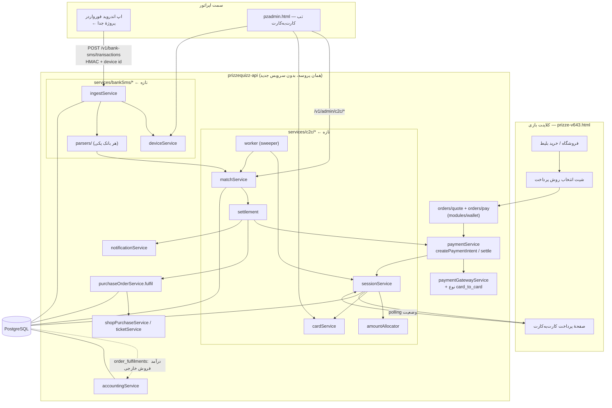
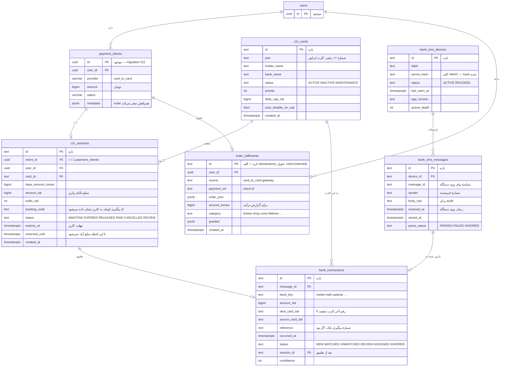
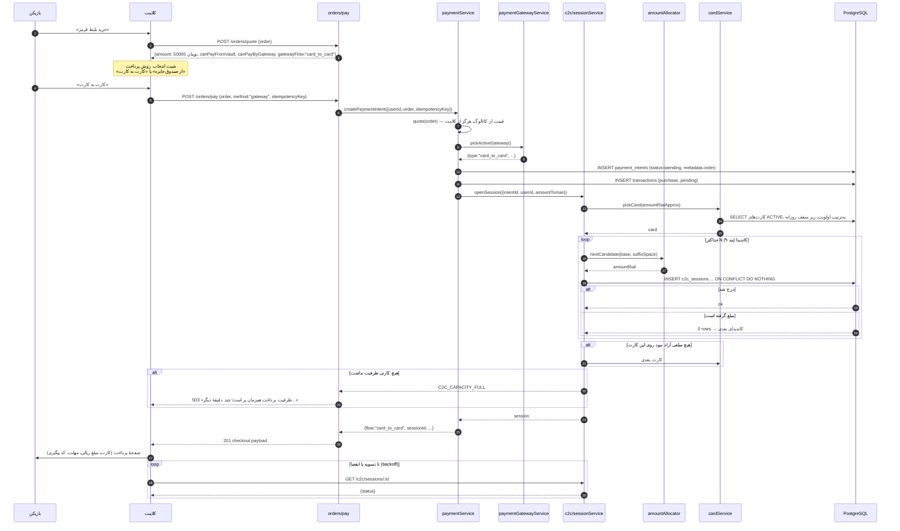
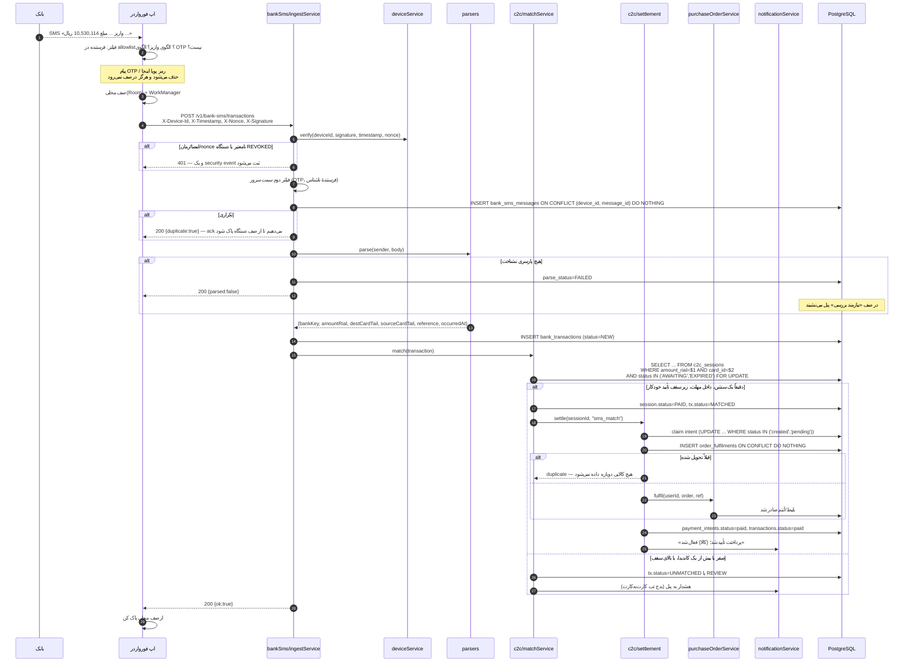
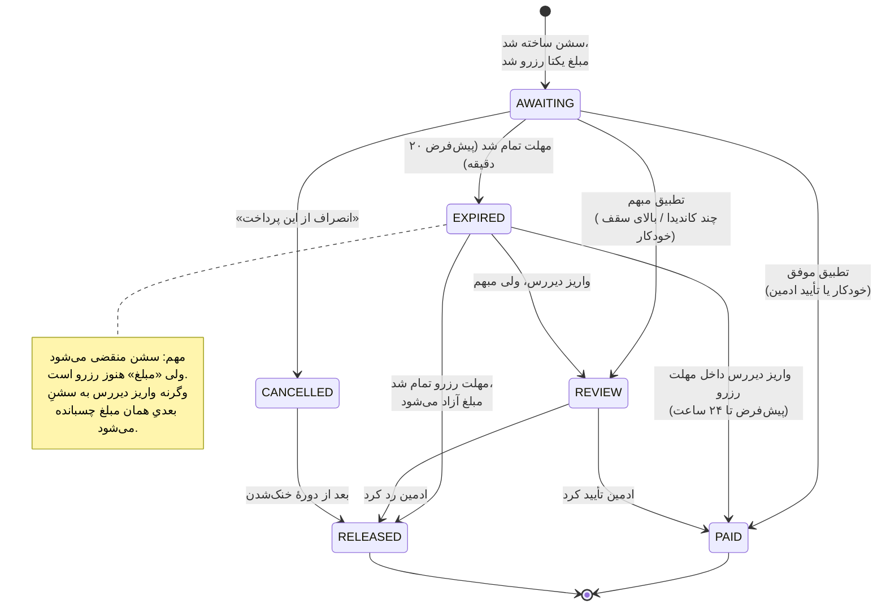
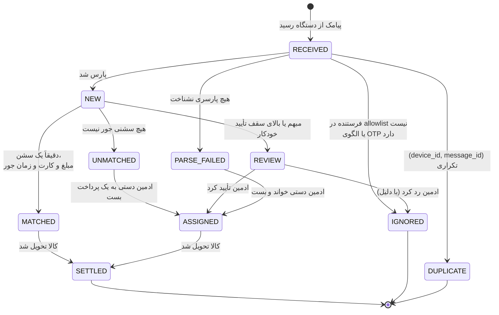
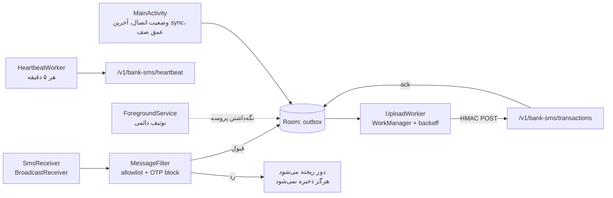
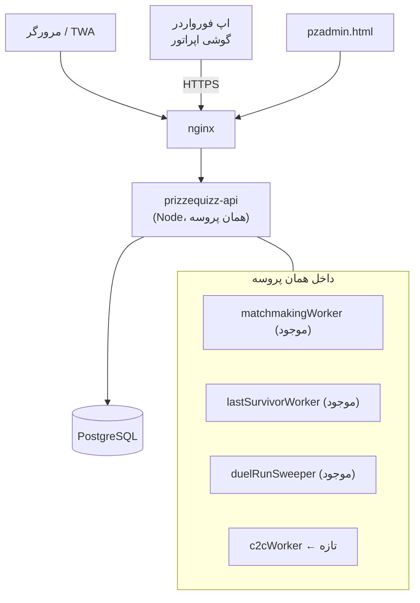

# درگاه کارت‌به‌کارت آنی — سند معماری (مرحلهٔ طراحی، قبل از کد)

وضعیت: **پیش‌نویس برای تأیید**. طبق خواستهٔ اپراتور در این مرحله هیچ کدی نوشته نشده
است. بعد از تأیید این سند، پیاده‌سازی مرحله‌به‌مرحله انجام می‌شود.

مرجع بصری: دو تصویر از سرویس CartBeCart فرستاده شد. آن‌ها **فقط برای فهرست
اطلاعاتی** که یک صفحهٔ پرداخت کارت‌به‌کارت لازم دارد به کار رفته‌اند. هیچ بخشی از
برندینگ، رنگ، چیدمان یا متن آن سرویس بازتولید نمی‌شود؛ صفحهٔ پرداخت ما با زبان
بصری خودِ `prizze-v643.html` ساخته می‌شود (RTL، فونت Vazirmatn، همان مودال‌ها و
همان لحن فارسی).

---

## ۰) اول از همه: چیزهایی که در کد دیدم و با پرامپت جور در نمی‌آید

پرامپت گفته بود «اگر جایی جور در نمی‌آید، کد را باور کن و بگو». این‌ها را قبل از
هر تصمیم معماری بخوانید، چون سه موردشان روی طراحی اثر مستقیم دارند.

### F1 — کد روی شاخهٔ `main` نیست
`origin/main` فقط یک `README.md` دارد. کل پروژه روی
`origin/claude/gracious-johnson-sog828` است. این سند روی همان خط کد نوشته و
کامیت شده است. اگر شاخهٔ مبنای دیگری مدنظرتان است، بگویید تا جابه‌جا کنم.

### F2 — «تحویل دقیقاً یک‌بار» امروز تضمین‌شده نیست 🔴
پرامپت (بند ۵-و) می‌گوید از idempotency موجود استفاده کن. اما دو نگهبانِ تحویل،
**در حافظهٔ پروسه** هستند، نه در دیتابیس:

| فایل | خط | نگهبان |
|---|---|---|
| `prizzequizz-api/src/services/purchaseOrderService.ts` | `const _fulfilled = new Set<string>()` | تحویل بلیط |
| `prizzequizz-api/src/services/shopPurchaseService.ts` | `const _seen = new Map<string, PurchaseResult>()` | خرید فروشگاه |

خودِ کد هم این را می‌داند و نوشته است:

> «A restart between two callbacks for the same intent is the one gap, and the
> gateway's own retry window is far shorter than that.»

برای درگاه فعلی این استدلال قابل قبول است (پنجرهٔ retry درگاه چند ثانیه است).
**برای کارت‌به‌کارت قابل قبول نیست**، چون:

- تأیید ممکن است دقایق یا ساعت‌ها بعد از ساخت سشن برسد؛
- تأیید از **سه مسیر مختلف** می‌تواند بیاید: موتور تطبیق، تأیید دستی ادمین، و
  sweeper ی که پرداخت‌های عقب‌مانده را دوباره تلاش می‌کند؛
- اگر روزی API روی بیش از یک instance اجرا شود، `Set` هر پروسه جداست.

**نتیجه:** جدول بادوام `order_fulfilments` (بند ۲) ساخته می‌شود و این دو نگهبانِ
حافظه‌ای **حذف** می‌شوند، نه اینکه کنارش بمانند (قاعدهٔ «کد قدیمی نماند»).

### F3 — درآمد پرداخت‌های خارجی در حسابداری اصلاً دیده نمی‌شود 🔴
`accountingService.ts` تمام خط‌های درآمد را از `wallet_ledger` می‌خواند:

```sql
sum(amount) FILTER (WHERE entry_type='ticket_purchase')  AS tickets
sum(amount) FILTER (WHERE entry_type='shop_purchase')    AS shop
sum(amount) FILTER (WHERE entry_type='lifeline_purchase') AS lifelines
```

اما مسیر پرداخت خارجی عمداً هیچ ردیفی در ledger نمی‌نویسد
(`settlePaymentIntent` → «nothing is posted to the ledger: the goods are simply
handed over»). یعنی **امروز هر فروشی که از درگاه انجام شود، در گزارش مالی پنل
صفر است.** الان که درگاه واقعی فعال نیست این نامرئی مانده؛ با کارت‌به‌کارت که
قرار است **کانال اصلی درآمد** شود، یعنی کل درآمد شرکت از گزارش مالی غایب می‌شود.

**نتیجه:** همان جدول `order_fulfilments` منبع «فروش پرداخت‌شده از بیرون» می‌شود و
خط‌های درآمدِ `accountingService` از آن هم می‌خوانند — با تفکیک بلیط / فروشگاه /
کمک‌ها، دقیقاً مثل تفکیکی که امروز روی ledger انجام می‌شود.

### F4 — `POST /v1/payments/intents` عملاً مرده است
در `src/modules/payments/routes.ts` این route فقط `amount` می‌فرستد، ولی
`createPaymentIntent` بدون `order` همیشه `DEPOSIT_REMOVED` پرتاب می‌کند. یعنی این
endpoint در هر حالت 400 برمی‌گرداند. مسیر واقعی خرید `POST /v1/orders/pay` است.
طبق قاعدهٔ «کد قدیمی نماند»، این route حذف می‌شود.

### F5 — Redis هست، ولی اختیاری
پرامپت گفت «پروژه الان Redis ندارد». دقیق‌تر: `redis` در `package.json` هست، در
`docker-compose.yml` سرویسش بالا می‌آید، و سه adapter از آن استفاده می‌کنند
(`matchmakingQueue`, `leaderboardService`, `realtime/presenceStore`) — اما **هر
سه پشت env-flag** هستند و پیش‌فرض `memory` است.

**نتیجه‌گیری پرامپت درست است ولی دلیلش فرق می‌کند:** ما به Redis نیاز نداریم چون
PostgreSQL برای قفل و یکتایی و idempotency کافی است (بند ۹)، نه چون Redis وجود
ندارد. **هیچ وابستگی عملیاتی تازه‌ای اضافه نمی‌شود.**

### F6 — دو منبع حقیقت برای «نوع درگاه»
`src/types/domain.ts` دارد:
```ts
export type PaymentProvider = 'sandbox' | 'zarinpal' | 'stripe' | 'manual';
```
و `paymentGatewayService.ts` جدا دارد:
```ts
export const GATEWAY_TYPES = ['zibal','zarinpal','nextpay','idpay','bitpay','sandbox','custom'];
```
این دو هم‌اکنون هم با هم نمی‌خوانند (`zibal` در یکی هست در دیگری نیست). موقع
افزودن `card_to_card` **هر دو** به‌روز می‌شوند و در سند API یکی‌شان مرجع اعلام
می‌شود: `GATEWAY_TYPES` مرجع است، `PaymentProvider` فقط برچسبِ ذخیره‌شده در
`payment_intents.provider` (که `VARCHAR(40)` است و جا دارد).

### F7 — بقایای «شارژ کیف پول» در کلاینت
در `prizze-v643.html`: شیت `#topupSheet` (خطوط ۷۵۱۳–۷۵۳۰)، `selectTopupAmount()`،
بدنهٔ قدیمی `submitTopup()` (خط ۱۴۸۱۹) که **در سمت کلاینت** `wallet+=amount`
می‌کند و یک تراکنش جعلی «شارژ صندوق جایزه» به UI اضافه می‌کند، و کارت «شارژ سریع»
در شبکهٔ کیف پول (خط ۱۴۷۸۱) هنوز سر جایشان هستند. `openTopup()` خنثی شده و
`submitTopup` در خط ۲۲۱۶۷ override شده، ولی خودِ کد مانده است.

این دقیقاً همان صفحه‌ای است که ورودی پرداخت جدید در آن می‌نشیند، پس در همین کار
**حذف می‌شوند**. جای «شارژ سریع» چیزی نمی‌گذاریم: پرداخت همیشه از مسیر یک
**سفارش مشخص** شروع می‌شود، نه از کیف پول.

### F8 — محدودیت‌های طولی که طراحی باید رعایت کند
`wallet_ledger.ref_type VARCHAR(32)`، `ref_id VARCHAR(120)`،
`idempotency_key VARCHAR(200)`، `payment_intents.idempotency_key VARCHAR(180) UNIQUE`.
کلیدهای idempotency پیشنهادی در بند ۹ زیر این سقف‌ها طراحی شده‌اند.

---

## ۱) قید بنیادی — دوباره، چون کل طراحی رویش سوار است

**صندوق جایزه شارژ نمی‌شود.** هیچ‌جای این طراحی `entryType: 'deposit'` وجود ندارد
و هیچ مسیری موجودی نقدی به کاربر نمی‌دهد. کارت‌به‌کارت **فقط** یک راه تازه برای
«تأیید پرداختِ یک سفارش مشخص» است:

```
سفارش (بلیط / سکه / جان / پک چت / کاراکتر / آیتم فروشگاه)
  → PaymentIntent (سفارش همراهش سفر می‌کند)
  → سشن کارت‌به‌کارت (کارت مقصد + مبلغ یکتای ریالی + مهلت)
  → کاربر واریز می‌کند
  → پیامک بانکِ اپراتور می‌رسد → پارس → تطبیق
  → تسویهٔ داخلی → purchaseOrderService.fulfil()
  → کالا تحویل می‌شود، wallet_ledger اصلاً حرکت نمی‌کند
```

پولی که به کارت اپراتور می‌رسد **پول شرکت** است، نه موجودی بازیکن. تنها جایی که
ثبت می‌شود `order_fulfilments` (درآمد فروش) است، نه دفتر کل بازیکن.

---

## ۲) دیاگرام معماری



**تصمیم‌های ساختاری که در این دیاگرام تثبیت شده‌اند:**

1. **سرویس جدید بالا نمی‌آید.** همه چیز داخل همان پروسهٔ `prizzequizz-api` است.
   worker با `setInterval` اجرا می‌شود، دقیقاً مثل `startDuelRunSweeper()` و
   `startLastSurvivorWorker()` که از قبل هستند. صف (queue) نداریم — بند ۱۲
   می‌گوید دقیقاً کجا و با چه علامتی worker جدا می‌شود.
2. **رجیستری درگاه موازی ساخته نمی‌شود.** `card_to_card` به `GATEWAY_TYPES`
   اضافه می‌شود و خودبه‌خود اولویت، فعال/غیرفعال، تست اتصال و `gatewayReports()`
   می‌گیرد.
3. **پیامک ورودی و خروجی هرگز قاطی نمی‌شوند.** جدول زیر مرز را تعریف می‌کند.

### مرز پیامک ورودی و خروجی

| | پیامک **خروجی** (از قبل) | پیامک **ورودی** (تازه) |
|---|---|---|
| کاربرد | OTP، اطلاع‌رسانی، تبلیغات | پیامک واریز بانکِ اپراتور |
| سرویس | `services/smsService.ts` | `services/bankSms/*` |
| ماژول | `modules/sms/` | `modules/bankSms/` |
| مسیر API | `/v1/admin/sms/*` | `/v1/bank-sms/*` و `/v1/admin/c2c/*` |
| جدول‌ها | `sms_config`, `sms_templates`, `sms_log`, `sms_blacklist` | `bank_sms_devices`, `bank_sms_messages`, `bank_transactions` |
| تب پنل | `sms`, `smsgroups` | `c2c`, `c2ccards`, `c2cdevices` |

> **چرا `/v1/bank-sms` و نه `/v1/sms/transactions` که پرامپت گفته بود:** فضای نام
> `/v1/.../sms` در `tabForPath()` به تب `sms` نگاشت می‌شود
> (`if (p.includes('/admin/sms')) return 'sms'`). کنار هم گذاشتن دو دامنهٔ کاملاً
> متفاوت زیر یک پیشوند، مدل دسترسی را شکننده می‌کند: کسی که دسترسی «پنل پیامکی»
> دارد نباید به‌خاطر شباهت مسیر به تراکنش‌های بانکی برسد. اسم `bank-sms` این را
> در سطح مسیر حل می‌کند، نه با یک قرارداد شفاهی.

---

## ۳) واحد پول — دقیق، چون یک «× ۱۰» جاافتاده یعنی ده برابر پول

قاعده‌ها:

| چیز | واحد | کجا |
|---|---|---|
| قیمت کاتالوگ و quote | **تومان** | `economyConfig.getTicketPrices()`, `shopService.price` |
| `payment_intents.amount` | **تومان** | همان ستون موجود، بدون تغییر معنا |
| `wallet_ledger.amount` | **تومان** | دست‌نخورده |
| مبلغ نمایش‌داده‌شده به کاربر («مبلغ نهایی») | **تومان** | صفحهٔ پرداخت |
| **مبلغ واریز** (`c2c_sessions.amount_rial`) | **ریال** | صفحهٔ پرداخت، بزرگ، با دکمهٔ کپی |
| خروجی پارسر پیامک | **ریال** | `bankSms/parsers/*` |
| **تطبیق** | **ریال** | `matchService` |
| `order_fulfilments.amount_toman` | **تومان** | برای حسابداری |

**تنها جایی که ضرب و تقسیم در ۱۰ وجود دارد:** `src/services/money.ts`

```ts
export const RIAL_PER_TOMAN = 10;
export function tomanToRial(t: number): number;   // ورودی صحیح مثبت، وگرنه throw
export function rialToToman(r: number): number;   // فقط اگر بر ۱۰ بخش‌پذیر باشد، وگرنه throw
export function formatRialFa(r: number): string;  // «۱۰٬۵۳۰٬۱۱۴ ریال»
export function formatTomanFa(t: number): string; // «۱٬۰۵۳٬۰۰۰ تومان»
```

هیچ فایل دیگری اجازهٔ نوشتن `* 10` یا `/ 10` روی مبلغ ندارد. تست
`money.test.ts` این را با یک grep روی سورس هم چک می‌کند (بند ۱۳).

**چرا یکتاسازی در ریال:** دقیقاً به دلیلی که در تصویر مرجع هم پیداست — رقم تومانی
گرد و قابل‌فهم می‌ماند (۱٬۰۵۳٬۰۰۰ تومان) و پسوند یکتا در ریال پنهان می‌شود
(۱۰٬۵۳۰٬۱۱۴). اختلاف حداکثر ۹۹ ریال ≈ ۹٫۹ تومان است که برای کاربر بی‌معنی است.

⚠️ **یک فرض که باید تأیید شود (A1 در بند ۱۴):** این فقط وقتی کار می‌کند که اپِ
بانکیِ *پرداخت‌کننده* اجازهٔ وارد کردن مبلغ ریالیِ غیرمضرب ۱۰ را بدهد. بعضی
اپ‌ها ورودی را به تومان می‌گیرند و آخرین رقم ریال را صفر می‌کنند. برای همین
حالت، `suffixMode` قابل تنظیم است:

- `rial` (پیش‌فرض): پسوند ۱..۹۹ ریال — ظرفیت ۹۹، اختلاف ≤ ۹٫۹ تومان
- `toman`: پسوند مضرب ۱۰ ریال (۱۰..۹۹۰) — ظرفیت ۹۹، اختلاف ≤ ۹۹ تومان

هر دو حالت ظرفیت یکسان دارند؛ فقط بزرگی اختلاف فرق می‌کند. اگر گزارش شد که
کاربران نمی‌توانند مبلغ را دقیق وارد کنند، یک سوییچ در پنل کافی است و هیچ کدی
عوض نمی‌شود.

---

## ۴) ERD — چه چیزی تازه است و چه چیزی از قبل هست



### جدول‌های **موجود** که استفاده می‌شوند (هیچ‌کدام بازسازی نمی‌شوند)

| جدول | نقش در این کار |
|---|---|
| `payment_intents` (mig 011) | همان aggregate پرداخت. سفارش در `metadata.order` سفر می‌کند. |
| `payment_gateways` / `payment_settings` | رجیستری درگاه، اولویت، فعال/غیرفعال — `card_to_card` یکی از آن‌ها |
| `transactions` | ردیف سازگاری `purchase/pending` که `createPaymentIntent` می‌سازد و تسویه به `paid` برمی‌گرداند |
| `users` | مالک سفارش |
| `wallet_ledger` / `wallet_accounts` | **دست نمی‌خورد.** کارت‌به‌کارت هیچ ردیفی اینجا نمی‌نویسد. |
| `notifications` | «پرداخت تأیید شد» |
| `admin_audit` (`adminAuditService.recordAdmin`) | هر تأیید/رد دستی ادمین |
| `company_expenses` | کارمزد بانکی، اگر بعداً ثبت شد (دستهٔ `gateway` از قبل هست) |

### جدول‌های **تازه** (۶ عدد) — migration `026_card_to_card.sql`

`c2c_cards`، `c2c_sessions`، `bank_sms_devices`، `bank_sms_messages`،
`bank_transactions`، `order_fulfilments`.

طبق الگوی موجود پروژه (`walletLedgerService.ensureSchema`)، هر سرویس علاوه بر
فایل migration یک `ensureSchema()` هم دارد تا «build + restart» بدون اجرای دستی
migration هم کار کند.

### ایندکس‌ها و قیدهایی که *معنا* دارند

```sql
-- قلب یکتایی مبلغ: دو سشنِ زنده روی یک کارت هرگز یک مبلغ ندارند.
CREATE UNIQUE INDEX c2c_amount_unique
  ON c2c_sessions(card_id, amount_rial)
  WHERE status IN ('AWAITING','EXPIRED');

-- پیامک تکراری از یک دستگاه هرگز دوبار ذخیره نمی‌شود.
CREATE UNIQUE INDEX bank_sms_dedupe
  ON bank_sms_messages(device_id, message_id);

-- شمارهٔ پیگیری بانک، وقتی بانک آن را می‌دهد، دومین سد ضد تکرار است.
CREATE UNIQUE INDEX bank_tx_reference_unique
  ON bank_transactions(bank_key, reference)
  WHERE reference IS NOT NULL AND reference <> '';

-- تحویل دقیقاً یک‌بار (جایگزین Set و Map حافظه‌ای).
-- id خودش کلید idempotency است: PRIMARY KEY + INSERT ... ON CONFLICT DO NOTHING

CREATE INDEX c2c_sessions_status_time ON c2c_sessions(status, expires_at);
CREATE INDEX bank_tx_status_time      ON bank_transactions(status, occurred_at DESC);
CREATE INDEX bank_tx_amount_lookup    ON bank_transactions(amount_rial, occurred_at DESC);
CREATE INDEX order_fulfilments_time   ON order_fulfilments(created_at DESC);
CREATE INDEX order_fulfilments_cat    ON order_fulfilments(category, created_at DESC);
```

`c2c_amount_unique` تنها چیزی است که یکتایی مبلغ را **تضمین** می‌کند. الگوریتم
بند ۹ فقط کاندیدا پیشنهاد می‌دهد؛ داور نهایی این ایندکس است. این تفاوت مهم است:
با هر تعداد instance و هر تعداد درخواست همزمان، دیتابیس اجازه نمی‌دهد دو سشن
زنده مبلغ یکسان بگیرند.

---

## ۵) Sequence Diagram — مسیر پرداخت (از کلیک تا صفحهٔ واریز)



نکات تصمیمی:

- **کلاینت هرگز مبلغ نمی‌فرستد.** `orders/quote` و `orders/pay` هر دو قیمت را از
  کاتالوگ می‌خوانند؛ این رفتار از قبل درست است و حفظ می‌شود.
- **یک درِ ورودی، نه دو تا.** روش پرداخت همان `method: "gateway"` می‌ماند و
  *سرور* بر اساس درگاه فعال تصمیم می‌گیرد که flow کدام است. پاسخ یک
  discriminated union است (`flow: "redirect" | "card_to_card"`). این یعنی وقتی
  فردا درگاه بانکی واقعی فعال شد، هیچ چیزی در کلاینت عوض نمی‌شود — فقط اولویت
  درگاه در پنل عوض می‌شود. اگر به‌جایش `method:"card_to_card"` می‌گذاشتیم،
  انتخاب درگاه از پنل به کلاینت منتقل می‌شد که خلاف کل ایدهٔ رجیستری درگاه است.
- **سشن قبل از نمایش صفحه ساخته می‌شود، نه بعد.** اگر مبلغ یکتا گرفته نشود،
  کاربر هرگز صفحه‌ای نمی‌بیند که مبلغش قابل شناسایی نیست.
- **پولینگ با backoff**: ۲ ثانیه برای ۳۰ ثانیهٔ اول، بعد ۵ ثانیه، بعد ۱۵ ثانیه.
  اگر صفحه بسته شد، اطلاع‌رسانی از مسیر `notificationService` (وب‌پوش) می‌آید —
  همان مسیری که «پرداخت موفق بود» فعلی از آن استفاده می‌کند. WebSocket فعلاً
  کانال کاربرمحور ندارد (`ServerRealtimeType` فقط رویدادهای مسابقه دارد)؛ اضافه
  کردنش یک کار جدا است و اینجا لازم نیست.

---

## ۶) Sequence Diagram — مسیر پیامک (از گوشی اپراتور تا تحویل کالا)



**چرا `FOR UPDATE`:** دو پیامک هم‌زمان (مثلاً retry دستگاه + پیامک دوم بانک) و دو
instance API می‌توانند هم‌زمان یک سشن را ببینند. قفل ردیف سشن، تطبیق را سریالی
می‌کند. این همان الگویی است که `walletLedgerService.postEntryPg` از قبل دارد؛
چیز تازه‌ای اختراع نمی‌کنیم.

**چرا `INSERT order_fulfilments` قبل از `fulfil`:** درج، هم کلید idempotency است
هم رکورد درآمد. اگر پروسه بین درج و تحویل کرش کند، sweeper ردیفی را می‌بیند که
`granted` ندارد و تحویل را کامل می‌کند (بند ۱۰، ردیف «کرش وسط تحویل»). برعکسش —
اول تحویل بعد درج — یعنی کرش وسط کار، کالای تحویل‌شدهٔ بدون رکورد، و تحویل دوباره
در تلاش بعدی.

---

## ۷) State Machine — سشن پرداخت



**تفکیک «انقضای سشن» از «آزادسازی مبلغ» مهم‌ترین جزئیات این ماشین است.** اگر
مبلغ همان لحظهٔ انقضا آزاد شود و به کاربر بعدی داده شود، واریز دیررسِ کاربر اول
به سفارش کاربر دوم تطبیق می‌خورد. با فاصلهٔ رزرو (`reserved_until`)، این حالت
از نظر ساختاری غیرممکن است، نه اینکه «بعید» باشد.

نگاشت به `payment_intents.status` (که از قبل وجود دارد):

| c2c_sessions.status | payment_intents.status |
|---|---|
| AWAITING | `pending` |
| PAID | `paid` |
| EXPIRED / RELEASED | `expired` |
| CANCELLED | `failed` |
| REVIEW | `pending` (تا تعیین تکلیف) |

## ۷-۲) State Machine — تراکنش بانکی



`PARSE_FAILED` عمداً حالت پایانی نیست: پیامکی که پارسر نشناخته، پول واقعی است که
رسیده. باید در صف پنل بنشیند تا آدم ببیندش، و همان‌جا نمونه‌اش برای نوشتن پارسر
تازه به کار برود.

---

## ۸) API Contract

قرارداد پاسخ‌ها همان `http/response.ts` موجود است (`{data}` / `{error:{code,message}}`).
همهٔ پیام‌های خطا فارسی‌اند.

### ۸-۱ بازیکن (نیازمند `Authorization: Bearer`)

#### `POST /v1/orders/quote` — *موجود، یک فیلد اضافه می‌شود*
```jsonc
// پاسخ (فیلد جدید: gatewayFlow)
{
  "order": {"kind":"ticket","tier":"red","qty":1},
  "amount": 50000, "currency": "cash", "label": "بلیط قرمز",
  "vaultBalance": 12000,
  "canPayFromVault": false,
  "canPayByGateway": true,
  "gatewayFlow": "card_to_card"   // یا "redirect" یا null اگر درگاهی فعال نیست
}
```
`gatewayFlow` فقط برای این است که دکمهٔ شیت درست برچسب بخورد («کارت به کارت» به
جای «درگاه پرداخت»). هیچ تصمیم مالی‌ای به آن وابسته نیست.

#### `POST /v1/orders/pay` — *موجود، پاسخِ `method:"gateway"` توسعه پیدا می‌کند*
```jsonc
// درخواست — بدون تغییر
{"order": {...}, "method": "gateway", "idempotencyKey": "ord_...", "callbackUrl": null}

// پاسخ وقتی درگاه فعال از نوع card_to_card است
{
  "method": "gateway",
  "flow": "card_to_card",
  "intentId": "…", "sessionId": "…",
  "status": "AWAITING",
  "trackingCode": "PQ-7K3M",
  "order":   {"label":"بلیط قرمز", "qty":1},
  "amounts": {
    "baseToman": 50000,
    "discountToman": 0,
    "finalToman": 50000,
    "payableRial": 500047        // ← این عدد را کاربر واریز می‌کند
  },
  "card": {
    "pan": "6274121777044256",
    "panFormatted": "۶۲۷۴ ۱۲۱۷ ۷۷۰۴ ۴۲۵۶",
    "holderName": "…", "bankName": "بانک …"
  },
  "expiresAt": "2026-09-10T21:24:00Z",
  "serverTime": "2026-09-10T21:04:00Z",   // برای شمارش معکوس بدون اتکا به ساعت گوشی
  "notice": "مبلغ را دقیقاً و بدون تغییر واریز کنید؛ حتی یک ریال اختلاف باعث می‌شود پرداخت شناسایی نشود."
}

// پاسخ وقتی درگاه فعال از نوع redirect است (رفتار امروز، بدون تغییر)
{"method":"gateway","flow":"redirect","intentId":"…","amount":50000,"status":"pending","paymentUrl":"…"}
```

> `serverTime` عمدی است: شمارش معکوس مهلت نباید به ساعت گوشی کاربر تکیه کند.
> کلاینت اختلاف را یک‌بار حساب می‌کند و بقیهٔ شمارش را از روی `performance.now()`
> جلو می‌برد.

#### `GET /v1/c2c/sessions/:id` — *تازه*
مالکیت چک می‌شود؛ سشن کاربر دیگر ۴۰۴ می‌دهد (نه ۴۰۳، تا وجود سشن لو نرود).
```jsonc
{"status":"AWAITING","expiresAt":"…","serverTime":"…","secondsLeft":842,
 "settled":false,"granted":null}
// بعد از تسویه:
{"status":"PAID","settled":true,
 "granted":[{"key":"ticket-red","value":1,"label":"بلیط قرمز"}]}
```
Rate limit: ۱ درخواست در ثانیه به‌ازای هر کاربر (سازگار با backoff کلاینت).

#### `POST /v1/c2c/sessions/:id/cancel` — *تازه*
«انصراف از این پرداخت». سشن `CANCELLED` می‌شود، intent `failed`. مبلغ فوراً آزاد
**نمی‌شود** (دورهٔ خنک‌شدن؛ بند ۹).

### ۸-۲ دستگاه فورواردر (بدون توکن کاربر — احراز هویت دستگاه)

#### `POST /v1/bank-sms/pair` — *تازه*
```jsonc
// درخواست: {"pairingCode":"482913","label":"گوشی اپراتور — سیم‌کارت ملت","appVersion":"1.0.0"}
// پاسخ  : {"deviceId":"…","secret":"…"}   ← secret فقط همین یک‌بار برگردانده می‌شود
```
کد جفت‌سازی در پنل تولید می‌شود، ۶ رقمی، یک‌بارمصرف، عمر ۱۰ دقیقه، حداکثر ۵ تلاش.

#### `POST /v1/bank-sms/transactions` — *تازه*
هدرها: `X-Device-Id`, `X-Timestamp` (unix ms), `X-Nonce`, `X-Signature`
که `X-Signature = HMAC-SHA256(secret, deviceId + "\n" + timestamp + "\n" + nonce + "\n" + sha256(body))`
```jsonc
// درخواست — دسته‌ای، چون دستگاه صف آفلاین دارد
{"messages":[
  {"messageId":"…","sender":"+9810001100","body":"…","receivedAt":"2026-09-10T21:12:03Z","simSlot":0}
]}
// پاسخ
{"results":[{"messageId":"…","stored":true,"duplicate":false,"parsed":true,"matched":true}]}
```
حداکثر ۵۰ پیام در هر درخواست. پاسخ همیشه per-message است تا دستگاه بداند کدام را
از صف پاک کند.

#### `POST /v1/bank-sms/heartbeat` — *تازه*
```jsonc
// {"queueDepth":0,"appVersion":"1.0.0","batteryOptimized":false,"lastSmsAt":"…"}
```
پنل از این برای «آخرین sync موفق» و هشدار آفلاین‌بودن استفاده می‌کند.

### ۸-۳ ادمین (تب‌های `c2c`, `c2ccards`, `c2cdevices`)

| متد و مسیر | کار |
|---|---|
| `GET /v1/admin/c2c/transactions` | صف تراکنش‌ها با فیلتر status/بازهٔ زمانی/مبلغ |
| `GET /v1/admin/c2c/sessions` | پرداخت‌های در انتظار و تاریخچه |
| `POST /v1/admin/c2c/transactions/:id/assign` | تخصیص دستی تراکنش به یک سشن → تسویه |
| `POST /v1/admin/c2c/transactions/:id/ignore` | رد با دلیل اجباری |
| `POST /v1/admin/c2c/transactions/manual` | ثبت دستی پیامک (وقتی فورواردر آفلاین است) |
| `GET/POST/DELETE /v1/admin/c2c/cards` | کارت‌های مقصد، وضعیت، اولویت، سقف روزانه |
| `GET /v1/admin/c2c/devices` | دستگاه‌ها، آخرین sync، عمق صف، نسخه |
| `POST /v1/admin/c2c/devices/pairing-code` | تولید کد جفت‌سازی |
| `POST /v1/admin/c2c/devices/:id/revoke` | ابطال فوری دستگاه |
| `GET /v1/admin/c2c/reports/daily` | گزارش روزانه: تعداد/مبلغ، نرخ تطبیق خودکار، میانگین تأخیر |
| `GET /v1/admin/c2c/settings` / `PUT` | مهلت، مهلت رزرو، سقف تأیید خودکار، `suffixMode` |

`assign` و `ignore` هر دو از طریق `adminAuditService.recordAdmin` ثبت می‌شوند
(چه کسی، چه زمانی، چه مبلغی، چه دلیلی) — جدول audit تازه‌ای ساخته نمی‌شود.

### ۸-۴ حذف‌شده‌ها (قاعدهٔ «کد قدیمی نماند»)

| چه چیزی | چرا |
|---|---|
| `POST /v1/payments/intents` | همیشه ۴۰۰ می‌دهد (F4) |
| `POST /v1/payments/intents/:id/verify` | فقط تکرارِ `GET` همان مسیر است |
| شیت `#topupSheet` و `selectTopupAmount` و بدنهٔ `submitTopup` در کلاینت | بقایای شارژ کیف پول (F7) |
| کارت «شارژ سریع» در صفحهٔ کیف پول | همان |
| `_fulfilled: Set` و `_seen: Map` | جایشان را `order_fulfilments` می‌گیرد (F2) |

`POST /v1/payments/callback` و `GET /v1/payments/sandbox/:id/pay` **می‌مانند** —
مسیر درگاه‌های redirect است و کارت‌به‌کارت جایگزینش نیست، مکملش است.

---

## ۹) الگوریتم مبلغ یکتا (با تحلیل برخورد و ظرفیت)

### تعریف

```
payableRial = tomanToRial(finalToman) + suffix
suffix ∈ S,  S = {1..99}            وقتی suffixMode = 'rial'   (پیش‌فرض)
             {10,20,…,990}          وقتی suffixMode = 'toman'
```

`suffix = 0` هرگز استفاده نمی‌شود. دلیل: مبلغ «گرد» همان چیزی است که یک واریز
نامرتبط یا دستی به احتمال زیاد دارد. با کنار گذاشتنش، هیچ واریز گردی هرگز
خودبه‌خود به یک سفارش تطبیق نمی‌خورد.

### تخصیص

```
allocate(intent, baseRial):
  cards ← کارت‌های ACTIVE، مرتب بر اولویت، که سقف روزانه‌شان پر نشده
  for card in cards:
      candidates ← جایگشت تصادفی S            ← تصادفی، نه ترتیبی
      for s in first K candidates (K = 25):
          try INSERT c2c_sessions(card_id=card, amount_rial=baseRial+s, status='AWAITING')
              ON CONFLICT DO NOTHING
          if inserted: return session
  raise C2C_CAPACITY_FULL
```

سه تصمیم و دلیلشان:

1. **ترتیب تصادفی، نه `s=1,2,3…`** — ترتیبی بودن دو ضرر دارد: کاربر بعدی همیشه
   با کاربر قبلی سر یک مبلغ رقابت می‌کند (کشمکش درج)، و از روی پسوند می‌شود
   حدس زد چند پرداخت فعال است. تصادفی هر دو را حل می‌کند.
2. **`ON CONFLICT DO NOTHING` به‌جای «اول بخوان بعد بنویس»** — خواندن و بعد نوشتن
   یک race شرطی کلاسیک است. اینجا دیتابیس داور است، پس دو درخواست همزمان با
   مبلغ یکسان، یکی موفق و یکی صفر ردیف می‌گیرد و کاندیدای بعدی را می‌رود.
3. **`K = 25` نه همهٔ ۹۹ تا** — اگر ۲۵ کاندیدای تصادفی همه گرفته باشند، یعنی
   اشغال آن کارت به‌احتمال زیاد بالای ۸۰٪ است و بهتر است به کارت بعدی برویم تا
   اینکه ۹۹ بار به دیتابیس بزنیم. (احتمال شکستِ ۲۵ کاندیدا وقتی اشغال ۵۰٪ است:
   ۰٫۵²⁵ ≈ ۳×۱۰⁻⁸؛ وقتی ۷۰٪ است: ≈ ۱٫۳×۱۰⁻⁴.)

   در پیاده‌سازی، `ON CONFLICT` با inference clause صریح نوشته می‌شود
   (`ON CONFLICT (card_id, amount_rial) WHERE status IN ('AWAITING','EXPIRED')`)
   نه به شکل خالی، تا برخورد روی «مبلغ» از هر برخورد دیگری قابل تفکیک بماند.

### تحلیل ظرفیت

فضای مبلغ به‌ازای **هر (کارت، قیمت پایه)** است، نه کل سیستم:

| متغیر | مقدار |
|---|---|
| اندازهٔ فضای پسوند | ۹۹ |
| مهلت پرداخت (`ttl`) | ۲۰ دقیقه |
| مهلت رزرو (`reserved_until`) | مهلت + ۲۴ ساعت |

⚠️ اینجا یک نکتهٔ ظریف هست که راحت از قلم می‌افتد: **آنچه ظرفیت را مصرف می‌کند
مهلت رزرو است، نه مهلت پرداخت.** یک سشن منقضی تا ۲۴ ساعت مبلغش را نگه می‌دارد.
پس ظرفیت واقعی:

```
حداکثر سشن ساخته‌شده در ۲۴ ساعت، به ازای هر (کارت، قیمت) = ۹۹
با ۳ کارت فعال و قیمت‌های ۱۲٬۵۰۰ / ۲۵٬۰۰۰ / ۵۰٬۰۰۰ تومان:
  ۹۹ × ۳ کارت × ۳ قیمت = ۸۹۱ پرداخت در ۲۴ ساعت
```

برای شروع کافی است، ولی **سقف است و باید دیده شود**. سه اهرم برای بزرگ کردنش،
به‌ترتیب ارجحیت:

| اهرم | اثر | هزینه |
|---|---|---|
| کاهش مهلت رزرو از ۲۴ به ۶ ساعت | ۴ برابر ظرفیت | واریز دیررسِ بعد از ۶ ساعت دستی می‌شود |
| افزودن کارت مقصد | خطی | یک حساب بانکی بیشتر |
| `suffixMode='rial'` با فضای ۱..۹۹۹ (سه رقم) | ۱۰ برابر | اختلاف تا ۹۹٫۹ تومان |

**هشدار عملیاتی:** وقتی اشغالِ یک (کارت، قیمت) از ۶۰٪ رد شد، پنل هشدار می‌دهد.
این عدد در گزارش روزانه هست تا سقف قبل از رسیدن دیده شود، نه بعدش.

### وقتی همهٔ پسوندها اشغال باشند

پرامپت درست می‌گوید که این حالت باید رفتار مشخص داشته باشد. رفتار:

1. کارت بعدی با ظرفیت آزاد امتحان می‌شود؛
2. اگر هیچ کارتی ظرفیت نداشت → **هیچ سشنی ساخته نمی‌شود** و کاربر ۵۰۳ می‌گیرد با
   پیام: «الان ظرفیت پرداخت همزمان تکمیل است. چند دقیقهٔ دیگر دوباره تلاش کن.»
   — نه مبلغ تکراری، نه خطای گنگ.
3. هم‌زمان یک هشدار برای ادمین ثبت می‌شود (بدج تب + ردیف در گزارش)، چون این
   وضعیت یعنی یا کارت کم است یا یک حملهٔ اشغال فضا در جریان است.

### دفاع در برابر «حملهٔ اشغال فضای مبلغ»

یک کاربر می‌تواند صد بار «خرید» بزند و صد مبلغ را قفل کند بدون اینکه یک ریال
بدهد. این یک DoS واقعی روی درآمد است. سه سد:

- حداکثر **۲ سشن `AWAITING`** به‌ازای هر کاربر؛ سشن سوم، قدیمی‌ترین را
  `CANCELLED` می‌کند (تجربهٔ کاربر هم بهتر است: کسی که دوباره از فروشگاه شروع
  کرده، سشن قبلی‌اش را نمی‌خواهد).
- حداکثر **۱۰ سشن ساخته‌شده در ساعت** به‌ازای هر کاربر
  (`userRateLimit` موجود در `modules/wallet/routes.ts` همین کار را می‌کند).
- سشن `CANCELLED` مبلغش را بعد از **دورهٔ خنک‌شدن ۱۵ دقیقه** آزاد می‌کند، نه
  فوراً — هم برای واریزِ «انصراف دادم ولی زده بودم»، هم برای اینکه لغو پشت‌سرهم
  به ابزار چرخاندن فضای مبلغ تبدیل نشود.

---

## ۱۰) Security Model

### تهدید اصلی، بی‌تعارف

**در کارت‌به‌کارت، تنها شاهدِ پرداخت یک پیامک است.** هرکسی که بتواند یک پیامک
واریزِ باورپذیر را به سرور برساند، می‌تواند کالای مجانی بگیرد. یعنی سقف امنیتی
این سیستم برابر است با امنیت **گوشی اپراتور و کلید آن دستگاه**. این یک ضعف ذاتی
روش است، نه ضعف پیاده‌سازی؛ نمی‌شود حذفش کرد، فقط می‌شود محدودش کرد. طراحی زیر
دقیقاً برای محدود کردن آن است.

### لایه‌ها

| لایه | کنترل |
|---|---|
| احراز هویت دستگاه | HMAC-SHA256 با کلید مخصوص هر دستگاه؛ `secret` فقط hash‌شده در دیتابیس؛ فقط یک‌بار در پاسخ pair نشان داده می‌شود |
| ضد بازپخش (replay) | `X-Timestamp` با پنجرهٔ ±۵ دقیقه + `X-Nonce` یکتا (جدول nonce با TTL) |
| ابطال | `status='REVOKED'` — از لحظهٔ ثبت، همهٔ درخواست‌های آن دستگاه ۴۰۱ می‌گیرند |
| مبدأ پیام | allowlist شماره‌های فرستنده (سرشمارهٔ بانک‌ها)، قابل ویرایش در پنل؛ پیام از شمارهٔ ناشناس ذخیره ولی هرگز خودکار تطبیق نمی‌شود |
| سقف تأیید خودکار | مبلغ بالاتر از سقف (پیش‌فرض قابل تنظیم) همیشه به `REVIEW` می‌رود، حتی با تطبیق کامل |
| سقف روزانهٔ کارت | جمع واریزهای تأییدشدهٔ هر کارت در روز؛ رسیدن به سقف کارت را از انتخاب خارج می‌کند |
| ناهنجاری | جهش ناگهانی تعداد/مبلغ تراکنش‌های یک دستگاه → هشدار پنل |
| مغایرت‌گیری | گزارش روزانه برای تطبیق دستی با صورت‌حساب واقعی بانک — تنها راهِ کشفِ پیامک جعلی |
| مجوز | endpointهای ادمین از `requireAdmin(ctx,{tab:'c2c'})` رد می‌شوند؛ endpoint بازیکن مالکیت سشن را چک می‌کند |
| ورودی | همهٔ مبالغ عدد صحیح مثبت؛ پارسر خروجی رشته‌ای به SQL نمی‌دهد؛ همه‌جا query پارامتری (الگوی موجود پروژه) |

### چیزهایی که هرگز از دستگاه خوانده یا فرستاده نمی‌شوند

OTP، رمز پویا، رمز دوم، PIN، CVV2، و هر پیام حاوی «کد»/«رمز». این **در کد اپ
فیلتر می‌شود، نه فقط در مستندات** — و سرور هم دوباره فیلتر می‌کند (دفاع در عمق).
منطق فیلتر:

```
forward(msg):
  if sender ∉ allowlist:            drop
  if OTP_PATTERNS matches body:     drop  ← رد، حتی اگر الگوی واریز هم داشته باشد
  if not DEPOSIT_PATTERNS matches:  drop
  else enqueue(msg)
```

«رد» بر «قبول» اولویت دارد: پیامی که هم شبیه واریز است هم شبیه OTP، دور ریخته
می‌شود. این تصمیم عمدی است — هزینه‌اش یک پرداخت است که دستی می‌شود، در مقابلِ
احتمال بیرون رفتن رمز پویا از گوشی اپراتور.

### داده‌های حساس

- شمارهٔ کارت **مقصد** مال خود اپراتور است و باید کامل نمایش داده شود (کاربر باید
  بتواند کپی کند). در فهرست‌های پنل ماسک می‌شود؛ کامل فقط در صفحهٔ پرداخت و در
  فرم ویرایش کارت.
- **هیچ اطلاعاتی از کارت پرداخت‌کننده ذخیره نمی‌شود** جز ۴ رقم آخر که خود بانک در
  پیامک می‌فرستد، و آن هم فقط برای پشتیبانی و مغایرت‌گیری.
- `bank_sms_messages.body_raw` برای audit نگه داشته می‌شود؛ سیاست نگهداری:
  پیش‌فرض ۹۰ روز، بعد پاک‌سازی خودکار (چون بعد از مغایرت‌گیری ماهانه ارزشی ندارد و
  متن خام پیامک بانکی دادهٔ حساس است).

### CORS و توکن
`app.ts` امروز `access-control-allow-origin: *` می‌گذارد. چون احراز هویت با
`Authorization` است و نه کوکی، CSRF موضوعیت ندارد. ولی endpoint دستگاه با
هدرهای سفارشی کار می‌کند و لازم نیست از مرورگر قابل فراخوانی باشد؛ در فهرست
`access-control-allow-headers` اضافه **نمی‌شود** تا از مرورگر عملاً غیرقابل
فراخوانی بماند.

---

## ۱۱) Failure / Recovery Matrix

| # | اتفاق | چه می‌شود | راه بازگشت | حالت پایانی |
|---|---|---|---|---|
| ۱ | **پیامک دیر می‌رسد** (بعد از مهلت، قبل از پایان رزرو) | سشن `EXPIRED` است ولی مبلغ هنوز رزرو | تطبیق انجام می‌شود، کالا تحویل و به کاربر اطلاع داده می‌شود | `PAID` |
| ۲ | **پیامک خیلی دیر** (بعد از `reserved_until`) | سشن `RELEASED`؛ تطبیق خودکار انجام **نمی‌شود** | تراکنش `UNMATCHED` می‌شود و در صف پنل می‌نشیند؛ ادمین دستی تخصیص می‌دهد | `ASSIGNED → SETTLED` |
| ۳ | **پیامک تکراری** | `(device_id, message_id)` یکتاست → درج نمی‌شود | ۲۰۰ با `duplicate:true` تا دستگاه از صف پاکش کند | `DUPLICATE` |
| ۴ | **فورواردر آفلاین** | پیام‌ها در صف Room می‌مانند؛ heartbeat قطع می‌شود | پنل بعد از ۱۵ دقیقه بی‌خبری هشدار می‌دهد؛ اپراتور می‌تواند از «ثبت دستی پیامک» استفاده کند | تطبیق با تأخیر |
| ۵ | **سرور ری‌استارت وسط تحویل** | ردیف `order_fulfilments` هست ولی `granted` خالی | sweeper ردیف‌های ناتمام را برمی‌دارد و `fulfil` را دوباره صدا می‌زند (idempotent) | `SETTLED` |
| ۶ | **سرور ری‌استارت قبل از درج** | چیزی تحویل نشده، سشن هنوز `AWAITING`/`PAID` | تراکنش `MATCHED` است ولی سشن تسویه نشده → sweeper دوباره تسویه می‌کند | `SETTLED` |
| ۷ | **مبلغ اشتباه** (کم یا زیاد) | هیچ سشنی جور نیست | `UNMATCHED`؛ ادمین یا تخصیص می‌دهد یا با کاربر تماس می‌گیرد. پیشنهاد پنل: نزدیک‌ترین سشن بر اساس مبلغ و زمان نشان داده شود، ولی **هرگز خودکار تأیید نشود** | دستی |
| ۸ | **دو سشن با مبلغ یکسان** | از نظر ساختاری غیرممکن است (ایندکس یکتای جزئی). اگر رخ داد یعنی باگ | تطبیق چند کاندیدا پیدا می‌کند → `REVIEW` + لاگ `error` | دستی + باگ‌ریپورت |
| ۹ | **reference تکراری از بانک** | ایندکس یکتای `(bank_key, reference)` جلویش را می‌گیرد | مثل ردیف ۳ | `DUPLICATE` |
| ۱۰ | **پارسر ناتوان** | `parse_status=FAILED`، متن خام ذخیره | صف «نیازمند بررسی» در پنل؛ اپراتور دستی می‌خواند و تخصیص می‌دهد؛ همان نمونه ورودی نوشتن پارسر تازه می‌شود | `ASSIGNED` |
| ۱۱ | **کارت به سقف روزانه رسیده** | از انتخاب خارج می‌شود؛ سشن‌های قبلی‌اش دست‌نخورده معتبر می‌مانند | کارت بعدی انتخاب می‌شود؛ اگر کارتی نماند → ۵۰۳ با پیام روشن | — |
| ۱۲ | **تأیید اشتباه ادمین** | کالا تحویل شده | برگشت خودکار وجود ندارد (کالا مصرف‌شدنی است). عمل در audit ثبت است؛ اصلاح از مسیر `adminAdjust` موجود و با ثبت دلیل | دستی |
| ۱۳ | **پرداختی که قبلاً تحویل شده** | `order_fulfilments` کلید تکراری می‌بیند | `ON CONFLICT DO NOTHING` → هیچ کالای دومی صادر نمی‌شود؛ پاسخ `duplicate:true` | امن |
| ۱۴ | **کاربر انصراف داد ولی بعدش واریز کرد** | سشن `CANCELLED`، مبلغ در دورهٔ خنک‌شدن | تطبیق روی `CANCELLED` خودکار نیست → `REVIEW` تا ادمین تصمیم بگیرد | دستی |
| ۱۵ | **دستگاه فورواردر دزدیده/کپی شد** | امکان تزریق پیامک جعلی | ابطال فوری از پنل؛ سقف تأیید خودکار و سقف روزانه ضرر را محدود می‌کنند؛ مغایرت‌گیری روزانه کشفش می‌کند | ابطال + بررسی |
| ۱۶ | **دیتابیس در دسترس نیست موقع ساخت سشن** | intent ساخته نشده یا سشن ناقص | تراکنش دیتابیس اتمیک است: یا هر دو یا هیچ‌کدام. کاربر خطای «الان نمی‌شود» می‌گیرد | امن |
| ۱۷ | **پیامک واریزی که به هیچ سفارشی مربوط نیست** (مثلاً حقوق اپراتور) | `UNMATCHED` | ادمین با یک کلیک `ignore` می‌کند (با دلیل) تا صف تمیز بماند | `IGNORED` |

---

## ۱۲) معماری اپ اندروید فورواردر

### جایگاهش نسبت به `android/` موجود

`android/` امروز یک **TWA** است: پوستهٔ خود بازی روی `https://prizequiz.ir`، برای
انتشار در بازار. README آن یک قید سنگین دارد:

> «Bazaar accepts only a release-signed build, and every future update must be
> signed with the same key. Lose it and the listing can never be updated again.»

فورواردر **یک پروژهٔ کاملاً جدا** است: `prizzequizz-sms-forwarder/`.

| | `android/` (بازی) | `prizzequizz-sms-forwarder/` (تازه) |
|---|---|---|
| کاربر | همهٔ بازیکن‌ها | فقط اپراتور |
| توزیع | کافه‌بازار | APK مستقیم روی گوشی اپراتور |
| کلید امضا | کلید بازار، حیاتی | کلید مستقل، ساخته‌شده روی دستگاه خود اپراتور |
| مجوزها | هیچ مجوز حساسی | `RECEIVE_SMS` |

**چرا در بازار منتشر نمی‌شود:** یک اپ با مجوز `RECEIVE_SMS` که برای یک نفر
نوشته شده، هیچ دلیلی برای نشستن در فروشگاه ندارد؛ فقط سطح حمله و دردسر بازبینی
اضافه می‌کند. اگر روزی لازم شد، کلید امضایش هم جداست و **هرگز** نباید همان کلید
بازی باشد.

### ساختار داخلی



| جزء | مسئولیت | چرا اینطور |
|---|---|---|
| `SmsReceiver` | فقط دریافت و تحویل به فیلتر | هیچ منطقی اینجا نیست تا تست‌پذیر بماند |
| `MessageFilter` | allowlist فرستنده، بلاک OTP، تشخیص الگوی واریز | **کلاس خالص، بدون وابستگی به اندروید** → با unit test پوشش داده می‌شود |
| Room `outbox` | صف بادوام | پیام باید از kill شدن اپ و ری‌استارت گوشی جان سالم ببرد |
| `UploadWorker` | ارسال دسته‌ای با retry نمایی | WorkManager تنها راهی است که اندروید مدرن اجازهٔ کار پس‌زمینهٔ قابل‌اتکا می‌دهد |
| `ForegroundService` | نگه‌داشتن پروسه + نوتیف دائمی | بدون این، مدیریت باتری سازندگان اپ را می‌کشد |
| `HeartbeatWorker` | خبر زنده‌بودن | تنها راهی که سرور بفهمد دستگاه خاموش شده |
| `MainActivity` | وضعیت + جفت‌سازی + دکمهٔ «تست ارسال» | اپراتور باید بدون لاگ بفهمد چیزی خراب است |

### مجوزها (و آنچه عمداً نیست)

```xml
<uses-permission android:name="android.permission.RECEIVE_SMS"/>
<uses-permission android:name="android.permission.INTERNET"/>
<uses-permission android:name="android.permission.FOREGROUND_SERVICE"/>
<uses-permission android:name="android.permission.FOREGROUND_SERVICE_DATA_SYNC"/>
<uses-permission android:name="android.permission.RECEIVE_BOOT_COMPLETED"/>
<uses-permission android:name="android.permission.POST_NOTIFICATIONS"/>
```

**`READ_SMS` عمداً نیست.** `RECEIVE_SMS` فقط پیام‌های تازه را می‌دهد؛ `READ_SMS`
اجازهٔ خواندن کل صندوق پیام را می‌دهد، از جمله تمام OTPهای گذشتهٔ اپراتور. اپ به
آن نیازی ندارد، پس نمی‌گیردش. (اثر جانبی: پیامک‌هایی که موقع خاموش‌بودن گوشی
آمده‌اند خوانده نمی‌شوند — این معامله آگاهانه است و راه جبرانش «ثبت دستی پیامک»
در پنل است.)

### امنیت سمت اپ

- `secret` در **EncryptedSharedPreferences** ذخیره می‌شود.
- بدنهٔ پیام بعد از ack سرور از Room پاک می‌شود (نگهداری بلندمدت روی گوشی، ریسک
  بی‌دلیل است).
- هیچ لاگی متن پیامک را چاپ نمی‌کند (حتی در debug).
- فیلتر OTP در همان لحظهٔ دریافت اجرا می‌شود، **قبل** از هر ذخیره‌سازی.

### محدودیت‌های واقعی اندروید که باید بپذیریم

| محدودیت | اثر | کاهش اثر |
|---|---|---|
| مدیریت باتری سازندگان (شیائومی، سامسونگ، هواوی) | اپ کشته می‌شود و پیامک از دست می‌رود | ForegroundService + راهنمای درون‌اپ برای «Autostart» و معافیت از بهینه‌سازی باتری + هشدار سرور وقتی heartbeat قطع شد |
| Doze | تأخیر در ارسال، نه در دریافت | WorkManager با `expedited` برای اولین تلاش |
| دو سیم‌کارت | ممکن است پیامک روی سیم دیگر بیاید | `simSlot` ثبت و در پنل نمایش داده می‌شود |
| تغییر قالب پیامک بانک | پارسر می‌شکند | پارس **سمت سرور** است، نه روی گوشی؛ اصلاح پارسر یک دیپلوی سرور است، نه آپدیت اپ روی گوشی اپراتور |
| گوشی خاموش / بدون شبکه | تأخیر | صف بادوام + ثبت دستی در پنل |

> تصمیم مهم: **پارس کردن سمت سرور انجام می‌شود، نه در اپ.** اپ فقط متن خام را
> می‌فرستد. اگر پارس در اپ بود، هر تغییر قالب پیامک بانک نیازمند نصب نسخهٔ جدید
> روی گوشی اپراتور بود — و متن خام هم برای audit هرگز به سرور نمی‌رسید.

### معماری پارسرها (سمت سرور)

```ts
export interface BankSmsParser {
  readonly bankKey: string;              // 'mellat' | 'melli' | …
  readonly senderNumbers: string[];      // سرشماره‌های شناخته‌شده
  canParse(sender: string, body: string): boolean;
  parse(sender: string, body: string): ParsedDeposit | null;
}
export interface ParsedDeposit {
  amountRial: number;
  destCardTail?: string;
  sourceCardTail?: string;
  reference?: string;
  occurredAt?: string;
  raw: { matchedPattern: string };       // برای اینکه بشود فهمید کدام regex گرفت
}
```

رجیستری `parsers/index.ts` به‌ترتیب امتحان می‌کند و **اولین** پارسری که
`canParse` بدهد برنده است. هیچ regex ای بیرون از `parsers/` نوشته نمی‌شود.
هر پارسر فایل تست خودش را دارد که با نمونه‌های واقعی تغذیه می‌شود.

---

## ۱۳) ساختار تب پنل مدیریت

در `pzadmin.html`، گروه «اقتصاد» یک ورودی تازه می‌گیرد. چون این کار پنج صفحه
دارد، از الگوی `TAB_GROUPS` موجود استفاده می‌شود (همان کاری که برای «دریافت
جایزه» شده است):

```js
g_c2c: {icon:'🏦', label:'کارت به کارت', tabs:[
  ['c2c',        'تراکنش‌های ورودی'],
  ['c2csessions','پرداخت‌های در انتظار'],
  ['c2ccards',   'کارت‌های مقصد'],
  ['c2cdevices', 'دستگاه‌های فورواردر'],
  ['c2creports', 'گزارش روزانه']
]}
```

و در سرور:
- `ADMIN_TABS` در `adminAccountService.ts` این پنج کلید را می‌گیرد؛
- `tabForPath()` یک خط می‌گیرد: `if (p.includes('/admin/c2c')) return 'c2c';`

> نکته: `tabForPath` امروز فقط یک تب به‌ازای پیشوند مسیر برمی‌گرداند. برای اینکه
> «کارت‌های مقصد» و «دستگاه‌ها» مجوز جدا داشته باشند، هر کدام مسیر خودش را دارد
> (`/admin/c2c/cards`, `/admin/c2c/devices`) و در `tabForPath` **قبل** از قاعدهٔ
> کلی `/admin/c2c` می‌آیند — دقیقاً همان الگویی که برای `/admin/character-boxes`
> در برابر `/admin/characters` استفاده شده و دلیلش هم آنجا نوشته شده است.

### محتوای هر صفحه

| صفحه | چه چیزی نشان می‌دهد | چه کاری می‌شود کرد |
|---|---|---|
| تراکنش‌های ورودی | جدول تراکنش‌ها: زمان، مبلغ ریال، کارت مقصد، ۴ رقم مبدأ، وضعیت، دستگاه | فیلتر بر وضعیت/بازه/مبلغ؛ تخصیص دستی؛ رد با دلیل؛ دیدن متن خام پیامک |
| پرداخت‌های در انتظار | سشن‌های `AWAITING`/`EXPIRED`/`REVIEW`: کاربر، سفارش، مبلغ ریال، مهلت | تسویهٔ دستی؛ لغو؛ دیدن تاریخچه |
| کارت‌های مقصد | کارت‌ها با وضعیت، اولویت، سقف روزانه، **درصد اشغال فضای مبلغ** | افزودن/ویرایش؛ `ACTIVE`/`INACTIVE`/`MAINTENANCE`؛ تغییر سقف |
| دستگاه‌های فورواردر | آخرین sync، عمق صف، نسخهٔ اپ، وضعیت بهینه‌سازی باتری | تولید کد جفت‌سازی؛ ابطال؛ تغییر نام |
| گزارش روزانه | تعداد و مبلغ به تفکیک روز/کارت؛ نرخ تطبیق خودکار؛ میانگین تأخیر از واریز تا تحویل؛ صف بررسی دستی | خروجی برای مغایرت‌گیری با صورت‌حساب بانک |

**بدج تب**: تعداد تراکنش‌های `UNMATCHED` + `REVIEW` روی نام تب، از همان مسیر
`badgeStart()` موجود. اگر عددی آنجا باشد یعنی پولی رسیده که هنوز به کسی نرسیده —
این دقیقاً چیزی است که باید فوراً دیده شود.

**اتصال به گزارش مالی (F3)**: تب «حسابداری» موجود، خط‌های درآمدش را از
`order_fulfilments` هم می‌خواند، با همان تفکیک بلیط / فروشگاه / کمک‌ها. یک ردیف
تازه هم اضافه می‌شود: «فروش کارت‌به‌کارت» تا کانال درآمد در گزارش پیدا باشد.

---

## ۱۴) صفحهٔ پرداخت بازیکن

اطلاعاتی که لازم است (برداشت‌شده از تصویر مرجع CartBeCart، بدون هیچ برداشتی از
ظاهرش):

| بخش | منبع داده |
|---|---|
| خلاصهٔ سفارش: عنوان، تعداد، قیمت، تخفیف، **مبلغ نهایی (تومان)** | `amounts` در پاسخ `orders/pay` |
| کد پیگیری | `trackingCode` |
| «انصراف از این پرداخت» | `POST /c2c/sessions/:id/cancel` |
| شمارهٔ کارت مقصد + نام صاحب کارت + بانک + دکمهٔ کپی | `card` |
| **مبلغ واریز به ریال، بزرگ، با دکمهٔ کپی** | `amounts.payableRial` |
| هشدار «مبلغ را دقیقاً و بدون تغییر واریز کنید…» | `notice` |
| شمارش معکوس مهلت | `expiresAt` − `serverTime` |
| «فعال‌سازی خودکار پس از واریز — می‌توانی صفحه را ببندی» | متن ثابت |

الزامات پیاده‌سازی:

- زبان بصری از خود `prizze-v643.html` می‌آید: RTL، فونت Vazirmatn، دکمهٔ بستن
  قرمز، همان کلاس‌های `sheet`/`aaa-modal` که بقیهٔ مودال‌ها استفاده می‌کنند.
  **هیچ رنگ، آیکون یا چیدمانی از CartBeCart کپی نمی‌شود.**
- ارقام فارسی با تابع `fa()` موجود.
- دکمهٔ کپی: `navigator.clipboard` با fallback به `document.execCommand('copy')`
  (اپ‌های وب‌ویو داخل بازار همیشه clipboard API ندارند) و بازخورد بصری «کپی شد».
- مبلغ ریالی برای کپی **بدون جداکننده** در clipboard می‌رود (چون در اپ بانکی
  paste می‌شود) ولی **با** جداکننده نمایش داده می‌شود.
- شمارش معکوس با `serverTime` کالیبره می‌شود، نه ساعت گوشی.
- وقتی مهلت تمام شد: صفحه به حالت «مهلت تمام شد» می‌رود با دکمهٔ «تلاش دوباره» که
  سفارش را از نو قیمت‌گذاری و سشن تازه می‌سازد — و متن روشن که «اگر واریز کرده‌ای،
  نگران نباش؛ تا ۲۴ ساعت شناسایی می‌شود».
- بعد از تسویه: همان `pzReceipt()` موجود که «چه چیزی تحویل داده شد» را از پاسخ
  سرور می‌خواند، نه از چیزی که کارت محصول تبلیغ کرده بود.
- **دسترس‌پذیری**: مبلغ ریالی و شمارهٔ کارت با `aria-label` خوانا؛ کنتراست متن
  هشدار حداقل ۴٫۵:۱؛ دکمه‌ها حداقل ۴۴×۴۴ پیکسل؛ شمارش معکوس با `aria-live="polite"`
  ولی نه هر ثانیه (هر ۳۰ ثانیه اعلام شود، وگرنه screen reader غیرقابل استفاده می‌شود).

---

## ۱۵) معماری استقرار

### امروز چه چیزی اضافه می‌شود: **هیچ سرویس تازه‌ای**



`c2cWorker` با `setInterval` هر ۳۰ ثانیه، دقیقاً مثل `startDuelRunSweeper`:

1. سشن‌های `AWAITING` که مهلتشان گذشته → `EXPIRED`
2. سشن‌های `EXPIRED` که مهلت رزروشان گذشته → `RELEASED`
3. سشن‌های `CANCELLED` بعد از خنک‌شدن → `RELEASED`
4. تسویه‌های ناتمام (ردیف `order_fulfilments` بدون `granted`) → تحویل دوباره
5. دستگاه‌های بدون heartbeat > ۱۵ دقیقه → هشدار

با env-flag: `C2C_WORKER=false` خاموشش می‌کند (همان الگوی
`MATCHMAKING_WORKER`/`LEAGUE_WORKER`).

### دیپلوی

```bash
cd prizzequizz-api
npm ci && npm run build
npm run migrate          # 026_card_to_card.sql
npm run db:verify
# restart سرویس
```

`ensureSchema()` هم داخل سرویس‌ها هست، پس «build + restart» بدون migration هم
کار می‌کند — همان تضمینی که `walletLedgerService` امروز می‌دهد.

### کجا worker جدا می‌شود (علامت مشخص، نه حدس)

فعلاً همه چیز هم‌زمان و در همان پروسه است. **شرط خروج** این است:

- اگر p95 زمان پاسخ `POST /v1/bank-sms/transactions` از **۵۰۰ms** رد شد، یا
- اگر بیش از **۵ تراکنش در ثانیه** پایدار شد، یا
- اگر API روی بیش از یک instance رفت،

آن‌وقت `matchService` از مسیر درخواست جدا می‌شود: ingest فقط ذخیره می‌کند و
`200` می‌دهد، و یک worker جدول `bank_transactions` با `status='NEW'` را با
`SELECT … FOR UPDATE SKIP LOCKED` می‌خورد. **این تغییر هیچ جدول یا API ای را عوض
نمی‌کند** — به همین دلیل است که الان صف نمی‌سازیم.

نکتهٔ چند-instance: طراحی از همین حالا امن است (قفل ردیف + ایندکس یکتا)، فقط
`c2cWorker` باید در آن حالت یک leader داشته باشد؛ ساده‌ترین راه با ابزار موجود،
یک `pg_advisory_lock` است — بدون Redis.

### مانیتورینگ

- متریک‌های موجود `recordHttpRequest` مسیرهای تازه را خودکار می‌گیرند.
- لاگ‌های ساخت‌یافته با `logger`: `c2c_session_opened`, `c2c_amount_exhausted`,
  `bank_sms_received`, `bank_sms_parse_failed`, `c2c_matched`,
  `c2c_manual_review`, `c2c_settled`, `c2c_device_offline`.
- سه عددی که باید در داشبورد باشند: **نرخ تطبیق خودکار**، **میانگین تأخیر واریز
  تا تحویل**، **عمق صف بررسی دستی**. اگر اولی افت کند یا سومی رشد کند، یعنی
  پارسر یا فورواردر مشکل دارد — قبل از اینکه کاربر شکایت کند.

---

## ۱۶) فرض‌ها — و آنچه از اپراتور لازم دارم

این‌ها را نمی‌شود از روی کد فهمید. تا وقتی روشن نشوند، پارسر و تطبیق روی حدس
ساخته می‌شوند و حدس در کدِ مالی قابل قبول نیست.

| # | فرض | چرا مهم است | چه چیزی لازم دارم |
|---|---|---|---|
| **A1** | اپ بانکیِ پرداخت‌کننده اجازهٔ وارد کردن مبلغ ریالیِ غیرمضرب ۱۰ را می‌دهد | اگر ندهد، کل ایدهٔ پسوند ریالی می‌شکند و باید `suffixMode='toman'` شود | یک تست عملی: با اپ بانکی خودتان ۱۲۵٬۰۴۷ ریال کارت‌به‌کارت کنید و بگویید پذیرفت یا نه |
| **A2** | قالب دقیق پیامک واریز هر بانکی که کارت مقصد در آن دارید | پارسر بدون نمونهٔ واقعی نوشتنی نیست | **۳ تا ۵ نمونهٔ واقعی از هر بانک**، دست‌نخورده، با مبلغ‌های مختلف (شامل یک واریز و ترجیحاً یک برداشت، تا پارسر بتواند این دو را تفکیک کند) |
| **A3** | پیامک بانک شمارهٔ پیگیری یکتا دارد | دومین سد ضد تکرار به آن وابسته است؛ اگر نباشد فقط `(device_id, message_id)` می‌ماند | از همان نمونه‌های A2 معلوم می‌شود |
| **A4** | سرشمارهٔ فرستندهٔ هر بانک ثابت است | allowlist مبدأ به آن وابسته است | شمارهٔ فرستندهٔ هر نمونه در A2 |
| **A5** | کارت‌های مقصد به نام شخص/شرکت اپراتور و برای این کار اختصاصی‌اند | اگر حقوق و خرید شخصی هم به همان کارت بیاید، صف `UNMATCHED` پر از نویز می‌شود | تأیید، و اینکه چند کارت و از چه بانک‌هایی |
| **A6** | سقف روزانهٔ کارت‌به‌کارت هر کارت (سقف بانکی و سقف دلخواه شما) | انتخاب کارت و سقف روزانه به آن وابسته است | عدد به ریال |
| **A7** | حجم مورد انتظار پرداخت روزانه | تحلیل ظرفیت بند ۹ روی آن سوار است | تخمین: روزی چند پرداخت، اوجش چند |
| **A8** | مهلت پرداخت ۲۰ دقیقه قابل قبول است | ظرفیت و تجربهٔ کاربر هر دو به آن وابسته‌اند | تأیید یا عدد دلخواه شما |
| **A9** | گوشی فورواردر یک دستگاه اختصاصی است که همیشه روشن و شارژ است | اگر گوشی شخصی روزمره باشد، مدیریت باتری آن را می‌کشد | تأیید |
| **A10** | نسخهٔ اندروید گوشی فورواردر | `minSdk` و رفتار WorkManager به آن وابسته است | نسخه |
| **A11** | تخفیف (مثل «۱۰٪» در تصویر مرجع) در PrizzeQuizz وجود دارد یا نه | در کد فعلی هیچ مفهوم تخفیفی در `quote()` نیست. صفحهٔ پرداخت جای ردیف تخفیف را دارد ولی فعلاً همیشه صفر است | آیا تخفیف/کد تخفیف جزو این کار است یا کار جدا؟ |
| **A12** | دستور دیپلوی و شاخهٔ کاری | برای مرحلهٔ پیاده‌سازی | همان‌طور که پرامپت گفته بود از شما بپرسم |

---

## ۱۷) برنامهٔ تست (رویهٔ جاری پروژه + mutation)

تست‌های API با `npx tsx src/tests/*.test.ts`، تست‌های مرورگر
`browser-*.mjs` با playwright. برای **هر تست تازه** یک خرابی عمدی مشخص می‌شود که
باید آن تست را قرمز کند — تستی که با خراب‌کردن کد هم سبز بماند، تست نیست.

| فایل تست | چه چیزی را ثابت می‌کند | جهش (mutation) که باید بگیرد |
|---|---|---|
| `money.test.ts` | تبدیل تومان↔ریال؛ رد مبلغ غیرصحیح؛ نبودن `*10` بیرون از `money.ts` | برگرداندن `RIAL_PER_TOMAN` به ۱؛ حذف `throw` روی باقیماندهٔ تقسیم |
| `c2cAmount.test.ts` | دو سشن هم‌زمان روی یک کارت هرگز یک مبلغ نمی‌گیرند (۲۰۰ تخصیص موازی)؛ `suffix=0` هرگز؛ خطای روشن موقع پر شدن ظرفیت | حذف ایندکس یکتا؛ برداشتن `ON CONFLICT`؛ اجازه دادن به `suffix=0` |
| `c2cSession.test.ts` | ماشین حالت: انقضا، رزرو بعد از انقضا، آزادسازی، لغو، خنک‌شدن | یکی کردن `expires_at` و `reserved_until` |
| `bankSmsParsers.test.ts` | هر پارسر روی نمونه‌های واقعی (A2)؛ پیامک برداشت به‌عنوان واریز خوانده نشود؛ پیامک ناشناخته `FAILED` شود نه صفر | برداشتن تفکیک واریز/برداشت؛ برگرداندن ۰ به‌جای `null` |
| `bankSmsIngest.test.ts` | امضای نامعتبر رد شود؛ timestamp کهنه رد شود؛ nonce تکراری رد شود؛ دستگاه REVOKED رد شود؛ پیام تکراری دوبار ذخیره نشود | حذف چک امضا؛ حذف پنجرهٔ زمانی؛ حذف ایندکس dedupe |
| `bankSmsFilter.test.ts` | پیامک OTP/رمز پویا **هرگز** پذیرفته نشود، حتی اگر کلمهٔ «واریز» هم داشته باشد | معکوس کردن اولویت رد بر قبول |
| `c2cMatch.test.ts` | تطبیق فقط با مبلغ+کارت+زمان؛ چند کاندیدا → REVIEW؛ بالای سقف → REVIEW؛ واریز دیررس داخل رزرو → تطبیق؛ بعد از رزرو → UNMATCHED | حذف شرط کارت (تطبیق کور با مبلغ)؛ حذف سقف تأیید خودکار |
| `c2cSettleOnce.test.ts` | ۱۰ تسویهٔ موازی روی یک سشن = یک تحویل؛ تسویه بعد از ری‌استارت (شبیه‌سازی با پاک کردن حافظه) = یک تحویل | برگرداندن `_fulfilled` حافظه‌ای؛ برداشتن `ON CONFLICT` از `order_fulfilments` |
| `c2cRevenue.test.ts` | فروش کارت‌به‌کارت در گزارش حسابداری دیده شود و `wallet_ledger` تکان نخورد | حذف خواندن `order_fulfilments` در `accountingService`؛ اضافه کردن یک `postEntry` به مسیر تسویه |
| `c2cCards.test.ts` | کارت به سقف رسیده انتخاب نشود؛ `MAINTENANCE` انتخاب نشود؛ اولویت رعایت شود | برداشتن فیلتر سقف |
| `browser-c2c.mjs` | صفحهٔ پرداخت: مبلغ ریالی، کپی، شمارش معکوس، انصراف، فعال‌سازی خودکار بعد از تسویه | حذف `serverTime` (شمارش معکوس با ساعت گوشی) |
| `browser-panelcheck.mjs` (موجود، توسعه) | تب‌های تازه، مجوزها، بدج | حذف چک `canTab` |

نکتهٔ روش: تست‌های همزمانی (`c2cAmount`, `c2cSettleOnce`) با درایور Postgres
واقعی هم باید اجرا شوند، نه فقط با درایور حافظه‌ای — چون چیزی که ثابت می‌کنند
(ایندکس یکتا و `FOR UPDATE`) در درایور حافظه‌ای اصلاً وجود ندارد.

---

## ۱۸) مراحل پیاده‌سازی پیشنهادی

هر مرحله مستقلاً قابل دیپلوی و برگشت‌پذیر است.

| مرحله | محتوا | خروجی قابل مشاهده |
|---|---|---|
| **۰** | `money.ts` + `order_fulfilments` + مهاجرت مسیر درگاه موجود به تحویل بادوام + خواندن درآمد در حسابداری | باگ F2 و F3 بسته می‌شود، مستقل از کارت‌به‌کارت |
| **۱** | جدول‌ها، `cardService`، `amountAllocator`، تب «کارت‌های مقصد» | ادمین می‌تواند کارت تعریف کند |
| **۲** | `sessionService` + `card_to_card` در `GATEWAY_TYPES` + `orders/pay` + صفحهٔ پرداخت کلاینت | کاربر صفحهٔ واریز را می‌بیند؛ تسویه هنوز فقط دستی |
| **۳** | پنل: صف تراکنش، ثبت دستی پیامک، تخصیص دستی، تسویه | سیستم **کامل کار می‌کند** با ورود دستی — یعنی قبل از نوشتن یک خط اندروید، قابل استفاده است |
| **۴** | `bankSms` ingest + پارسرها + `matchService` + worker | تطبیق خودکار از پیامکی که دستی ثبت می‌شود |
| **۵** | اپ اندروید فورواردر + جفت‌سازی + heartbeat + تب دستگاه‌ها | خودکار سرتاسری |
| **۶** | گزارش روزانه، هشدارها، پاک‌سازی متن خام، حذف کدهای قدیمی (F4, F7) | آمادهٔ بهره‌برداری |

**چرا مرحلهٔ ۳ قبل از ۴ و ۵:** با ورود دستی، کل زنجیرهٔ پول (سشن → تطبیق → تحویل
→ حسابداری) با پول واقعی و بدون هیچ ریسک اندرویدی تست می‌شود. اگر اول اپ ساخته
شود، اولین باگِ تطبیق را با پول واقعیِ یک بازیکن پیدا می‌کنیم.

---

## ۱۹) خلاصهٔ تصمیم‌ها و بده‌بستان‌ها

| تصمیم | جایگزینی که رد شد | چرا |
|---|---|---|
| یکتاسازی در ریال، نمایش در تومان | یکتاسازی در تومان | رقم تومانیِ کاربر گرد می‌ماند؛ اختلاف زیر ۱۰ تومان بی‌معنی است |
| ایندکس یکتای جزئی به‌عنوان داور یکتایی | قفل در حافظه یا Redis | تنها راهی که با چند instance و بدون وابستگی تازه درست بماند |
| تفکیک `expires_at` از `reserved_until` | یک تاریخ انقضا | بدون آن، واریز دیررس به سفارش نفر بعدی می‌چسبد |
| پارس سمت سرور | پارس روی گوشی | تغییر قالب پیامک = یک دیپلوی سرور، نه نصب دستی روی گوشی اپراتور |
| `order_fulfilments` بادوام | `Set`/`Map` موجود در حافظه | تأیید کارت‌به‌کارت ساعت‌ها بعد و از سه مسیر می‌آید |
| `method:"gateway"` + `flow` در پاسخ | `method:"card_to_card"` | انتخاب درگاه در پنل می‌ماند، نه در کلاینت |
| بدون صف و بدون Redis | صف از روز اول | بار فعلی صفر است؛ شرط خروج در بند ۱۵ نوشته شده |
| اپ فورواردر جدا از `android/` | افزودن به همان اپ | مجوز `RECEIVE_SMS` و کلید امضای بازار نباید به هم گره بخورند |
| مرحلهٔ دستی قبل از خودکار | ساخت اپ اول | زنجیرهٔ پول با پول واقعی تست شود، نه با اولین بازیکن |

---

*این سند از روی کدِ شاخهٔ `claude/gracious-johnson-sog828` نوشته شده است. هر
جا بین این سند و کد اختلافی دیدید، کد مرجع است — بگویید تا سند اصلاح شود.*
